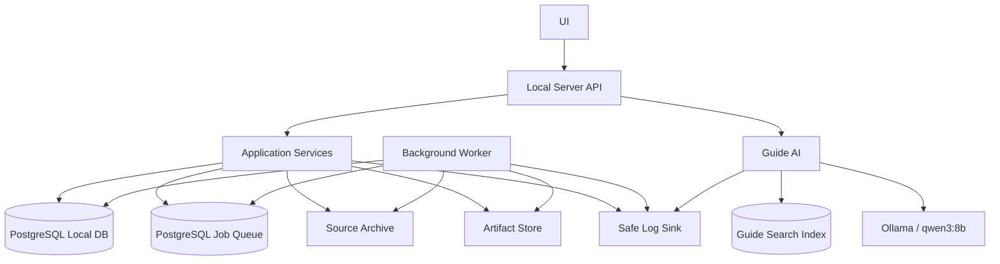
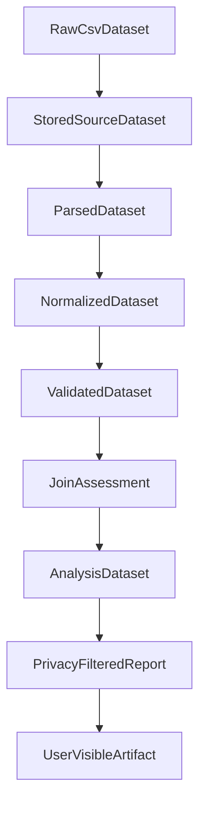
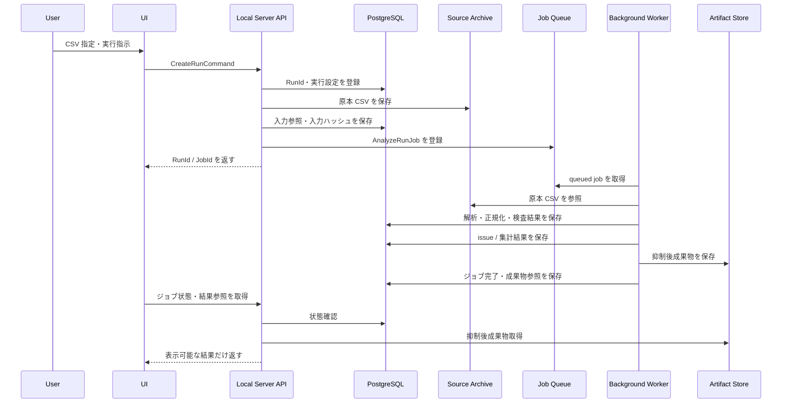
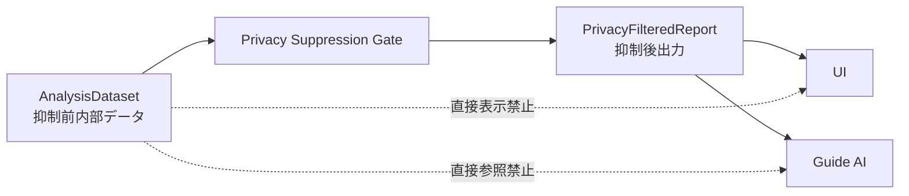
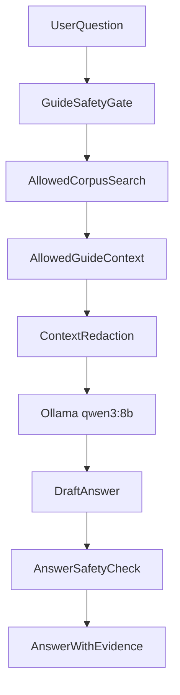
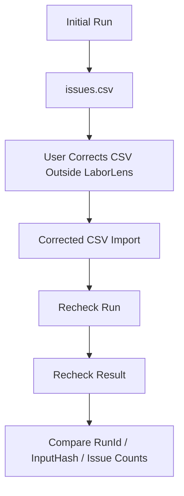

# LaborLens アーキテクチャ設計書

Date: 2026-06-02
Status: draft
Source: `REQUIREMENTS.md`
Related:

- `GLOSSARY.md`
- `BUSINESS-RULES.md`
- `ACCEPTANCE-CRITERIA.md`
- `EXTERNAL-DESIGN.md`
- `DATA-DESIGN.md`
- `TEST-PLAN.md`
- `OPERATIONS.md`
- `LEAN-SPEC-PLANNING.md`

## この文書の位置づけ

この文書は、LaborLens の実行時構成と責務分担を定義するアーキテクチャ設計書である。

この文書では、ローカルサーバー、ローカル DB、バックグラウンドジョブ、UI、ガイド AI の責務境界を定義する。LaborLens はローカル実行を基本とし、利用者 PC または社内端末上で、CSV 取り込み、検査、集計、プライバシー抑制、レポート生成、ガイド AI による説明補助を実行できる構成とする。

この文書で定義するもの:

- 論理コンポーネント
- コンポーネント間の依存方向
- ローカルサーバー、UI、DB、ジョブ、ガイド AI の責務分担
- データ状態ごとの所有者
- ジョブキュー方式
- PostgreSQL の採用方針
- ガイド AI と RAG の参照境界
- 抑制前データと抑制後出力の安全境界
- 保存時暗号化の初期方針
- ログマスキング方針
- アーキテクチャ上の禁止経路
- 残る未決事項

この文書で定義しないもの:

| 項目 | 扱う文書 |
| --- | --- |
| 用語の厳密な定義 | `GLOSSARY.md` |
| 打刻漏れ、時刻逆転、長時間労働候補、少人数部署などの判定条件 | `BUSINESS-RULES.md` |
| 受け入れ基準 | `ACCEPTANCE-CRITERIA.md` |
| 画面レイアウト、操作フロー、レポート表示順 | `EXTERNAL-DESIGN.md` |
| CSV 列定義、正規化データ、DB スキーマ詳細 | `DATA-DESIGN.md` |
| 性能試験、AI 品質評価、負荷試験 | `TEST-PLAN.md` |
| 認証、端末管理、運用手順、鍵管理 | `OPERATIONS.md` |
| Lean の型、述語、定理候補 | `LEAN-SPEC-PLANNING.md` |

## 1. アーキテクチャ方針

LaborLens のアーキテクチャは、UI を薄く保ち、ローカルサーバーをアプリケーション境界、バックグラウンドジョブを長時間処理の実行主体、PostgreSQL を状態と監査証跡の保存主体、ガイド AI を抑制後情報と根拠文書に限定された説明補助として分離する。

### 1.1 採用する基本構成

| 項目 | 採用方針 |
| --- | --- |
| 実行形態 | 利用者 PC または社内端末上のローカル実行 |
| UI | ローカルサーバー API を呼び出す操作・閲覧層 |
| ローカルサーバー | アプリケーション境界、API、RunId 発行、ジョブ登録、結果提供 |
| ローカル DB | PostgreSQL |
| ジョブキュー | PostgreSQL backed job queue |
| バックグラウンド処理 | ローカルワーカーで実行 |
| ガイド AI | Ollama 上の `qwen3:8b` を初期モデルとする |
| RAG | 初期 local UI milestone からは外し、data-quality workflow が安定してから段階導入する |
| ルール説明 | 初期 UI では RAG ではなく deterministic な `RuleExplanation` を表示する |
| 保存時暗号化 | 初期から必須仕様。ローカル DB 領域、Source Archive、Artifact Store、バックアップを暗号化対象にする |
| ログ | allowlist logging、完全伏せ字、HMAC 仮名化、少人数抑制を採用する |

### 1.2 アーキテクチャ原則

| 原則 | 内容 |
| --- | --- |
| ローカル優先 | 外部 API やクラウド送信を前提にしない。主要処理はローカルサーバー、ローカル DB、ローカルワーカーで実行する。 |
| 原本不変 | 取り込んだ原本 CSV を変更しない。修正後 CSV は別入力として扱う。 |
| 状態分離 | 原本、保存済み原本、解析済み、正規化済み、検査済み、分析用、抑制後出力を分離する。 |
| ジョブ分離 | 重い処理は UI スレッドと同期 API から分離し、バックグラウンドジョブとして実行する。 |
| RunId トレーサビリティ | 実行単位、入力参照、入力ハッシュ、実行設定、成果物、失敗理由を RunId に紐づける。 |
| 抑制前後の境界分離 | 抑制前データと抑制後成果物を型、保存場所、API、検索対象で分離する。 |
| ガイド AI の参照制限 | ガイド AI は抑制前データを参照しない。承認済み、版管理済み、プライバシー安全確認済みの根拠文書と抑制後情報だけを使う。 |
| 判断代替の禁止 | 法的判断、医療判断、人事評価、外部共有可否の最終判断をアーキテクチャ上も出力経路に載せない。 |
| 失敗時の監査可能性 | 途中失敗しても、原本、RunId、入力ハッシュ、ジョブ状態、失敗理由を確認可能にする。 |

## 2. 論理コンポーネント



### 2.1 コンポーネント一覧

| コンポーネント | 概要 |
| --- | --- |
| UI | 利用者操作、進捗確認、結果閲覧、再確認指示を行う画面層。 |
| Local Server API | UI からの要求を受ける HTTP/API 境界。 |
| Application Services | RunId 発行、入力登録、ジョブ登録、成果物参照、権限・安全境界を担うアプリケーション層。 |
| PostgreSQL Local DB | 実行履歴、ジョブ状態、入力参照、正規化データ、issue、集計結果、成果物メタデータを保存するローカル DB。 |
| PostgreSQL Job Queue | `jobs` テーブルを中心とするジョブキュー。Redis や RabbitMQ は初期構成では採用しない。 |
| Background Worker | CSV 解析、正規化、検査、集計、抑制、成果物生成を実行するワーカー。 |
| Source Archive | 取り込んだ原本 CSV を保存する原本保管領域。 |
| Artifact Store | `run_summary.json`、`issues.csv`、レポートなどの成果物を保存する領域。 |
| Guide AI | 操作方法、レポートの読み方、issue の意味、制約条件を説明するローカルガイド AI。 |
| Guide Search Index | ガイド AI が参照してよい文書だけを登録する検索インデックス。 |
| Ollama / qwen3:8b | ガイド AI の初期推論基盤。 |
| Safe Log Sink | マスキング済みログだけを保存するログ出力先。 |

## 3. コンポーネント責務

### 3.1 責務分担表

| コンポーネント | 持つ責務 | 持たせない責務 |
| --- | --- | --- |
| UI | CSV 選択、データ種別指定、実行指示、ジョブ進捗表示、完了・失敗表示、結果閲覧、再確認指示、修正依頼確認 | CSV 検査、集計、プライバシー抑制、結合可否判定、DB 直接更新、抑制前データ表示、AI への生データ提供 |
| Local Server API | UI からの要求受付、入力検証、RunId 発行、ジョブ登録、進捗取得、成果物取得、ガイド AI への許可済み文脈提供 | 重い処理の同期実行、画面表示ロジック、ガイド AI による判断代替、DB への無制限アクセス公開 |
| Application Services | 実行設定管理、入力ハッシュ管理、データ状態遷移の制御、プライバシー境界の入口制御、成果物参照管理 | 業務ルールの詳細判定式、画面レイアウト、DB 物理設計詳細 |
| PostgreSQL Local DB | RunId、入力参照、入力ハッシュ、実行設定、ジョブ状態、正規化データ、issue、集計結果、成果物メタデータ、実行履歴の保存 | 業務判断ロジック、画面制御、ガイド AI 回答生成、原本 CSV の破壊的更新 |
| PostgreSQL Job Queue | 未処理ジョブ、実行中ジョブ、完了ジョブ、失敗ジョブ、取消要求、進捗、リトライ情報の保存 | 分散キューとしての高度な外部連携、UI 表示、業務判断 |
| Background Worker | CSV 解析、正規化、スキーマ確認、データ品質検査、マスタ照合、粒度判定、結合可否判定、集計、プライバシー抑制、成果物生成、進捗更新、失敗理由記録 | ユーザー操作、画面表示、DB 外への未記録出力、抑制前データのユーザー向け出力 |
| Source Archive | 原本 CSV の保存、入力ハッシュ検証用の参照保持 | 原本 CSV の自動修正、正規化済みデータの保存主体、成果物公開 |
| Artifact Store | 抑制後成果物、CSV 出力、JSON 出力、レポートファイルの保存 | 抑制前データの公開、原本 CSV の破壊的変更 |
| Guide AI | 操作説明、レポート項目説明、issue 意味説明、ready/partial/blocked 説明、抑制理由説明、根拠文書付き回答 | 法的判断、医療判断、人事評価、外部共有可否判断、抑制対象情報の復元、抑制前データ参照、任意 SQL 実行 |
| Guide Search Index | 承認済み、版管理済み、プライバシー安全確認済み文書と抑制後情報の検索用台帳、文書 ID、版、更新日、文書種別、参照元、ハッシュ、インデックスバージョン、公開可否の保持 | 抑制前データのインデックス化、個人疲労値や睡眠時間の検索対象化 |
| Safe Log Sink | マスキング済みログの保存、障害調査用イベントの保持 | raw value、個人情報、健康関連情報、自由記述、生行データの保存 |

### 3.2 アーキテクチャ上の決定

| ID | 決定 | 内容 |
| --- | --- | --- |
| ADR-ARCH-001 | PostgreSQL 採用 | ローカル DB は PostgreSQL とする。 |
| ADR-ARCH-002 | PostgreSQL backed job queue 採用 | 初期構成では `jobs` テーブルをキューとして使い、Redis や RabbitMQ は採用しない。 |
| ADR-ARCH-003 | Ollama `qwen3:8b` 採用 | ガイド AI の初期モデルは Ollama 上の `qwen3:8b` とする。 |
| ADR-ARCH-004 | ガイド AI の参照対象制限 | ガイド AI は承認済み、版管理済み、プライバシー安全確認済みの `AllowedGuideDocument` だけを検索対象にする。 |
| ADR-ARCH-005 | UI と Guide AI の DB 直接アクセス禁止 | UI と Guide AI は PostgreSQL に直接アクセスしない。Local Server API を経由する。 |
| ADR-ARCH-006 | 初期暗号化方針 | 初期実装では OS ディスク暗号化を前提にし、アプリ層では境界分離、アクセス制限、ログマスキングを優先する。 |
| ADR-ARCH-007 | ログマスキング必須 | raw value はログに出力せず、allowlist logging とマスキングを必須にする。 |
| ADR-ARCH-008 | 抑制前データ Default Deny | 抑制前データは通常 UI、RAG、ガイド AI、一般管理者画面から参照不可とし、許可ロール、目的、チケット、期間、範囲、承認、監査ログを必須にする。 |

## 4. 依存方向

### 4.1 許可する依存方向

```text
UI
  -> Local Server API

Local Server API
  -> Application Services
  -> PostgreSQL Local DB
  -> PostgreSQL Job Queue
  -> Source Archive
  -> Artifact Store
  -> Guide AI Gateway

Background Worker
  -> PostgreSQL Job Queue
  -> PostgreSQL Local DB
  -> Source Archive
  -> Artifact Store
  -> Safe Log Sink

Guide AI
  -> Guide Search Index
  -> Ollama
  -> Safe Log Sink
```

### 4.2 禁止する依存方向

| 禁止経路 | 理由 |
| --- | --- |
| UI -> PostgreSQL Local DB | UI が安全境界やアプリケーション制約を迂回するため。 |
| UI -> Source Archive の直接読取 | 原本 CSV や抑制前データを表示する危険があるため。 |
| UI -> AnalysisDataset の直接表示 | プライバシー抑制前の情報が表示される危険があるため。 |
| Guide AI -> PostgreSQL Local DB の任意 SQL | プロンプト注入や抑制前データ漏えいの危険があるため。 |
| Guide AI -> RawCsvDataset / NormalizedDataset / AnalysisDataset | 抑制対象情報を回答する危険があるため。 |
| Background Worker -> UI の直接更新 | 再現性と監査可能性を損なうため。進捗は DB に記録し、UI は API 経由で取得する。 |
| Artifact Store -> 抑制前データ公開 | 成果物は抑制後出力を原則とするため。 |
| DB トリガー -> 業務判断本体 | 業務ルールを DB 内に閉じ込めるとテスト、Lean 仕様化、保守性が下がるため。 |

## 5. データ状態モデルと所有者

LaborLens は、入力データを状態別に区別して扱う。状態の違いは、型、保存先、API、ガイド AI の検索対象、ユーザー表示可否に影響する。



### 5.1 状態ごとの責務

| 状態 | 意味 | 主な所有者 | 保存方針 | ユーザー表示 | Guide AI 参照 |
| --- | --- | --- | --- | --- | --- |
| `RawCsvDataset` | 利用者が指定した原本 CSV | Source Archive | 変更不可 | 不可 | 不可 |
| `StoredSourceDataset` | 原本保存後、入力ハッシュと参照情報を持つ状態 | Source Archive + PostgreSQL | 変更不可 | メタデータのみ可 | 不可 |
| `ParsedDataset` | CSV として読めた状態 | Background Worker | 再生成可能 | 不可 | 不可 |
| `NormalizedDataset` | 列名、日付、ID などを内部形式へ揃えた状態 | Background Worker + PostgreSQL | 再生成可能 | 原則不可 | 不可 |
| `ValidatedDataset` | スキーマ確認とデータ品質検査を通した状態 | Background Worker + PostgreSQL | 再生成可能 | issue と要約のみ可 | 不可 |
| `JoinAssessment` | 他データとの結合可否が判定された状態 | Background Worker + PostgreSQL | 再生成可能 | 結合可否と理由のみ可 | 抑制後説明だけ可 |
| `AnalysisDataset` | 集計・確認ポイント整理に使う状態 | Background Worker + PostgreSQL | 再生成可能 | 不可 | 不可 |
| `PrivacyFilteredReport` | 安全境界を通したユーザー向け出力 | Artifact Store + PostgreSQL | 生成結果として保存 | 可 | 可 |
| `UserVisibleArtifact` | UI 表示またはファイル出力対象 | Artifact Store | 生成結果として保存 | 可 | 可 |

### 5.2 型境界の方針

実装では、同じ構造を使い回さず、状態ごとに意味のある型を分ける。

```typescript
// 例示。実装言語を限定するものではない。

type RunId = Brand<string, "RunId">;
type InputHash = Brand<string, "InputHash">;
type JobId = Brand<string, "JobId">;
type ArtifactId = Brand<string, "ArtifactId">;

type RawCsvDataset = {
  readonly state: "raw_csv_dataset";
  readonly sourcePath: SourceFilePath;
};

type StoredSourceDataset = {
  readonly state: "stored_source_dataset";
  readonly runId: RunId;
  readonly datasetKind: DatasetKind;
  readonly sourceRef: SourceRef;
  readonly inputHash: InputHash;
  readonly importedAt: ImportedAt;
};

type PrivacyFilteredReport = {
  readonly state: "privacy_filtered_report";
  readonly runId: RunId;
  readonly artifactId: ArtifactId;
  readonly suppressionSummary: SuppressionSummary;
  readonly generatedAt: GeneratedAt;
};
```

この方針により、抑制前データを誤って UI や Guide AI に渡すことを型レベルで防ぎやすくする。

## 6. 基本処理フロー



### 6.1 処理段階

| 段階 | 実行主体 | 主な出力 |
| --- | --- | --- |
| CSV 指定 | UI | `CreateRunCommand` |
| RunId 発行 | Local Server API | `RunRecord` |
| 原本保存 | Local Server API | `StoredSourceDataset` |
| 入力ハッシュ記録 | Local Server API | `InputHashRecord` |
| ジョブ登録 | Local Server API | `JobRecord` |
| CSV 解析 | Background Worker | `ParsedDataset` |
| 正規化 | Background Worker | `NormalizedDataset` |
| スキーマ確認 | Background Worker | `schema_issue` |
| データ品質検査 | Background Worker | `data_quality_issue` |
| マスタ照合 | Background Worker | `master_issue` |
| 粒度判定 | Background Worker | `grain_issue` |
| 結合可否判定 | Background Worker | `JoinAssessment`, `join_issue` |
| 集計・確認ポイント整理 | Background Worker | `AnalysisDataset` |
| プライバシー抑制 | Background Worker | `PrivacyFilteredReport`, `privacy_issue` |
| 成果物生成 | Background Worker | `run_summary.json`, `issues.csv`, report artifacts |
| 結果閲覧 | UI | `UserVisibleArtifact` |

## 7. PostgreSQL Local DB

### 7.1 採用理由

ローカル DB には PostgreSQL を採用する。PostgreSQL は無料で利用でき、ローカル環境で動作し、大量データの取り込み、検索、集計、トランザクション、インデックス、JSON、全文検索、拡張機能を扱えるため、LaborLens の初期構成に適している。

PostgreSQL を system of record とし、DuckDB は後段の分析補助候補に留める。DuckDB や Polars は集計、探索、後段分析で有効になり得るが、初期の正規化データ、issue、RunId、監査、成果物メタデータの正とする保存先にはしない。

初期 data-ingest slice は Rust の `csv` crate による狭い CSV pipeline から開始する。目的は高速な DataFrame 集計ではなく、汚れた CSV を行単位で読み、標準列名解決、型変換、検査、issue 化を安定させることである。Polars は後段の分析・高速集計候補とする。

### 7.2 DB が保持する情報

PostgreSQL は、次の情報を保持する。

| 分類 | 例 |
| --- | --- |
| 実行単位 | `runs`, `run_settings`, `run_inputs` |
| 入力参照 | データ種別、取込時刻、入力ハッシュ、Source Archive 参照 |
| ジョブ状態 | `jobs`, `job_events`, `job_progress` |
| 正規化データ | 正規化済み勤怠、従業員マスタ、人件費、売上、シフトなど |
| issue | issue 分類、優先度、行、列、理由、関連 RunId |
| 集計結果 | 部署別、店舗別、雇用区分別、期間別などの集計 |
| 抑制結果 | 抑制有無、抑制理由、抑制対象分類 |
| 成果物メタデータ | artifact id、ファイル種別、生成時刻、参照先 |
| ガイド検索台帳 | 承認済み、版管理済み、プライバシー安全確認済み文書と抑制後情報、文書 ID、版、更新日、文書ハッシュ、インデックスバージョン |
| 監査ログ | マスキング済みイベント、失敗理由、再実行履歴 |

### 7.3 DB に持たせないもの

PostgreSQL には、次の責務を持たせない。

- UI 表示ロジック
- ガイド AI 回答生成
- 業務ルールの詳細判定式の本体
- 法的判断、医療判断、人事評価の判定
- 原本 CSV の破壊的更新
- 抑制前データのユーザー向け公開

### 7.4 大量データ処理方針

10,000 人 x 3 年分の日次勤務データ、約 10,950,000 行規模の勤怠データを設計目標とする。初期性能目標は次の通りとし、詳細な測定条件は `TEST-PLAN.md` で定義する。

| 対象 | 初期目標 |
| --- | --- |
| CSV 取込、スキーマ確認、正規化 | 15 分以内 |
| データ品質検査、マスタ照合、集計、プライバシー抑制 | 10 分以内 |
| JSON / CSV / Markdown 成果物生成 | 5 分以内 |
| 全体処理時間 | 30 分以内 |
| ピークメモリ使用量 | 16 GB 以下 |
| ジョブ進捗 API | p95 1 秒以内 |
| UI 用サマリー取得 | p95 3 秒以内 |

アーキテクチャ上は、次の方針を採用する。

- 大量 CSV は UI では処理しない。
- 大量 CSV はバックグラウンドジョブで処理する。
- 取り込みは可能な限りバルクインポート方式を使う。
- 正規化データは RunId、対象期間、データ種別で追跡できるようにする。
- 集計は必要に応じて中間テーブルまたはマテリアライズされた結果として保存する。
- 失敗時に途中状態と失敗理由を追跡できるようにする。

## 8. PostgreSQL backed job queue

### 8.1 基本方針

LaborLens は、PostgreSQL backed job queue を採用する。

ローカルサーバーは、UI から実行指示を受けても、同期 API 内で重い処理を完了させない。ローカルサーバーは `jobs` テーブルに作業依頼を登録し、バックグラウンドワーカーが `queued` 状態のジョブを取得して処理する。

初期構成では、Redis、RabbitMQ、外部ジョブサービスは採用しない。

### 8.2 ジョブ種別

```typescript
type JobKind =
  | "import_dataset"
  | "analyze_run"
  | "recheck_run"
  | "generate_report"
  | "build_guide_index";
```

| ジョブ種別 | 内容 |
| --- | --- |
| `import_dataset` | 原本 CSV の登録、入力ハッシュ記録、取り込み準備を行う。 |
| `analyze_run` | CSV 解析、正規化、検査、照合、粒度判定、結合可否判定、集計、抑制、成果物生成を行う。 |
| `recheck_run` | 修正後 CSV を別入力として再確認し、修正前後の差分を整理する。 |
| `generate_report` | 検査済みデータや集計結果からレポート成果物を生成する。 |
| `build_guide_index` | 承認済み、版管理済み、プライバシー安全確認済み文書と抑制後情報からガイド AI 用検索インデックスを構築する。 |

### 8.3 ジョブ状態

```typescript
type JobStatus =
  | "queued"
  | "running"
  | "cancel_requested"
  | "cancelled"
  | "succeeded"
  | "failed";
```

| 状態 | 意味 |
| --- | --- |
| `queued` | 登録済みで、まだ実行されていない。 |
| `running` | ワーカーが取得し、処理中である。 |
| `cancel_requested` | 利用者またはシステムにより取消要求が出ている。 |
| `cancelled` | 取消可能地点で停止した。 |
| `succeeded` | 正常終了した。 |
| `failed` | 失敗した。失敗理由を確認できる必要がある。 |

### 8.4 ジョブ進捗

ジョブ進捗は、UI が理解できる粒度で保存する。

```typescript
type ProcessingStage =
  | "source_saved"
  | "csv_parsing"
  | "normalizing"
  | "schema_checking"
  | "data_quality_checking"
  | "master_matching"
  | "grain_assessing"
  | "join_assessing"
  | "aggregating"
  | "privacy_filtering"
  | "artifact_generating"
  | "completed";

type JobProgress = {
  readonly stage: ProcessingStage;
  readonly processedRows?: ProcessedRows;
  readonly totalRows?: TotalRows;
  readonly message: LogSafeMessage;
};
```

進捗メッセージには個人情報、健康関連情報、生データ値を含めない。

### 8.5 リトライと冪等性

ジョブは RunId と入力ハッシュに紐づく。再実行時には、同じ RunId を再利用する場合と、新しい RunId を発行する場合を区別する。

| ケース | 方針 |
| --- | --- |
| 同一入力の再実行 | 入力ハッシュ、実行設定、対象期間を確認できるようにする。 |
| 修正後 CSV の再確認 | 原本とは別入力として扱い、新しい入力ハッシュを記録する。 |
| 途中失敗後の再実行 | 失敗理由と再実行条件を保存する。 |
| 成果物生成だけの再試行 | 元データと実行設定を固定した上で再生成する。 |

### 8.6 取消

取消は即時強制終了ではなく、取消可能地点で停止する方式とする。

取消可能地点の例:

- CSV チャンク処理の境界
- 正規化バッチの境界
- 集計ステップの境界
- 成果物生成前

取消後も、RunId、入力参照、入力ハッシュ、取消時点、取消理由を確認できる必要がある。

## 9. Source Archive

Source Archive は、取り込んだ原本 CSV を保存する領域である。

### 9.1 責務

- 原本 CSV を変更不可の入力として保存する。
- 入力ハッシュを検証できる参照を保持する。
- RunId、データ種別、取込時刻、ファイル参照と紐づける。
- 修正後 CSV は原本とは別の入力として保存する。

### 9.2 禁止事項

- 原本 CSV を自動上書き修正してはならない。
- 原本 CSV を UI に直接表示してはならない。
- ガイド AI の検索対象にしてはならない。
- 原本 CSV の内容をログへ出力してはならない。

### 9.3 保存方式

初期構成では、原本 CSV はローカルファイルとして保存し、PostgreSQL には参照情報と入力ハッシュを保存する。DB BLOB 保存は初期構成では必須としない。

```text
Source Archive
  /runs/{RunId}/sources/{DatasetKind}/{InputHash}.csv

PostgreSQL
  run_inputs.source_ref
  run_inputs.input_hash
  run_inputs.dataset_kind
  run_inputs.imported_at
```

実際のディレクトリ構成、ファイル名規約、バックアップ方式は `DATA-DESIGN.md` または `OPERATIONS.md` で定義する。

## 10. Artifact Store

Artifact Store は、ユーザー向け成果物と成果物メタデータを保存する領域である。

### 10.1 対象成果物

- `run_summary.json`
- `issues.csv`
- `profile_report.json`
- 内部確認用 Markdown レポート
- 内部確認用 JSON レポート
- 内部確認用 CSV 群
- 共有用 PDF レポート
- 抑制済み共有用 CSV
- UI 表示用 JSON
- データ準備状況レポート
- 勤怠確認レポート
- 人件費粒度レポート
- 人員不足確認レポート
- 月次労務レポート
- 抑制済み集計レポート
- 外部共有前チェックリスト
- 再確認結果

### 10.2 成果物の前提条件

成果物生成前に、少なくとも次の処理が完了していなければならない。

- スキーマ確認
- データ品質検査
- 必要なマスタ照合
- 必要な粒度判定
- 必要な結合可否判定
- プライバシー抑制

### 10.3 出力形式方針

成果物は用途別に次の形式で生成する。

| 用途 | 出力形式 | 保存先の考え方 |
| --- | --- | --- |
| 内部確認用 | Markdown + CSV + JSON | `Artifact Store` に保存し、担当者確認、差分レビュー、テスト、機械処理で使う。 |
| 共有用 | PDF + 抑制済み CSV | 抑制後データだけを含め、外部共有前チェックを通した成果物として保存する。 |
| UI 表示用 | JSON | Local UI が構造化データとして取得し、画面側で表示する。 |

PDF は、1 ページ目に要約、2 ページ目以降に詳細表を置く。グラフは補助扱いとし、判断の根拠は表、抑制理由、入力参照、RunId、入力ハッシュで追跡できるようにする。

### 10.4 成果物メタデータ

すべての成果物は、次のメタデータを持つ。

```typescript
type ArtifactMetadata = {
  readonly artifactId: ArtifactId;
  readonly runId: RunId;
  readonly tenantId: TenantId;
  readonly artifactKind: ArtifactKind;
  readonly generatedAt: GeneratedAt;
  readonly inputRef: InputRef;
  readonly normalizedRef: NormalizedRef;
  readonly policyRef: PolicyRef;
  readonly outputRef: OutputRef;
  readonly auditRef: AuditRef;
  readonly reportPeriod?: ReportPeriod;
  readonly suppressionApplied: SuppressionApplied;
};

type RunArtifact = {
  readonly runId: RunId;
  readonly tenantId: TenantId;
  readonly inputRef: InputRef;
  readonly normalizedRef: NormalizedRef;
  readonly policyRef: PolicyRef;
  readonly outputRef: OutputRef;
  readonly auditRef: AuditRef;
  readonly createdBy: ActorId;
  readonly createdAt: CreatedAt;
  readonly status: RunStatus;
};
```

## 11. UI

### 11.1 UI の責務

UI は、利用者の操作面を担当する。UI はアプリケーションロジックの入口ではあるが、業務処理の主体ではない。

UI が行うこと:

- CSV ファイルを指定する。
- データ種別を指定する。
- 実行指示を送る。
- RunId と JobId を表示する。
- ジョブ進捗、完了、失敗、取消可能状態を表示する。
- ready / partial / blocked を表示する。
- issue 一覧を表示する。
- 抑制後レポートを表示する。
- 修正後 CSV の再確認を指示する。
- ガイド AI へ質問を送る。

UI が行わないこと:

- CSV の中身を直接検査する。
- 業務ルールを判定する。
- プライバシー抑制を判定する。
- 抑制前データを表示する。
- DB へ直接接続する。
- ガイド AI に抑制前データを渡す。

### 11.2 UI が扱うデータ型

UI は、原則として次の型だけを扱う。

```typescript
type UiRunSummary = {
  readonly runId: RunId;
  readonly preparationStatus: PreparationStatus;
  readonly issueCounts: IssueCounts;
  readonly artifactRefs: ReadonlyArray<ArtifactRef>;
};

type UiJobStatus = {
  readonly jobId: JobId;
  readonly runId: RunId;
  readonly status: JobStatus;
  readonly progress: JobProgress;
  readonly failure?: DisplayableFailureReason;
};

type UiIssueRow = {
  readonly issueId: IssueId;
  readonly issueCategory: IssueCategory;
  readonly severity: IssueSeverity;
  readonly datasetKind: DatasetKind;
  readonly rowRef?: DisplayableRowRef;
  readonly columnName?: DisplayableColumnName;
  readonly reason: DisplayableIssueReason;
};
```

UI 用の型には、個人疲労値、睡眠時間、疲労コメント、生の自由記述、抑制前集計を含めない。

## 12. Local Server API

### 12.1 API 境界

Local Server API は、UI とアプリケーション処理の境界である。

API の責務:

- UI からのコマンドを受け付ける。
- 入力を検証する。
- RunId を発行する。
- 入力ハッシュを記録する。
- 実行設定を保存する。
- ジョブを登録する。
- ジョブ状態を返す。
- 成果物参照を返す。
- 抑制後の表示可能情報だけを返す。
- ガイド AI に許可済み文脈だけを渡す。

### 12.2 主なコマンド

```typescript
type CreateRunCommand = {
  readonly requestedBy: LocalUserRef;
  readonly targetPeriod?: TargetPeriod;
  readonly runSettings: RunSettings;
};

type RegisterCsvInputCommand = {
  readonly runId: RunId;
  readonly datasetKind: DatasetKind;
  readonly localFileRef: LocalFileRef;
  readonly csvReadOptions: CsvReadOptions;
};

type StartAnalysisCommand = {
  readonly runId: RunId;
};

type RequestRecheckCommand = {
  readonly previousRunId: RunId;
  readonly correctedInputs: ReadonlyArray<RegisterCsvInputCommand>;
};

type AskGuideCommand = {
  readonly question: UserQuestion;
  readonly visibleContextRefs: ReadonlyArray<ArtifactRef>;
  readonly language: GuideAnswerLanguage;
};
```

### 12.3 主なクエリ

```typescript
type GetRunSummaryQuery = {
  readonly runId: RunId;
};

type GetJobStatusQuery = {
  readonly jobId: JobId;
};

type ListIssuesQuery = {
  readonly runId: RunId;
  readonly filter?: IssueFilter;
};

type GetArtifactQuery = {
  readonly artifactId: ArtifactId;
};
```

## 13. バックグラウンドワーカー

### 13.1 ワーカーの責務

バックグラウンドワーカーは、長時間処理の実行主体である。

ワーカーが実行する処理:

- CSV 読み込み
- 文字コード、区切り文字、ヘッダー有無などの読み込み条件処理
- 入力ハッシュ検証
- スキーマ確認
- データ品質検査
- 従業員マスタ照合
- データ粒度判定
- 結合可否判定
- 勤怠、労務、人件費、店舗運用に関する確認材料整理
- プライバシー抑制
- 成果物生成
- ジョブ進捗更新
- 失敗理由記録

### 13.2 ワーカーが守る制約

- 原本 CSV を変更しない。
- 生成結果は RunId と入力ハッシュへ紐づける。
- 成果物生成前にプライバシー抑制を通す。
- 失敗時にも原本、実行履歴、失敗理由を残す。
- ログ出力前に必ずマスキングを行う。
- 抑制前データを Artifact Store にユーザー向け成果物として保存しない。

### 13.3 ワーカーパイプライン

```text
StoredSourceDataset
  -> parseCsv
  -> ParsedDataset
  -> normalizeDataset
  -> NormalizedDataset
  -> validateDataset
  -> ValidatedDataset
  -> assessJoinability
  -> JoinAssessment
  -> buildAnalysisDataset
  -> AnalysisDataset
  -> applyPrivacySuppression
  -> PrivacyFilteredReport
  -> generateArtifacts
  -> UserVisibleArtifact
```

各関数は、意味のある状態型を入力し、次の状態型を出力する変換として設計する。

## 14. プライバシー境界

### 14.1 境界の位置

プライバシー境界は、`AnalysisDataset` と `PrivacyFilteredReport` の間に置く。



### 14.2 抑制前データ

抑制前データには、次が含まれ得る。

- 個人識別子
- 個人別勤怠情報
- 個人別の勤務負荷、長時間労働、深夜勤務、休憩不足、連勤、有休取得不足などの労務リスク指標
- 個人疲労値、睡眠時間、疲労コメントなど、既存入力に含まれ得る健康関連値
- 自由記述コメント
- 少人数部署の集計
- 個人推測可能な集計
- 給与額または人件費に関する高感度情報

抑制前データは、通常 UI、RAG、Guide AI、一般管理者画面の直接参照対象にしてはならない。

### 14.3 抑制後出力

抑制後出力は、次のいずれかの処理を通したものとする。

- 非表示
- 伏せ字
- 集計単位への変換
- 少人数集計の抑制
- 抑制理由の表示
- 根拠条件の表示

### 14.4 抑制結果の型

```typescript
type SuppressionDecision =
  | { readonly kind: "visible" }
  | { readonly kind: "redacted"; readonly reason: SuppressionReason }
  | { readonly kind: "suppressed"; readonly reason: SuppressionReason }
  | { readonly kind: "aggregated"; readonly grain: DisplayGrain };

type SuppressionReason =
  | "personal_identifier"
  | "health_related_value"
  | "fatigue_comment"
  | "small_group"
  | "reidentification_risk"
  | "attribute_combination_small_group"
  | "complementary_disclosure"
  | "judgment_substitution_risk";
```

少人数部署は有効データ数で判定する。有効データ数が 10 人未満の部署または集計セルは少人数部署、有効データ数が 10 人以上 30 人未満の部署または集計セルは注意部署として扱う。差分推測、属性組合せ、自然言語表現により個人または少人数セルを推測できる場合も抑制対象にする。詳細は `BUSINESS-RULES.md` で定義し、実行設定として RunId に記録する。

## 15. ガイド AI

### 15.1 目的

ガイド AI は、LaborLens の操作方法、レポートの読み方、issue の意味、制約条件の意味を、根拠文書付きで説明する補助機能である。

ガイド AI は、LaborLens の判定を拡張しない。法的判断、医療判断、人事評価、外部共有可否の最終判断を行わない。

### 15.2 採用モデル

初期モデルは、Ollama 上の `qwen3:8b` とする。

14B 以上のモデルは、応答品質、速度、メモリ使用量、利用者 PC の性能要件を評価した後の候補として扱う。評価方法は `TEST-PLAN.md` で定義する。

### 15.3 ガイド AI パイプライン



### 15.4 ガイド AI が参照できる情報

| 参照対象 | 可否 | 条件 |
| --- | --- | --- |
| 製品マニュアル | 可 | 承認済み、版管理済み、`AllowedGuideDocument` として登録されていること。 |
| 労務コンパスの仕様書 | 可 | 承認済み、版管理済み、`AllowedGuideDocument` として登録されていること。 |
| 操作 FAQ | 可 | 承認済み、版管理済み、`AllowedGuideDocument` として登録されていること。 |
| 用語集 | 可 | 承認済み、版管理済み、`AllowedGuideDocument` として登録されていること。 |
| 承認済みの労務ルール解説 | 可 | 承認済み、版管理済み、抑制前の個人情報を含まないこと。 |
| 顧客別設定情報 | 条件付き可 | `tenant_id` によるテナント分離があること。 |
| 抑制済み集計結果 | 条件付き可 | 個人推測リスク判定後かつ `privacy_filtered = true` であること。 |
| `issues.csv` | 条件付き可 | 氏名、メール、疲労値、睡眠時間、自由記述がマスク済みであること。 |
| 抑制前データ | 不可 | 例外なし。 |
| RawCsvDataset | 不可 | 例外なし。 |
| NormalizedDataset | 不可 | 例外なし。 |
| AnalysisDataset | 不可 | 例外なし。 |
| 個人疲労値、睡眠時間、疲労コメント | 不可 | 例外なし。 |
| 少人数部署で個人推測可能な集計 | 不可 | 例外なし。 |
| 監査ログ | 不可 | 例外なし。 |
| 下書き文書 | 不可 | 例外なし。 |
| Slack、メール、チケット原文 | 原則不可 | 個人情報、未確認情報が混入しやすいため。 |
| 任意 SQL 実行結果 | 不可 | 例外なし。 |

### 15.5 回答要件

ガイド AI の回答は、次を満たす必要がある。

- 日本語または英語で回答する。
- 根拠文書またはレポート箇所を示す。
- 検索結果が不足する場合、不足していることを説明する。
- 推測で断定しない。
- 法的判断、医療判断、人事評価として読める結論を出さない。
- 抑制対象情報を復元しない。
- プロンプト注入により参照範囲や安全境界を無視しない。

## 16. RAG インデックス

### 16.1 基本方針

RAG インデックスは、ガイド AI が参照してよい文書だけを検索可能にするための検索台帳である。

local RAG は、最初の local UI milestone から外す。初期 UI では、RAG による自由回答より先に、`RuleExplanation` により「なぜこの issue が出たか」「どのデータが不足しているか」「どのルールを参照したか」を deterministic に表示する。

RAG インデックスを導入する場合は、PostgreSQL 上の `guide_documents` と `guide_chunks` により管理する。検索方式はキーワード検索を基本とする。必要に応じて、PostgreSQL 全文検索またはベクトル検索拡張を検討する。

```typescript
type RuleExplanation = {
  readonly issueCode: IssueCode;
  readonly businessRuleSectionId: string;
  readonly plainLanguageReason: string;
  readonly requiredSourceData: readonly DatasetKind[];
  readonly recommendedHumanCheck: string;
};
```

### 16.2 AllowedGuideDocument

```typescript
type AllowedGuideDocument = {
  readonly guideDocumentId: GuideDocumentId;
  readonly documentKind: GuideDocumentKind;
  readonly sourceRef: DocumentSourceRef;
  readonly sourceHash: SourceHash;
  readonly documentVersion: DocumentVersion;
  readonly sourceUpdatedAt: SourceUpdatedAt;
  readonly approvalStatus: "approved";
  readonly tenantId?: TenantId;
  readonly ragIndexVersion: RagIndexVersion;
  readonly privacySafe: true;
  readonly indexedAt: IndexedAt;
  readonly visibility: "guide_allowed";
};

type GuideDocumentKind =
  | "product_manual"
  | "product_spec"
  | "operation_faq"
  | "glossary"
  | "approved_labor_rule"
  | "tenant_setting"
  | "constraint_document"
  | "masked_issues"
  | "privacy_filtered_report";
```

RAG 対象は、承認済み、版管理済み、抑制後情報に限定する。対象可否は次の通りとする。

| 区分 | RAG 対象 | 条件 |
| --- | --- | --- |
| 製品マニュアル | 対象 | 承認済み、版管理済み |
| 労務コンパスの仕様書 | 対象 | 承認済み、版管理済み |
| 操作 FAQ | 対象 | 承認済み、版管理済み |
| 用語集 | 対象 | 承認済み、版管理済み |
| 承認済みの労務ルール解説 | 対象 | 承認済み、版管理済み |
| 顧客別設定情報 | 条件付き対象 | `tenant_id` によるテナント分離が必須 |
| 抑制済み集計結果 | 条件付き対象 | 個人推測リスク判定後かつ `privacy_filtered = true` |
| 抑制前 CSV | 対象外 | 情報漏洩リスクが高い |
| 個人別データ | 対象外 | RAG に入れるべきではない |
| 監査ログ | 対象外 | 機密性が高い |
| 下書き文書 | 対象外 | 未承認情報を回答するリスクがある |
| Slack、メール、チケット原文 | 原則対象外 | 個人情報、未確認情報が混入しやすい |

### 16.3 GuideChunk

```typescript
type GuideChunk = {
  readonly guideChunkId: GuideChunkId;
  readonly guideDocumentId: GuideDocumentId;
  readonly chunkText: GuideSafeText;
  readonly citationRef: CitationRef;
  readonly chunkHash: ChunkHash;
};
```

`GuideSafeText` は、抑制対象情報を含まない検索用テキストである。

### 16.4 インデックス更新条件

RAG インデックス更新条件は次の通りとする。

| 更新条件 | 扱い |
| --- | --- |
| 通常更新 | 承認済み文書が更新されたとき |
| 定期更新 | 毎日またはリリースごと |
| 強制更新 | 法改正、仕様変更、FAQ 重大修正時 |
| 無効化 | 文書が廃止、撤回、非公開化されたとき |
| 版管理 | 回答には参照文書 ID、版、更新日を紐づける |
| 禁止 | 未承認文書、抑制前データ、個人別データのインデックス投入 |

自動更新の実装方式、差分更新方式、インデックスの保持世代数は `OPERATIONS.md` または実装設定で定義する。

## 17. 保存時暗号化

### 17.1 初期方針

保存時暗号化は、初期から必須仕様とする。対象はローカル DB 領域、Source Archive、Artifact Store、バックアップである。ローカル端末の OS ディスク暗号化を前提にしつつ、アプリケーション層でも暗号化対象、鍵管理、ログマスキング、バックアップ保護の境界を固定する。

- 抑制前データと抑制後成果物の分離
- UI と Guide AI からの抑制前データ直接アクセス禁止
- Local Server API 経由のアクセス制御
- ログマスキング
- Source Archive と Artifact Store の区別
- RunId、入力ハッシュ、実行設定による追跡性
- OS 資格情報ストアまたは利用者指定秘密情報による鍵管理
- バックアップの暗号化
- 原本 CSV 行、氏名、未マスク従業員 ID、詳細勤務実績をログに出さない制御

### 17.2 暗号化対象

| 対象 | 初期方針 |
| --- | --- |
| PostgreSQL data directory | OS ディスク暗号化またはアプリケーション管理の暗号化領域に配置する |
| Source Archive | ファイル単位暗号化または暗号化領域に保存する |
| Artifact Store | 抑制前成果物と共有用成果物を分離し、保存領域を暗号化する |
| Backup | 暗号化済みバックアップだけを許可する |
| 高リスク項目 | 将来の運用版でカラム単位暗号化またはアプリケーション層暗号化を検討する |

### 17.3 禁止事項

- 暗号鍵を PostgreSQL 内に平文保存してはならない。
- 暗号鍵をログに出力してはならない。
- 暗号鍵を設定ファイルに平文保存してはならない。
- 暗号化済みであることを理由に、抑制前データを UI や Guide AI に渡してはならない。

鍵管理方式は `OPERATIONS.md` で定義する。

## 18. ログマスキング

### 18.1 基本方針

LaborLens は、ログ出力前に `LogMaskingPolicy` を必ず通す。ログには、障害調査に必要なイベント、件数、処理段階、失敗分類だけを出力し、個人情報、健康関連情報、生データ値を出力しない。

### 18.2 ログに出してよい項目

allowlist として、原則次の項目だけをログ出力する。

| 項目 | 例 |
| --- | --- |
| RunId | `run_01H...` |
| JobId | `job_01H...` |
| DatasetKind | `attendance`, `employee_master`, `labor_cost` |
| ProcessingStage | `schema_checking`, `privacy_filtering` |
| IssueCategory | `schema_issue`, `privacy_issue` |
| IssueCode | `DQ_ATTENDANCE_CLOCK_IN_MISSING`、`CHECK_LABOR_OVERTIME_MONTH_45H` など。体系は `BUSINESS-RULES.md` の issue code / business check code に従う。 |
| IssueSeverity | `critical`, `high`, `medium`, `low` |
| row_number | 必要な場合のみ。生データ値は出さない。 |
| column_name | 必要な場合のみ。 |
| record_count | 件数。 |
| elapsed_ms | 処理時間。 |
| failure_kind | 失敗分類。 |

### 18.3 ログに出してはならない項目

| 項目 | 方針 |
| --- | --- |
| 氏名 | 出力禁止。 |
| 社員番号 | 原則出力禁止。必要な場合は HMAC 仮名化。 |
| メールアドレス | 出力禁止または完全伏せ字。 |
| 電話番号 | 出力禁止または完全伏せ字。 |
| 住所 | 出力禁止。 |
| 個人疲労値 | 出力禁止。 |
| 睡眠時間 | 出力禁止。 |
| 疲労コメント | 出力禁止。 |
| 自由記述コメント | 出力禁止。 |
| 給与額 | 原則出力禁止。必要な場合は集計粒度に変換。 |
| 生の打刻時刻 | 原則出力禁止。必要な場合は丸めた時間帯。 |
| CSV 生行 | 出力禁止。 |
| 入力ファイルの全文 | 出力禁止。 |

### 18.4 マスキング手法

#### 18.4.1 完全伏せ字

健康関連情報、自由記述、コメント、個人識別子は、原則として完全伏せ字にする。

```text
name = [REDACTED]
email = [REDACTED]
fatigue_comment = [REDACTED]
```

#### 18.4.2 部分マスキング

障害調査に最低限必要な場合だけ、部分マスキングを使う。

```text
email = f***@example.com
phone = 090-****-1234
employee_id = EMP-****-1234
```

ただし、社員番号は組織内で個人識別子になり得るため、部分マスキングより HMAC 仮名化を優先する。

#### 18.4.3 HMAC 仮名化

同じ人物かどうかだけ追跡したい場合、秘密鍵付き HMAC により安定仮名化する。

```text
employee_id = emp_hmac_9f2a81c3
```

単純なハッシュは、社員番号の候補が少ない場合に総当たりされる可能性があるため、原則として使用しない。

#### 18.4.4 粒度の粗化

日時や数値は、調査目的に必要な粒度へ丸める。

```text
worked_at = 2026-06
clock_time = 09:00 hour bucket
monthly_overtime = 40-60h bucket
```

#### 18.4.5 少人数抑制

少人数部署や個人推測可能な集計は、ログでも抑制する。

```text
department = [SMALL_GROUP_SUPPRESSED]
count = [SUPPRESSED]
reason = small_group_privacy_boundary
```

少人数部署と注意部署の有効データ数閾値は `BUSINESS-RULES.md` で定義する。

### 18.5 ログ型

```typescript
type RawLogEvent = {
  readonly runId: RunId;
  readonly stage: ProcessingStage;
  readonly message: string;
  readonly values: Record<string, unknown>;
};

type SafeLogEvent = {
  readonly runId: RunId;
  readonly jobId?: JobId;
  readonly stage: ProcessingStage;
  readonly eventKind: LogEventKind;
  readonly message: LogSafeMessage;
  readonly details: LogSafeDetails;
};

type LogMaskingPolicy = {
  readonly apply: (event: RawLogEvent) => SafeLogEvent;
};
```

`RawLogEvent` を直接 `LogSink` に渡してはならない。

```text
RawLogEvent
  -> LogMaskingPolicy
  -> SafeLogEvent
  -> SafeLogSink
```

## 19. 準備状態と issue

### 19.1 準備状態

```typescript
type PreparationStatus = "ready" | "partial" | "blocked";
```

| 状態 | 意味 |
| --- | --- |
| `ready` | 必要な入力が揃い、対象レポートを生成できる状態。 |
| `partial` | 一部の入力または粒度が不足しているが、限定されたレポートを生成できる状態。 |
| `blocked` | 必須入力、必須列、形式、結合キーなどが不足し、対象レポートを生成できない状態。 |

### 19.2 issue 分類

```typescript
type IssueCategory =
  | "schema_issue"
  | "data_quality_issue"
  | "master_issue"
  | "grain_issue"
  | "join_issue"
  | "privacy_issue"
  | "processing_issue";

type IssueSeverity = "critical" | "high" | "medium" | "low";
```

issue code の体系と詳細判定条件は `BUSINESS-RULES.md` と `ACCEPTANCE-CRITERIA.md` で定義する。

### 19.3 issue 出力のアーキテクチャ方針

- issue は RunId に紐づく。
- issue はデータ品質 issue と業務確認ポイントを混在させない。
- issue は行、列、理由、優先度、issue 種別を持つ。
- issue の生値出力は必要最小限にする。
- `issues.csv` は修正依頼に使える粒度にする。
- `privacy_issue` は表示前の抑制判定と連動する。

## 20. 再確認フロー

修正後 CSV は、原本 CSV を上書きせず、別入力として取り込む。



再確認結果では、次を比較できるようにする。

- 修正前 RunId
- 修正後 RunId
- 修正前入力ハッシュ
- 修正後入力ハッシュ
- issue 件数の変化
- 主要 issue の変化
- 対象期間
- 実行設定

## 21. ローカルデモ構成

ローカルデモは、実在個人情報を含まない架空データだけを扱う。

デモで確認できるべきもの:

- データ準備状況
- 不備一覧
- 売上粒度確認
- 人件費粒度確認
- プライバシー境界
- 実行結果比較
- 原本 CSV を変更しない処理の流れ
- 少人数集計や個人疲労値が抑制されること
- 修正前後で issue が減ること

デモでも、ガイド AI は抑制前データを参照してはならない。

## 22. ローカル起動構成

初期構成では、同一端末上に次を起動する。

```text
LaborLens UI
LaborLens Local Server
LaborLens Background Worker
PostgreSQL
Ollama
```

### 22.1 プロセス分離

| プロセス | 役割 |
| --- | --- |
| UI process | 画面表示とユーザー操作。 |
| Local server process | API、RunId 発行、ジョブ登録、成果物提供。 |
| Worker process | 長時間処理。 |
| PostgreSQL process | 状態保存、ジョブキュー、検索台帳。 |
| Ollama process | ガイド AI 推論。 |

初期開発では、Local server と Worker を同一実行ファイル内の別スレッドまたは別プロセスとして実装してもよい。ただし、アーキテクチャ上の責務は分離する。

## 23. セキュリティ境界

### 23.1 境界一覧

| 境界 | 内容 |
| --- | --- |
| UI/API 境界 | UI は API だけを呼び出す。 |
| API/DB 境界 | DB へのアクセスはアプリケーション層が制御する。 |
| 抑制前後境界 | 抑制前データと抑制後成果物を分離する。 |
| Guide AI 境界 | Guide AI は承認済み、版管理済み、プライバシー安全確認済み文書と抑制後情報だけを参照する。 |
| Log 境界 | raw log を SafeLogEvent に変換してから保存する。 |
| Source/Artifact 境界 | 原本 CSV とユーザー向け成果物を保存場所と参照型で分離する。 |

### 23.2 認証・アクセス制御

ローカル実行を前提とするが、認証、アクセス制御、権限ロール、端末管理の詳細は `OPERATIONS.md` で定義する。

ARCHITECTURE.md では、最低限次を制約として置く。

- UI は Local Server API を経由する。
- Guide AI は任意 SQL を実行できない。
- 抑制前データへのアクセスは Default Deny とし、アプリケーションサービス内に閉じる。
- 抑制前データを返す API を一般 UI 用に公開しない。
- 通常 UI、RAG、Guide AI、一般管理者画面は抑制前データを参照できない。
- ログには raw value を出力しない。

抑制前データへのアクセスを許可できるロールは次に限定する。

| ロール | 参照できる条件 |
| --- | --- |
| システム管理者 | 障害調査、復旧、設定確認など、明示目的とチケット番号がある場合 |
| 監査担当 | 監査目的、対象期間、対象 `RunId` または `DatasetId` が明示されている場合 |
| データ保護責任者 | 個人情報保護または安全境界確認の目的が明示されている場合 |
| 限定された運用担当 | 承認済みチケットに基づく必要最小範囲に限る場合 |

すべてのアクセス要求は、明示的な目的、チケット番号、期間制限、必要最小限の対象範囲、承認を持たなければならない。条件を満たさない要求は拒否し、拒否イベントを監査対象にする。

禁止事項:

- Guide AI からの抑制前データ直接参照。
- RAG インデックスへの抑制前データ投入。
- 一般ユーザーまたは一般管理者画面への抑制前データ露出。
- 抑制前データの CSV 再配布。

監査ログには、誰が、いつ、どの `RunId` または `DatasetId` に、どの目的と範囲でアクセスしたかを残す。監査ログは追記型またはハッシュ連鎖などにより、改ざん困難にする。

## 24. 障害処理

### 24.1 失敗時に保持する情報

処理に失敗した場合でも、次を確認できるようにする。

- RunId
- JobId
- 入力参照
- 入力ハッシュ
- 実行設定
- 処理段階
- 失敗分類
- マスキング済み失敗理由
- 再実行に必要な情報

### 24.2 失敗分類

```typescript
type FailureKind =
  | "csv_read_failed"
  | "schema_validation_failed"
  | "normalization_failed"
  | "master_matching_failed"
  | "join_assessment_failed"
  | "privacy_filtering_failed"
  | "artifact_generation_failed"
  | "guide_index_build_failed"
  | "unexpected_processing_error";
```

失敗理由には、生データ、個人情報、健康関連情報、自由記述を含めない。

## 25. 受け入れ基準との対応

| アーキテクチャ方針 | 対応する検証観点 |
| --- | --- |
| 原本 CSV を Source Archive に保存し、変更しない | 原本ハッシュまたはファイル内容が変化しないこと |
| PostgreSQL backed job queue を使う | 重い処理が UI スレッドから分離されること |
| ジョブ進捗を DB に保存する | UI が進捗、完了、失敗、取消可能状態を表示できること |
| Privacy Suppression Gate を成果物生成前に置く | 個人疲労値、睡眠時間、疲労コメントがユーザー向け出力に出ないこと |
| Guide AI の検索対象を AllowedGuideDocument に限定する | Guide AI が安全境界を越えた回答をしないこと |
| 抑制前データアクセスを Default Deny にする | 許可ロール、目的、チケット、期間、範囲、承認、監査ログがないアクセスを拒否できること |
| SafeLogEvent だけを保存する | ログに個人情報や健康関連情報が出ないこと |
| RunId、入力ハッシュ、実行設定を保存する | 再実行時に入力、設定、対象期間を確認できること |

## 26. 保留する未決事項

現時点で、本書で保留する主要未決事項はない。運用手順、保持期間、端末別性能補正、詳細な UI レイアウトは後続文書で扱う。

次の項目は、本書で大方針を決定済みとする。ただし、詳細は後続文書で定義する。

| ID | 項目 | 本書での決定 | 詳細定義先 |
| --- | --- | --- | --- |
| OPEN-001 | 少人数部署とみなす範囲 | 有効データ数 10 人未満を少人数部署、10 人以上 30 人未満を注意部署とする。 | `BUSINESS-RULES.md` |
| OPEN-002 | 長時間労働確認で使う初期閾値 | 月次総労働時間から `月の日数 / 7 * 40 時間` を差し引いた時間外・休日労働時間 45 時間以上を最初の確認ラインとする。 | `BUSINESS-RULES.md` |
| OPEN-003 | 有給取得状況で表示する集計粒度 | `PaidLeaveDisplayGrain` で、組織粒度、雇用区分、付与ルール区分、年5日義務区分、期間粒度を保持する。初期表示は `組織 × 付与ルール区分 × 年5日義務区分 × 年度` とする。 | `BUSINESS-RULES.md`, `DATA-DESIGN.md` |
| OPEN-005 | issue code の体系 | `DQ_*`, `CHECK_*`, `PRIVACY_*`, `JOIN_*`, `REPORT_*`, `AI_*`, `RECHECK_*` などの領域接頭辞で分類し、Rule ID と対応付ける。 | `BUSINESS-RULES.md`, `ACCEPTANCE-CRITERIA.md` |
| OPEN-012 | レポート出力形式 | 内部確認用は Markdown + CSV + JSON、共有用は PDF + 抑制済み CSV、UI 表示用は JSON とする。PDF は 1 ページ目を要約、2 ページ目以降を詳細表にする。 | `DATA-DESIGN.md`, `ARCHITECTURE.md` |
| OPEN-008 | Ollama で採用する初期モデル | `qwen3:8b` を初期モデルとする。 | `TEST-PLAN.md` |
| OPEN-009 | RAG の検索対象文書とインデックス更新条件 | RAG 対象は承認済み、版管理済み、抑制後情報に限定する。製品マニュアル、労務コンパスの仕様書、操作 FAQ、用語集、承認済み労務ルール解説は対象、顧客別設定情報と抑制済み集計結果は条件付き対象、抑制前 CSV、個人別データ、監査ログ、下書き文書、Slack、メール、チケット原文は対象外とする。通常更新、定期更新、強制更新、無効化、版管理、禁止条件を固定する。 | `DATA-DESIGN.md`, `ARCHITECTURE.md`, `BUSINESS-RULES.md` |
| OPEN-011 | 抑制前データへのアクセス制御 | Default Deny とし、通常 UI、RAG、Guide AI、一般管理者画面から参照不可にする。許可ロールはシステム管理者、監査担当、データ保護責任者、限定された運用担当に限り、明示目的、チケット番号、期間制限、必要最小範囲、承認、改ざん困難な監査ログを必須にする。 | `BUSINESS-RULES.md`, `DATA-DESIGN.md`, `OPERATIONS.md` |
| OPEN-004 | 店舗別、部署別、雇用区分別の優先表示順 | 固定ロジックではなく、店舗マスタ、部署マスタ、雇用区分マスタに `display_order` を持たせ、登録済み項目は `display_order` 昇順で表示する。顧客ごとの並び順はマスタ設定で吸収し、コードにハードコードしない。無効化済み項目は原則非表示とし、過去データ参照時だけ末尾表示する。未登録値、未照合、その他、推定項目は登録済み項目の後ろに表示し、同順位時はコード昇順、次に名称昇順で安定化する。 | `EXTERNAL-DESIGN.md`, `DATA-DESIGN.md` |
| OPEN-006 | CSV 列名の標準形と別名許容範囲 | 内部列名は標準列名のみとし、正規化時に入力列名を標準列名へ解決する。照合前には前後空白除去、全半角正規化、連続空白の単一空白化だけを機械的に行い、英字は `case-insensitive` として照合する。明示的に登録された別名だけを許可する。未知列または未登録別名は警告付きで保持するが処理には使わず、必須列欠落、曖昧な別名、同名重複列、同一標準列に複数列が対応する状態、正規化後衝突、別名辞書不整合はエラーとする。未知列または未登録別名は必須列の代替として扱わない。別名辞書は入力プロファイル別、バージョン別に管理し、承認済みの有効版だけを使用する。部分一致、類似度、表記ゆれ推定、LLM 推定による列名解決は禁止する。 | `DATA-DESIGN.md`, `BUSINESS-RULES.md`, `TEST-PLAN.md` |
| OPEN-007 | 10000 人 × 3 年分データの性能目標値 | 日次勤務データ 10,000 人 x 3 年分、約 10,950,000 行を前提とし、全体処理 30 分以内、ピークメモリ 16 GB 以下を初期目標とする。 | `TEST-PLAN.md` |
| OPEN-010 | ガイド AI の評価データセット | 少人数セル、個人推測、非表示理由、抑制前データ、監査、ロール、根拠文書にない質問、個人特定、医療的断定、未承認情報、過去不具合、仕様変更を評価対象にする。 | `TEST-PLAN.md` |

### 26.1 追加設計判断

| ID | 決定内容 | 反映先 |
| --- | --- | --- |
| ARCH-DECISION-DB-001 | 初期実装の system of record は PostgreSQL とする。DuckDB は後段の分析補助候補に留める。 | `ARCHITECTURE.md`, `REPOSITORY-PLAN.md` |
| ARCH-DECISION-INGEST-001 | 最初の data-ingest slice は Rust `csv` crate による狭い CSV pipeline とする。Polars は後段候補にする。 | `ARCHITECTURE.md`, `REPOSITORY-PLAN.md` |
| ARCH-DECISION-REPORT-001 | Rust core は JSON、CSV、Markdown までを生成し、PDF は post-processing layer に残す。 | `DATA-DESIGN.md`, `REPOSITORY-PLAN.md` |
| ARCH-DECISION-RAG-001 | local RAG は最初の local UI milestone から外し、初期 UI は deterministic な `RuleExplanation` を使う。 | `ARCHITECTURE.md`, `REPOSITORY-PLAN.md` |
| ARCH-DECISION-SEC-001 | 保存時暗号化とログマスキングは初期から必須仕様にする。 | `ARCHITECTURE.md`, `OPERATIONS.md` |

## 27. 変更時の影響範囲

アーキテクチャ変更時には、少なくとも次を確認する。

| 変更 | 確認対象 |
| --- | --- |
| DB 変更 | `DATA-DESIGN.md`, `TEST-PLAN.md`, 移行方針 |
| ジョブ方式変更 | UI 進捗表示、失敗時監査、再実行、性能試験 |
| ガイド AI モデル変更 | 応答品質、メモリ使用量、速度、安全回答、プロンプト注入耐性 |
| RAG 検索対象変更 | 抑制前データ混入、根拠表示、回答安全性 |
| 保存時暗号化変更 | 鍵管理、バックアップ、検索・集計性能、運用手順 |
| ログ方針変更 | 個人情報、健康関連情報、少人数集計、障害調査可能性 |
| レポート形式変更 | 成果物メタデータ、RunId、入力ハッシュ、抑制理由表示 |

## 28. まとめ

LaborLens の初期アーキテクチャは、次を中核とする。

- UI は薄く保ち、Local Server API だけを呼び出す。
- Local Server API は RunId、入力参照、入力ハッシュ、ジョブ登録、成果物参照を管理する。
- 重い処理は PostgreSQL backed job queue を使ってバックグラウンドワーカーが実行する。
- PostgreSQL はローカル DB として、実行履歴、正規化データ、issue、集計結果、成果物メタデータ、ジョブ状態、ガイド検索台帳を保存する。
- 原本 CSV は Source Archive に保存し、変更しない。
- ユーザー向け成果物は Artifact Store に保存し、プライバシー抑制後の情報だけを表示対象にする。
- ガイド AI は Ollama `qwen3:8b` を初期モデルとし、承認済み、版管理済み、プライバシー安全確認済み文書と抑制後情報だけを参照する。
- 保存時暗号化は初期段階では OS ディスク暗号化を前提とし、アプリケーション層では境界分離、アクセス制御、ログマスキングを優先する。
- 残る詳細事項は後続文書へ分離し、アーキテクチャ本文では仮決定を置かない。
