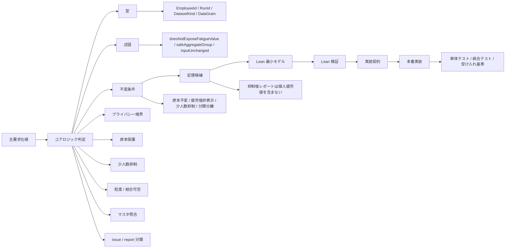
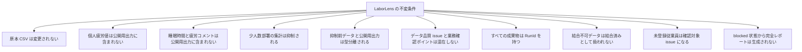
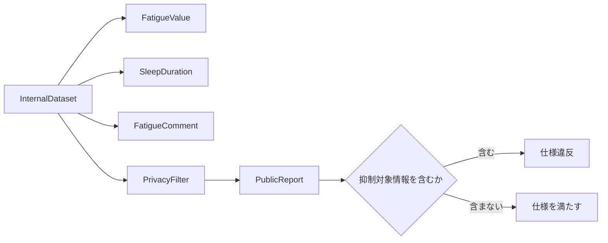

# LaborLens Lean 仕様化計画

Date: 2026-06-02
Status: brushed draft
Source:

- `docs/product/REQUIREMENTS_BRUSHED.md`
- `docs/product/LEAN-SPEC-PLANNING.md`

Related:

- `docs/product/GLOSSARY.md`
- `docs/product/BUSINESS-RULES.md`
- `docs/product/ACCEPTANCE-CRITERIA.md`
- `docs/product/DATA-DESIGN.md`
- `docs/product/ARCHITECTURE.md`
- `docs/product/TEST-PLAN.md`

## 0. 要約

この文書は、LaborLens の主要求仕様から Lean で先に検証すべきコアロジックを抽出し、型、述語、不変条件、定理候補、検証順序、本番実装への移行条件を定義するための計画文書である。

Lean 検証の主対象はコアロジックに限定する。CSV パーサ、ファイルシステム IO、GUI 操作、PDF / Markdown の見た目は無理に Lean 仕様化しない。入出力の境界を扱う場合も、実 GUI ではなく、疑似 CLI コマンド、入力参照、出力 artifact の構造を表す最小モデルにとどめる。

LaborLens では、コアロジックに該当する処理について、本番実装に入る前に Lean 仕様化と Lean 検証を行う。Lean 検証が未完了のコアロジックは、本番実装ではなく `prototype`、`spike`、`demo` として扱う。

Lean で先に固定する対象は、画面、PDF、Markdown、自然文、CSV パーサ、DB 物理設計の詳細ではない。対象は、製品の安全性、信頼性、データ分類の正しさを支える仕様である。具体的には、プライバシー境界、少人数部署抑制、原本保護、粒度判定、結合可否、従業員マスタ照合、issue / report 分類、成果物の `RunId` 保持を優先する。

最初の Lean 化対象は、プライバシー境界とする。`FatigueValue` を内部データ、`PublicReport` を公開用出力、`PrivacyFilter` を内部データから公開用出力への変換として表し、`PrivacyFilter` 後の `PublicReport` に個人疲労値、睡眠時間、疲労コメントなどの抑制対象情報が含まれないことを検証する。

## 1. 目的

この文書の目的は、`REQUIREMENTS_BRUSHED.md` に書かれた製品要求のうち、Lean で表現し検証する対象を整理することである。

主要求仕様は、日本語による製品要求、利用者価値、安全境界、非機能要求、後続工程への引き継ぎを定義する。一方、この文書では、主要求仕様のうち次の性質を持つ部分を Lean の型、述語、不変条件、定理候補へ分解する。

- 誤ると個人情報、健康関連情報、法務・医療・人事評価に関する安全境界を破るもの
- 誤ると原本保護、再現性、成果物の信頼性が崩れるもの
- 誤るとデータ粒度、結合可否、従業員マスタ照合、issue 分類、report 分類が不正確になるもの
- 型、述語、不変条件、定理として表現できるもの
- 実装開始前に仕様として固定すべきもの

Lean 仕様は、本番コードそのものの完全な正しさ証明ではない。初期段階では、Lean 側で「守るべき性質」を明確化し、最小モデル上で検証する。その検証結果を本番実装の前提仕様として扱い、実装側では単体テスト、プロパティテスト、統合テスト、受け入れ基準によって対応を確認する。

## 2. 位置づけ

Lean 仕様は、製品仕様全体を置き換えない。Lean で扱うのは、製品の安全性、信頼性、分類の正しさに関する中核仕様である。

Lean で扱う代表例は次のとおりである。

- 原本 CSV が変更されないこと
- 個人疲労値、睡眠時間、疲労コメントが公開用出力に出ないこと
- 少人数部署または個人推測リスクのある集計が表示可能な集計結果に含まれないこと
- 結合できないデータを結合済みとして扱わないこと
- 従業員 ID を持たない人件費データを個人勤怠と結合可能として扱わないこと
- 未登録従業員、退職済み、部署不一致などを確認対象 issue として扱うこと
- データ品質 issue と業務確認ポイントを混在させないこと
- すべての成果物が `RunId` と入力参照を持つこと

この文書が決めること:

- コアロジックの判定基準
- Lean 検証を本番実装前に行うゲート条件
- Lean 化する型、述語、不変条件、定理候補
- フェーズごとの Lean 検証順序
- Lean 検証後に本番実装へ渡す実装契約
- 初期スコープ外とする対象

この文書が決めないこと:

- 画面レイアウト
- UI 操作フロー
- GUI 入出力仕様
- PDF / Markdown の見た目
- CSV パーサの詳細実装
- ファイルシステム IO の詳細実装
- ローカル DB の物理スキーマ
- バックグラウンドジョブの実装方式
- パフォーマンス目標値
- 自然文の細かな言い回し
- 認証、暗号化、ログマスキングの具体設計

これらは `EXTERNAL-DESIGN.md`、`DATA-DESIGN.md`、`ARCHITECTURE.md`、`TEST-PLAN.md`、`OPERATIONS.md` で扱う。

## 3. 本番実装前の Lean 検証ゲート

LaborLens では、コアロジックに該当する処理について、本番実装より先に Lean 仕様化と Lean 検証を行う。

### 3.1 基本ルール

コアロジックは、次の状態になるまで本番実装に入らない。

1. 対応する主要求 ID または要求項目が特定されている。
2. Lean で表す型が定義されている。
3. Lean で表す述語が定義されている。
4. 守るべき不変条件が定義されている。
5. 少なくとも 1 つ以上の定理候補が Lean 上に記述されている。
6. 最小モデルで主要性質の検証が通っている。
7. Lean で検証した性質と本番実装側の責務分担が明確である。
8. Lean では扱わない制約、仮定、未決事項が明示されている。
9. 対応する実装テストまたは受け入れ基準への引き継ぎ先が決まっている。

上記を満たさない場合、その実装は本番実装ではなく、`prototype`、`spike`、`demo` のいずれかとして扱う。

### 3.2 ゲート判定

| 判定 | 意味 | 実装扱い |
| --- | --- | --- |
| `verified` | Lean の型、述語、不変条件、主要定理が定義され、最小モデルで検証済み | 本番実装へ進める |
| `specified` | Lean の型、述語、不変条件は定義済みだが、主要定理の証明が未完了 | 本番実装不可。spike まで |
| `candidate` | Lean 化候補として整理済みだが、型または述語が未確定 | 本番実装不可。仕様検討中 |
| `out_of_scope` | 初期 Lean 検証の対象外 | 通常の設計、テスト、レビューで扱う |
| `blocked` | 要求、業務ルール、閾値、用語定義が未確定 | 実装不可。要求または業務ルールへ戻す |

### 3.3 例外扱い

次の場合は、コアロジックであっても Lean 検証前に実験コードを作成してよい。ただし、本番実装としては扱わない。

- 仕様化のために必要な spike
- UI デモ用の仮実装
- 架空データだけを使うローカルデモ
- 性能検証用のプロトタイプ
- Lean 仕様の妥当性を確認するための最小実装

例外扱いの実装には、次のいずれかのラベルを付ける。

- `prototype-only`
- `spike-only`
- `demo-only`
- `not-production-ready`
- `awaiting-lean-verification`

## 4. コアロジックの判定基準

コアロジックとは、製品の安全性、信頼性、データ分類の正しさを支える処理である。見た目や操作性ではなく、誤ると製品として守るべき制約が破られる処理を指す。

次のいずれかに該当する処理は、原則としてコアロジックとする。

### 4.1 安全境界に関わる処理

個人情報、健康関連情報、法務・医療・人事評価に関する誤出力につながる処理。

例:

- 個人疲労値の表示可否
- 睡眠時間、疲労コメントの出力可否
- 個人別疲労ランキングの禁止
- 少人数部署集計の抑制
- ガイド AI が抑制対象情報を復元しないこと
- 法務、医療、人事評価の最終判断として読める文言を出さないこと

### 4.2 信頼性と再現性に関わる処理

実行結果の信頼性、再確認可能性、原本保護を支える処理。

例:

- 原本 CSV を変更しないこと
- 入力ハッシュを保持すること
- `RunId` を成果物に保持すること
- 実行設定と対象期間を成果物に紐づけること
- 再確認時に修正前後の入力を区別できること

### 4.3 データ分類に関わる処理

誤分類すると利用者の判断材料を誤らせる処理。

例:

- `ready` / `partial` / `blocked` の分類
- `schema_issue` / `data_quality_issue` / `master_issue` / `grain_issue` / `join_issue` / `privacy_issue` の分類
- 従業員マスタ照合
- 退職済み、部署不一致の扱い
- データ粒度判定
- 結合可否判定

### 4.4 型、述語、不変条件として表現できる処理

Lean で型、述語、不変条件、定理候補として表現しやすい処理。

例:

- `doesNotExposeFatigueValue report`
- `safeAggregateGroup group`
- `inputUnchanged before after`
- `joinableLaborCost cost attendance`
- `existsInMaster employee master`
- `hasRunId artifact`
- `isBlocked readiness`

## 5. コアロジック一覧

| 優先度 | コアロジック | 主な要求 | Lean で検証する性質 | 本番実装へ渡す契約 |
| --- | --- | --- | --- | --- |
| P0 | プライバシー境界 | `FR-PRIVACY-001`, `FR-PRIVACY-004`, `SAFETY-001`, `SAFETY-002` | `PrivacyFilter` 後の `PublicReport` に個人疲労値、睡眠時間、疲労コメントが含まれない | 公開用出力は必ず `PrivacyFilter` 後の型だけを受け取る |
| P0 | 抑制前データと公開用出力の型分離 | `FR-PRIVACY-004`, `NFR-SEC-001` | `InternalDataset` と `PublicReport` が型レベルで混在しない | レポート生成 API は内部データ型を直接返さない |
| P0 | 少人数部署抑制 | `FR-PRIVACY-002`, `SAFETY-006` | `safeAggregateGroup` を満たさない集計が表示可能な集計結果に含まれない | 集計表示前に抑制判定を必ず通す |
| P1 | 原本保護 | `FLOW-001`, `FR-CSV-002`, `FR-CSV-003` | 実行前後で原本入力または入力ハッシュが変化しない | 原本保存後の処理は再生成可能データだけを変更する |
| P1 | 粒度判定と結合可否 | `FR-GRAIN-001`, `FR-GRAIN-002`, `FR-GRAIN-003` | 従業員 ID を持たない人件費データが個人勤怠と結合可能に分類されない | 結合処理は `JoinAssessment` を前提にする |
| P1 | 従業員マスタ照合 | `FR-MASTER-001`, `FR-MASTER-002` | 未登録従業員、退職済み、部署不一致が確認対象 issue を生成する | マスタ照合結果は issue 出力の前提になる |
| P1 | issue / report 分類 | `NFR-UX-002`, `NFR-UX-003` | データ品質 issue と業務確認ポイントが混在しない | issue CSV と業務レポートの型を分ける |
| P2 | 成果物の `RunId` 保持 | `FLOW-002`, `NFR-REL-002`, `NFR-REL-004` | すべての成果物が `RunId`、入力参照、正規化参照、ポリシー参照、出力参照、監査参照を持つ | 成果物生成時に `RunArtifact` を必須フィールドにする |
| P2 | 準備状態 | `ready`, `partial`, `blocked` | `blocked` の入力から完全レポートが生成されない | レポート生成前に readiness を確認する |
| P2 | ガイド AI の安全境界 | `FR-PRIVACY-005`, `NFR-SEC-002`, `AI-SAFE` | 抑制対象情報がガイド AI の回答対象データに含まれない | RAG 対象は承認済み、版管理済み、抑制後情報に限定する |

## 6. Lean 化マップ



## 7. 型として表す候補

| 型 | 意味 | 優先度 | 備考 |
| --- | --- | --- | --- |
| `EmployeeId` | 従業員識別子 | P1 | マスタ照合、勤怠、人件費結合に使う |
| `DepartmentId` | 部署識別子 | P0 | 少人数部署抑制に使う |
| `StoreId` | 店舗識別子 | P2 | 店舗別集計、運用確認に使う |
| `RunId` | 実行識別子 | P2 | 成果物と入力参照の紐づけに使う |
| `TenantId` | テナント識別子 | P2 | 顧客別設定情報と RAG 対象の分離に使う |
| `InputHash` | 原本入力のハッシュ | P1 | 原本保護、再確認に使う |
| `InputRef` | 入力参照 | P1 | 入力ファイル ID、SHA-256、アップロード時刻、テナント ID、スキーマバージョン |
| `NormalizedRef` | 正規化結果参照 | P1 | 正規化済みデータ ID、正規化ルール版、列名マッピング版 |
| `PolicyRef` | ポリシー参照 | P1 | 抑制ポリシー版、個人推測リスク閾値、RAG 許可文書版、アクセス制御版 |
| `OutputRef` | 出力参照 | P1 | 抑制済み成果物 ID、出力ハッシュ、生成時刻 |
| `AuditRef` | 監査参照 | P1 | 実行者、権限、実行理由、アクセスログ |
| `DatasetKind` | 入力データ種別 | P1 | 勤怠、人件費、売上、従業員マスタ、疲労関連データなど |
| `DataGrain` | データ粒度 | P1 | 従業員別、部署別、店舗別、日別、月別、時間帯別など |
| `ReadinessStatus` | データ準備状態 | P2 | `ready`、`partial`、`blocked` |
| `IssueCategory` | issue 分類 | P1 | schema、data_quality、master、grain、join、privacy、processing |
| `IssueCode` | issue コード | P1 | 詳細体系は `BUSINESS-RULES.md` と `ACCEPTANCE-CRITERIA.md` で定義 |
| `IssueSeverity` | issue 優先度 | P1 | critical、high、medium、low |
| `PrivacyStatus` | 表示可能、抑制済みなどの状態 | P0 | 公開用出力の安全状態を表す |
| `WorkRiskSignal` | 勤務実績から導出する労務リスク指標 | P0 | 長時間労働、深夜勤務、休憩不足、連勤、有休取得不足など。医学的診断ではない |
| `FatigueRiskCategory` | 疲労リスク区分 | P0 | `None`、`Low`、`Medium`、`High`。公開用出力では個人単位にしない |
| `FatigueValue` | 内部データとしての個人疲労リスク値 | P0 | 公開用出力に含めない。医学的診断として扱わない |
| `SleepDuration` | 内部データとしての睡眠時間 | P0 | 入力に含まれる場合も公開用出力に含めない |
| `FatigueComment` | 入力に含まれ得る疲労関連自由記述 | P0 | 正規化対象にせず、公開用出力に含めない |
| `InternalDataset` | 抑制前の内部データ | P0 | 公開用出力と型分離する |
| `AnalysisDataset` | 集計・確認ポイント整理に使う内部データ | P0 | 公開前に抑制を通す |
| `AggregateGroup` | 集計単位 | P0 | 少人数部署抑制に使う |
| `PublicReport` | ユーザー向けまたは外部向けの公開用出力 | P0 | 抑制済み出力のみを表す |
| `SuppressionReason` | 抑制理由 | P0 | 少人数、健康関連、個人推測リスクなど |
| `AccessRole` | 抑制前データへのアクセス主体ロール | P0 | システム管理者、監査担当、データ保護責任者、限定運用担当など |
| `AccessPurpose` | 抑制前データ参照目的 | P0 | 明示目的とチケット番号を持つ |
| `AccessScope` | 抑制前データ参照範囲 | P0 | 必要最小限の `RunId`、`DatasetId`、対象期間 |
| `Approval` | 抑制前データ参照承認 | P0 | 承認者、承認参照、期限を持つ |
| `AccessTime` | 抑制前データ参照時刻 | P0 | 期間制限の判定に使う |
| `Artifact` | 生成成果物 | P2 | `RunId` と入力参照を必須にする |
| `RunArtifact` | 実行成果物の追跡スキーマ | P1 | `RunId` から入力、正規化、ポリシー、出力、監査ログを追跡する |
| `AllowedGuideDocument` | RAG 許可文書 | P1 | 承認済み、版管理済み、抑制後情報だけを表す |
| `RagIndexVersion` | RAG インデックス版 | P2 | 回答根拠と更新条件の追跡に使う |

## 8. 述語として表す候補

| 述語 | 意味 | 優先度 | 検証対象 |
| --- | --- | --- | --- |
| `doesNotExposeFatigueValue report` | 個人疲労値が公開用出力に現れない | P0 | プライバシー境界 |
| `doesNotExposeSleepDuration report` | 個人の睡眠時間が公開用出力に現れない | P0 | プライバシー境界 |
| `doesNotExposeFatigueComment report` | 個人の疲労コメントが公開用出力に現れない | P0 | プライバシー境界 |
| `doesNotExposeSuppressedData report` | 抑制対象情報が公開用出力に現れない | P0 | プライバシー境界の一般化 |
| `safeAggregateGroup group` | 集計単位が少人数部署または推測可能単位ではない | P0 | 少人数部署抑制 |
| `isSuppressed group result` | 抑制対象グループの結果が抑制済みである | P0 | 少人数部署抑制 |
| `hasReidentificationRisk group context` | 集計単位または回答が個人推測リスクを持つ | P0 | 差分推測、属性組合せ、自然言語表現 |
| `CanAccessRawData role purpose scope approval time` | 抑制前データへのアクセスが許可される | P0 | Default Deny と許可条件 |
| `inputUnchanged before after` | 原本入力が実行前後で変化しない | P1 | 原本保護 |
| `hashUnchanged before after` | 入力ハッシュが実行前後で変化しない | P1 | 原本保護 |
| `hasRunId artifact` | 成果物が `RunId` を持つ | P2 | 再現性 |
| `hasInputReference artifact` | 成果物が入力参照を持つ | P2 | 再現性 |
| `hasRunArtifactRefs artifact` | 成果物が入力、正規化、ポリシー、出力、監査参照を持つ | P1 | 成果物追跡性 |
| `isAllowedGuideDocument doc` | RAG 対象が承認済み、版管理済み、抑制後情報である | P1 | ガイド AI 安全境界 |
| `validAttendanceRow row` | 勤怠行が有効な時刻範囲を持つ | P2 | データ品質検査 |
| `existsInMaster employee master` | 従業員がマスタに存在する | P1 | マスタ照合 |
| `activeInPeriod employee period master` | 対象期間に従業員が在籍扱いである | P1 | マスタ照合 |
| `departmentConsistent employee row master` | 行の部署とマスタ上の部署が整合する | P1 | マスタ照合 |
| `joinableLaborCost cost attendance` | 人件費データが個人勤怠と結合可能である | P1 | 粒度判定と結合可否 |
| `hasEmployeeId dataset` | データセットが従業員 ID 粒度を持つ | P1 | 結合可否 |
| `compatibleGrain left right` | 2 つのデータ粒度が結合目的に対して整合する | P1 | 結合可否 |
| `isDataQualityIssue issue` | issue がデータ品質 issue である | P1 | issue 分類 |
| `isBusinessCheck reportItem` | 項目が業務確認ポイントである | P1 | report 分類 |
| `separateIssueAndReport issue report` | issue と業務確認ポイントが混在しない | P1 | 分類分離 |
| `canGenerateFullReport readiness` | 完全レポートを生成できる準備状態である | P2 | readiness |
| `guideUsesOnlyPublicSources answer sources` | ガイド AI が公開可能な根拠だけを参照する | P2 | ガイド AI 安全境界 |

## 9. 不変条件として表す候補



| 不変条件 | 意味 | 優先度 |
| --- | --- | --- |
| `InvariantPrivacyBoundary` | 公開用出力には抑制対象の個人健康情報が含まれない | P0 |
| `InvariantInternalPublicSeparation` | 抑制前内部データと公開用出力が混在しない | P0 |
| `InvariantSmallGroupSuppression` | 少人数部署または個人推測リスクのある集計は表示可能な結果に含まれない | P0 |
| `InvariantRawDataAccessDefaultDeny` | 抑制前データは許可条件を満たす主体以外に渡らない | P0 |
| `InvariantSourceImmutability` | 原本 CSV または入力ハッシュは実行前後で変化しない | P1 |
| `InvariantJoinSoundness` | 結合不可データは結合済みとして扱われない | P1 |
| `InvariantMasterIssueGeneration` | 未登録、退職済み、部署不一致は確認対象 issue になる | P1 |
| `InvariantIssueReportSeparation` | データ品質 issue と業務確認ポイントは型または分類上分離される | P1 |
| `InvariantArtifactTraceability` | すべての成果物は `RunId`、入力参照、実行設定参照を持つ | P2 |
| `InvariantReadinessGate` | `blocked` 状態では完全レポートを生成しない | P2 |
| `InvariantGuideSafety` | ガイド AI は抑制前データを直接回答対象にしない | P2 |

## 10. 定理命名規則

Lean の定理名は、原則として動詞 + 目的語 + 補語または条件の形にする。lowerCamelCase を使い、主語を前置した `privacyFilter_hidesFatigueValue` のような形や、状態を主語にした `unsafeGroup_isSuppressed` のような形は避ける。

例:

| 避ける形 | 採用する形 |
| --- | --- |
| `privacyFilter_hidesFatigueValue` | `hideFatigueValueFromPublicReport` |
| `unsafeGroup_isSuppressed` | `suppressUnsafeAggregateGroup` |
| `sourcePreservation_keepsInputHash` | `preserveInputHashAfterSourceSave` |
| `generatedArtifact_hasRunId` | `attachRunIdToGeneratedArtifact` |

述語名は `doesNotExposeFatigueValue report`、`safeAggregateGroup group` のように性質を表してよい。ただし、定理名は検証する作用が読み取れる動詞始まりにする。

## 11. 定理候補

| 定理候補 | Lean 名候補 | 期待する意味 | 優先度 |
| --- | --- | --- | --- |
| 疲労値非表示定理 | `hideFatigueValueFromPublicReport` | `PrivacyFilter` 後の `PublicReport` には個人疲労値が含まれない | P0 |
| 睡眠時間非表示定理 | `hideSleepDurationFromPublicReport` | `PrivacyFilter` 後の `PublicReport` には個人睡眠時間が含まれない | P0 |
| 疲労コメント非表示定理 | `hideFatigueCommentFromPublicReport` | `PrivacyFilter` 後の `PublicReport` には個人疲労コメントが含まれない | P0 |
| 抑制対象非表示定理 | `hideSuppressedDataFromPublicReport` | 抑制対象情報は公開用出力に現れない | P0 |
| 型分離定理 | `excludeInternalRecordFromPublicReport` | `PublicReport` は `InternalRecord` を直接保持しない | P0 |
| 少人数抑制定理 | `suppressUnsafeAggregateGroup` | `safeAggregateGroup group = false` の集計は表示可能結果に含まれない | P0 |
| 個人推測リスク抑制定理 | `suppressReidentificationRiskFromPublicReport` | 差分推測、属性組合せ、自然言語表現により個人推測可能な結果は公開用出力に含まれない | P0 |
| 抑制前データアクセス制限定理 | `denyRawDataAccessWithoutAuthorization` | `¬ CanAccessRawData role purpose scope approval time` の場合、抑制前データは渡らない | P0 |
| 原本保護定理 | `preserveInputHashAfterSourceSave` | 原本保護処理を通した後も入力ハッシュは変化しない | P1 |
| 従業員 ID なし結合不可定理 | `rejectPersonalJoinWithoutEmployeeId` | 従業員 ID を持たない人件費データは個人勤怠と結合可能に分類されない | P1 |
| 粒度不整合定理 | `rejectJoinForIncompatibleGrain` | 粒度が分析目的に対して不整合なデータは結合可能に分類されない | P1 |
| 未登録従業員 issue 定理 | `generateMasterIssueForMissingEmployee` | 未登録従業員を含む勤怠行は確認対象 issue を生成する | P1 |
| 退職済み従業員 issue 定理 | `generateMasterIssueForInactiveEmployee` | 対象期間に在籍していない従業員行は確認対象 issue を生成する | P1 |
| 部署不一致 issue 定理 | `generateMasterIssueForDepartmentMismatch` | 行の部署とマスタの部署が一致しない場合、確認対象 issue を生成する | P1 |
| issue / report 分離定理 | `separateIssueFromBusinessCheck` | データ品質 issue と業務確認ポイントは混在しない | P1 |
| 成果物追跡定理 | `attachRunIdToGeneratedArtifact` | 生成成果物は `RunId` を持つ | P2 |
| 成果物参照追跡定理 | `attachTraceRefsToRunArtifact` | `RunArtifact` は `InputRef`、`NormalizedRef`、`PolicyRef`、`OutputRef`、`AuditRef` を持つ | P1 |
| readiness ゲート定理 | `blockFullReportWhenReadinessBlocked` | `blocked` 状態から完全レポートは生成されない | P2 |
| ガイド AI 安全定理 | `restrictGuideAnswerToPublicSources` | ガイド AI の回答対象は承認済み、版管理済み、抑制後情報に限定される | P2 |

## 12. 最初に Lean 化する範囲

最初の Lean 化は、プライバシー境界に絞る。

理由:

- 禁止事項が明確である。
- 個人情報・健康関連情報に関わるため、安全上の優先度が最も高い。
- 内部データと公開用出力の型分離にしやすい。
- `FatigueValue`、`PublicReport`、`PrivacyFilter`、`doesNotExposeFatigueValue` として最小モデル化しやすい。
- 本番実装前に仕様として固定する価値が高い。

最初の対象:



最初の Lean 目標:

- `FatigueValue` を内部データとして表す。
- `SleepDuration` を内部データとして表す。
- `FatigueComment` を内部データとして表す。
- 長時間労働、深夜勤務、休憩不足、連勤、有休取得不足などを `WorkRiskSignal` として表す。
- `CanAccessRawData role purpose scope approval time` を、抑制前データ参照の許可述語として表す。
- `InternalDataset` と `PublicReport` を型分離する。
- `PrivacyFilter` を内部データから公開用出力への変換として表す。
- `PrivacyFilter` 後の `PublicReport` に個人疲労値が含まれない性質を定義する。
- 可能であれば、睡眠時間、疲労コメント、個人別ランキングも抑制対象として一般化する。

## 13. Phase 1: プライバシー境界の詳細計画

### 12.1 対象

Phase 1 では、次の概念だけを扱う。

- `EmployeeId`
- `FatigueValue`
- `SleepDuration`
- `FatigueComment`
- `SensitiveField`
- `InternalRecord`
- `InternalDataset`
- `AccessRole`
- `AccessPurpose`
- `AccessScope`
- `Approval`
- `AccessTime`
- `CanAccessRawData`
- `PublicField`
- `PublicReport`
- `PrivacyFilter`
- `doesNotExposeFatigueValue`
- `doesNotExposeSuppressedData`

### 12.2 扱わないもの

Phase 1 では、次を扱わない。

- 実際の CSV 読み込み
- CSV 列名の正規化
- DB 保存
- 画面表示
- PDF / Markdown レイアウト
- 自然文の読みやすさ
- LLM の回答品質
- 少人数部署閾値の業務上の妥当性評価
- 認証、権限、暗号化

### 12.3 Lean スケッチ

以下は設計意図を示すスケッチであり、最終的な Lean 実装では命名やデータ構造を調整してよい。

```lean
namespace LaborLens.Privacy

structure EmployeeId where
  value : String

structure FatigueValue where
  value : Nat

structure SleepDuration where
  minutes : Nat

structure FatigueComment where
  text : String

inductive FatigueRiskCategory where
  | none
  | low
  | medium
  | high

structure WorkRiskSignal where
  scheduledWorkMinutes : Nat
  actualWorkMinutes : Nat
  overtimeMinutes : Nat
  nightWorkMinutes : Nat
  breakMinutes : Nat
  breakShortage : Bool
  consecutiveWorkDays : Nat
  holidayTakenDays : Nat
  paidLeaveTakenDays : Nat
  absenceDays : Nat
  fatigueRiskCategory : FatigueRiskCategory

inductive SensitiveField where
  | fatigueValue : EmployeeId -> FatigueValue -> SensitiveField
  | sleepDuration : EmployeeId -> SleepDuration -> SensitiveField
  | fatigueComment : EmployeeId -> FatigueComment -> SensitiveField
  | workRiskSignal : EmployeeId -> WorkRiskSignal -> SensitiveField

inductive AccessRole where
  | systemAdmin
  | auditor
  | dataProtectionOfficer
  | limitedOperator
  | generalAdmin
  | guideAI
  | ragIndex
  | normalUser

structure AccessPurpose where
  description : String
  ticketNumber : String

structure AccessScope where
  runId : String
  datasetId : String

structure Approval where
  approved : Bool
  approvalRef : String

structure AccessTime where
  withinLimit : Bool

def allowedRawAccessRole : AccessRole -> Prop
  | AccessRole.systemAdmin => True
  | AccessRole.auditor => True
  | AccessRole.dataProtectionOfficer => True
  | AccessRole.limitedOperator => True
  | _ => False

def HasExplicitPurpose (purpose : AccessPurpose) : Prop :=
  purpose.description ≠ "" ∧ purpose.ticketNumber ≠ ""

def HasLimitedScope (scope : AccessScope) : Prop :=
  scope.runId ≠ "" ∧ scope.datasetId ≠ ""

def CanAccessRawData
  (role : AccessRole)
  (purpose : AccessPurpose)
  (scope : AccessScope)
  (approval : Approval)
  (time : AccessTime) : Prop :=
  allowedRawAccessRole role ∧
  HasExplicitPurpose purpose ∧
  HasLimitedScope scope ∧
  approval.approved = true ∧
  time.withinLimit = true

inductive RawDataAccessDecision where
  | granted
  | denied

def rawDataAccessDecision
  (role : AccessRole)
  (purpose : AccessPurpose)
  (scope : AccessScope)
  (approval : Approval)
  (time : AccessTime) : RawDataAccessDecision :=
  if CanAccessRawData role purpose scope approval time then
    RawDataAccessDecision.granted
  else
    RawDataAccessDecision.denied

structure RunId where value : String
structure TenantId where value : String
structure InputRef where
  inputId : String
  fileHashSha256 : String
  schemaVersion : String

structure NormalizedRef where
  normalizedDatasetId : String
  normalizationRuleVersion : String
  columnMappingVersion : String

structure PolicyRef where
  suppressionPolicyVersion : String
  inferenceThresholdK : Nat
  ragIndexVersion : String
  accessPolicyVersion : String

structure OutputRef where
  artifactId : String
  outputHashSha256 : String

structure AuditRef where
  actorId : String
  actorRole : String
  executionReason : String
  accessLogRef : String

structure RunArtifact where
  runId : RunId
  tenantId : TenantId
  inputRef : InputRef
  normalizedRef : NormalizedRef
  policyRef : PolicyRef
  outputRef : OutputRef
  auditRef : AuditRef

structure AllowedGuideDocument where
  guideDocumentId : String
  documentVersion : String
  sourceUpdatedAt : String
  ragIndexVersion : String
  privacySafe : Bool
  approved : Bool

structure InternalRecord where
  employeeId : EmployeeId
  sensitive : List SensitiveField

structure InternalDataset where
  records : List InternalRecord

inductive PublicField where
  | aggregateText : String -> PublicField
  | suppressionNotice : String -> PublicField
  | sourceNote : String -> PublicField

structure PublicReport where
  fields : List PublicField

def hasRunArtifactRefs (artifact : RunArtifact) : Prop :=
  artifact.inputRef.inputId ≠ "" ∧
  artifact.normalizedRef.normalizedDatasetId ≠ "" ∧
  artifact.policyRef.suppressionPolicyVersion ≠ "" ∧
  artifact.outputRef.artifactId ≠ "" ∧
  artifact.auditRef.accessLogRef ≠ ""

def isAllowedGuideDocument (doc : AllowedGuideDocument) : Prop :=
  doc.approved = true ∧
  doc.documentVersion ≠ "" ∧
  doc.ragIndexVersion ≠ "" ∧
  doc.privacySafe = true

-- 実装では、PublicField に SensitiveField を入れられない設計にする。
def containsFatigueValue (report : PublicReport) : Prop :=
  False

def doesNotExposeFatigueValue (report : PublicReport) : Prop :=
  ¬ containsFatigueValue report

constant privacyFilter : InternalDataset -> PublicReport

theorem hideFatigueValueFromPublicReport
  (dataset : InternalDataset) :
  doesNotExposeFatigueValue (privacyFilter dataset) := by
  -- PublicReport の構造上、FatigueValue が表現できないことを証明する。
  unfold doesNotExposeFatigueValue
  unfold containsFatigueValue
  intro h
  exact h

theorem denyRawDataAccessWithoutAuthorization
  (role : AccessRole)
  (purpose : AccessPurpose)
  (scope : AccessScope)
  (approval : Approval)
  (time : AccessTime)
  (h : ¬ CanAccessRawData role purpose scope approval time) :
  rawDataAccessDecision role purpose scope approval time = RawDataAccessDecision.denied := by
  unfold rawDataAccessDecision
  split
  · contradiction
  · rfl

end LaborLens.Privacy
```

### 12.4 Lean 検証上の仮定と限界

Phase 1 の Lean 検証は、まず型レベルでの漏洩防止を扱う。つまり、`PublicReport` の構造上、`FatigueValue`、`SleepDuration`、`FatigueComment` などの内部データ型を直接保持できないことを検証する。

ただし、公開用出力に任意の `String` を許す場合、文字列の中に疲労値や睡眠時間が埋め込まれていないことまでは、単純な型分離だけでは証明できない。そのため、Phase 1 では次のいずれかを選ぶ。

1. `PublicReport` を自由文字列ではなく、公開可能な構造化フィールドだけで構成する。
2. 文字列レンダリング関数を別途モデル化し、内部データから直接文字列を生成できないことを検証する。
3. Lean では型レベルの漏洩防止までを扱い、文字列レンダリング上の漏洩は実装テストと受け入れ基準で扱う。

初期方針は 1 と 3 の併用とする。Lean では `PublicReport` を構造化し、実装側では疑似 CLI 仕様と成果物テストにより、Markdown、JSON、CSV、PDF、UI 表示用 JSON に個人疲労値、睡眠時間、疲労コメントが出ないことを確認する。GUI 操作そのものは Lean の検証対象にしない。

### 12.5 Phase 1 の完了条件

Phase 1 は次を満たしたら完了とする。

- `FatigueValue` が内部データとして定義されている。
- `PublicReport` が公開用出力として定義されている。
- `InternalDataset` と `PublicReport` が型として分離されている。
- `PrivacyFilter` の入力と出力が定義されている。
- `doesNotExposeFatigueValue` が定義されている。
- `hideFatigueValueFromPublicReport` が Lean 上で検証されている。
- 睡眠時間、疲労コメントへの拡張方針が記録されている。
- 本番実装側の抑制処理 API が Lean 仕様に対応している。

## 14. Phase 計画

| Phase | 目的 | Lean 成果物 | 本番実装との関係 | 完了条件 |
| --- | --- | --- | --- | --- |
| Phase 0 | 本番実装前の Lean 検証方針を固定する | この文書 | まだ実装しない | コアロジック、検証ゲート、優先順位が明記されている |
| Phase 1 | プライバシー境界を検証する | `Privacy.lean` | 抑制処理、公開用レポート生成の前提になる | `hideFatigueValueFromPublicReport` が通る |
| Phase 2 | 少人数部署抑制を検証する | `AggregationPrivacy.lean` | 集計表示、抑制済みレポートの前提になる | `suppressUnsafeAggregateGroup` が通る |
| Phase 3 | 原本保護を検証する | `SourcePreservation.lean` | CSV 取込、再確認、入力ハッシュ記録の前提になる | `preserveInputHashAfterSourceSave` が通る |
| Phase 4 | 粒度判定と結合可否を検証する | `Joinability.lean` | 人件費粒度レポート、結合処理の前提になる | `rejectPersonalJoinWithoutEmployeeId` が通る |
| Phase 5 | 従業員マスタ照合を検証する | `MasterCheck.lean` | `master_issue` 出力の前提になる | `generateMasterIssueForMissingEmployee` が通る |
| Phase 6 | issue / report 分類を検証する | `IssueReportSeparation.lean` | `issues.csv` と業務レポートの分離に使う | `separateIssueFromBusinessCheck` が通る |
| Phase 7 | 成果物追跡性を検証する | `ArtifactTraceability.lean` | `run_summary.json`、各レポート成果物の前提になる | `attachRunIdToGeneratedArtifact` が通る |
| Phase 8 | ガイド AI の安全境界を検証する | `GuideSafety.lean` | RAG 対象、回答根拠、安全制約に使う | `restrictGuideAnswerToPublicSources` が定義される |

## 15. 主仕様との対応

| 主仕様の項目 | Lean 仕様化の対象 | 定理候補 | 優先度 |
| --- | --- | --- | --- |
| 原本 CSV を変更しない | `inputUnchanged before after`, `hashUnchanged before after` | 原本保護定理 | P1 |
| 個人疲労値を公開用出力に表示しない | `doesNotExposeFatigueValue report` | 疲労値非表示定理 | P0 |
| 個人の睡眠時間、疲労コメントを公開用出力に表示しない | `doesNotExposeSleepDuration report`, `doesNotExposeFatigueComment report` | 睡眠時間非表示定理、疲労コメント非表示定理 | P0 |
| 抑制前内部データと抑制後公開用出力を区別する | `InternalDataset`, `PublicReport` | 型分離定理 | P0 |
| 少人数部署の集計を抑制する | `safeAggregateGroup group`, `isSuppressed group result` | 少人数抑制定理 | P0 |
| 結合不可データを結合済みとして扱わない | `joinableLaborCost cost attendance`, `compatibleGrain left right` | 結合不可定理 | P1 |
| 従業員 ID を持たない人件費データを個人勤怠と結合しない | `hasEmployeeId dataset`, `joinableLaborCost cost attendance` | 従業員 ID なし結合不可定理 | P1 |
| 未登録従業員を issue として出力する | `existsInMaster employee master` | 未登録従業員 issue 定理 | P1 |
| データ品質 issue と業務推奨を分離する | `IssueCategory`, `ReportItem`, `separateIssueAndReport` | issue / report 分離定理 | P1 |
| すべての成果物が `RunId` を持つ | `hasRunId artifact` | 成果物追跡定理 | P2 |
| `RunId` から入力、正規化、ポリシー、出力、監査ログを追跡する | `RunArtifact`, `hasRunArtifactRefs artifact` | 成果物参照追跡定理 | P1 |
| ガイド AI が抑制対象情報を回答しない | `guideUsesOnlyPublicSources answer sources`, `isAllowedGuideDocument doc` | ガイド AI 安全定理 | P2 |

## 16. 実装契約への落とし込み

Lean 検証済みの定理は、そのまま本番コードの関数名やモジュール構造を強制するものではない。ただし、本番実装は Lean で検証した性質を破ってはならない。

| Lean 検証対象 | 実装契約 | テストへの引き継ぎ |
| --- | --- | --- |
| `hideFatigueValueFromPublicReport` | 公開用レポート生成 API は `PrivacyFilteredReport` のみを返す。内部疲労値を直接返さない | 個人疲労値、睡眠時間、疲労コメントが疑似 CLI 生成成果物、Markdown、JSON、CSV、PDF、UI 表示用 JSON に出ないことを確認する |
| `suppressUnsafeAggregateGroup` | 集計結果は表示前に `safeAggregateGroup` 相当の判定を通す | 少人数部署サンプルで非表示、伏せ字、抑制済みになることを確認する |
| `preserveInputHashAfterSourceSave` | 原本保存後の処理は原本ファイルを更新しない。再生成可能データのみ更新する | 実行前後の原本 CSV ハッシュ一致を確認する |
| `rejectPersonalJoinWithoutEmployeeId` | 従業員 ID のない人件費データは個人勤怠と結合しない | 従業員 ID なし人件費データが結合不可として出力されることを確認する |
| `generateMasterIssueForMissingEmployee` | マスタに存在しない従業員 ID は `master_issue` として出力する | 未登録従業員を含むサンプルで issue が出ることを確認する |
| `separateIssueFromBusinessCheck` | `issues.csv` と業務確認レポートの型、出力先、分類を分ける | issue が業務推奨文として混入しないことを確認する |
| `attachRunIdToGeneratedArtifact` | すべての成果物に `RunId` を含める | 各成果物で `RunId` を確認する |
| `attachTraceRefsToRunArtifact` | `RunArtifact` に `InputRef`、`NormalizedRef`、`PolicyRef`、`OutputRef`、`AuditRef` を含める | `run_summary.json` と `artifact_manifest.json` から入力、正規化結果、抑制ポリシー、出力、監査ログを追跡できることを確認する |
| `restrictGuideAnswerToPublicSources` | ガイド AI は承認済み、版管理済み、抑制後情報だけを検索対象にする | 未承認文書、抑制前データ、個人別データ、監査ログ、下書き文書、Slack、メール、チケット原文を検索対象に入れようとした場合に拒否されることを確認する |

## 17. Lean ディレクトリ構成案

```text
lean/
  LaborLens/
    Core/
      Types.lean
      Dataset.lean
      Artifact.lean
    Spec/
      Privacy.lean
      AggregationPrivacy.lean
      SourcePreservation.lean
      Joinability.lean
      MasterCheck.lean
      IssueReportSeparation.lean
      Readiness.lean
      GuideSafety.lean
    Theorems/
      PrivacyTheorems.lean
      SourceTheorems.lean
      JoinTheorems.lean
      MasterTheorems.lean
      ArtifactTheorems.lean
```

構成方針:

- `Core` には共通型を置く。
- `Spec` には各ドメインの述語、不変条件、仕様関数を置く。
- `Theorems` には定理と証明を置く。
- 最初は Phase 1 の `Privacy.lean` と `PrivacyTheorems.lean` だけを作成してよい。
- 本番実装の言語やフレームワークとは独立させる。

## 18. Lean 検証レビュー手順

コアロジックの本番実装は、次の順で進める。

1. 主要求仕様から対象要求 ID を確認する。
2. コアロジック判定表に追加する。
3. Lean の型、述語、不変条件を定義する。
4. 定理候補を書く。
5. 最小モデルで Lean 検証を通す。
6. Lean で検証できたこと、できていないことを記録する。
7. 実装契約へ落とし込む。
8. テスト観点を `ACCEPTANCE-CRITERIA.md` または `TEST-PLAN.md` に引き継ぐ。
9. 本番実装に入る。

レビュー観点:

- 主要求仕様と Lean 仕様の対応が明確か。
- コアロジックの範囲が広すぎないか。
- 型分離で表現できるものを文字列運用にしていないか。
- 定理が実装に渡すべき性質を表しているか。
- Lean で扱わない仮定が明示されているか。
- 本番実装側のテストが Lean 仕様に対応しているか。

## 19. 初期スコープ外

次の内容は本番品質には重要だが、初期の Lean 検証対象には含めない。

- UI 表示順。店舗、部署、雇用区分の `display_order` は UI・帳票仕様で扱い、Lean のブロッカーにはしない。
- 画面レイアウト
- PDF / Markdown の見た目
- CSV パーサの詳細実装
- 文字コード、区切り文字、ヘッダー有無の実装詳細
- ローカル DB の物理設計
- バックグラウンドジョブの性能最適化
- メモリ上限、処理時間目標
- 自然文の読みやすさ
- 表示文言の細部
- 認証、認可、暗号化、ログマスキングの具体実装
- Ollama モデル選定
- RAG インデックスの保持世代数と差分更新方式

これらは、Lean ではなく次の文書で扱う。

| 対象外項目 | 扱う文書 |
| --- | --- |
| UI 表示順、画面レイアウト | `EXTERNAL-DESIGN.md`, `DATA-DESIGN.md` |
| PDF / Markdown の見た目 | `EXTERNAL-DESIGN.md`, `DATA-DESIGN.md` |
| CSV パーサ、正規化データ、ローカル DB | `DATA-DESIGN.md` |
| ローカルサーバー、ジョブ、UI、DB 構成 | `ARCHITECTURE.md` |
| 性能、メモリ、処理時間 | `ARCHITECTURE.md`, `TEST-PLAN.md` |
| 認証、暗号化、ログマスキング | `ARCHITECTURE.md`, `OPERATIONS.md` |
| 自然文品質、表示文言 | `EXTERNAL-DESIGN.md`, `TEST-PLAN.md` |
| ガイド AI のモデル選定 | `ARCHITECTURE.md`, `TEST-PLAN.md` |

## 20. 未決事項

現時点で、Lean 仕様化に必要な主要未決事項はない。運用手順、保持期間、差分更新方式などの実装・運用詳細は `OPERATIONS.md` または `TEST-PLAN.md` で扱う。

次の事項は決定済みであり、Lean 側では `BUSINESS-RULES.md` の値を前提または実行設定として受け取る。

| ID | 決定事項 | Lean への反映 | 参照先 |
| --- | --- | --- | --- |
| LEAN-OPEN-001 | 少人数部署とみなす範囲 | 有効データ数 10 人未満を `safeAggregateGroup = false` の候補にし、10 人以上 30 人未満は注意部署として表示制限の対象にする。 | `BUSINESS-RULES.md` |
| LEAN-OPEN-002 | 個人推測リスクの定義 | 少人数セル、差分推測、属性組合せ、自然言語表現により個人または `k` 未満の集団を推測できる場合は抑制対象にする。 | `BUSINESS-RULES.md`, `ACCEPTANCE-CRITERIA.md` |
| LEAN-OPEN-003 | 疲労関連データの内部型範囲 | `SensitiveField` は医学的診断ではなく、長時間労働、深夜勤務、休憩不足、連勤、有休取得不足などの労務リスク指標を内部型として扱う。病名、診断名、面談内容、理由詳細、自由記述原文は対象外にする。 | `GLOSSARY.md`, `DATA-DESIGN.md` |
| LEAN-OPEN-004 | issue code の体系 | `IssueCode` は `BUSINESS-RULES.md` の安定コード体系を入力分類として扱い、定理名はコード文字列ではなく安全性・分類性質に対応させる。 | `BUSINESS-RULES.md`, `ACCEPTANCE-CRITERIA.md` |
| LEAN-OPEN-005 | `RunId` と入力参照の成果物スキーマ | `RunArtifact` は `RunId`、`TenantId`、`InputRef`、`NormalizedRef`、`PolicyRef`、`OutputRef`、`AuditRef` を持つ。 | `DATA-DESIGN.md` |
| LEAN-OPEN-006 | 抑制前データへのアクセス制御 | `CanAccessRawData role purpose scope approval time` を許可述語とし、条件を満たさない場合は `denyRawDataAccessWithoutAuthorization` の対象にする。 | `ARCHITECTURE.md`, `BUSINESS-RULES.md`, `DATA-DESIGN.md` |
| LEAN-OPEN-007 | ガイド AI の検索対象文書 | `AllowedGuideDocument` は承認済み、版管理済み、抑制後情報だけを表し、未承認文書、抑制前データ、個人別データ、監査ログ、下書き文書、Slack、メール、チケット原文を除外する。 | `DATA-DESIGN.md`, `ARCHITECTURE.md` |
| LEAN-OPEN-008 | レポート出力形式 | `PublicReport` は形式別の見た目ではなく、Markdown、CSV、JSON、PDF、UI JSON の全出力が同じ抑制済み公開データから生成される性質を扱う。 | `DATA-DESIGN.md`, `ARCHITECTURE.md` |

## 21. 次のアクション

1. この文書を `docs/product/LEAN-SPEC-PLANNING.md` として採用する。
2. Phase 1 の Lean ファイルを作成する。
3. `FatigueValue`、`PublicReport`、`PrivacyFilter`、`doesNotExposeFatigueValue` を最小モデル化する。
4. `hideFatigueValueFromPublicReport` を Lean 上で通す。
5. 本番実装側のプライバシー抑制 API に実装契約を渡す。
6. `ACCEPTANCE-CRITERIA.md` に個人疲労値、睡眠時間、疲労コメントが公開用出力に出ないことの受け入れ基準を追加する。
7. Phase 2 として少人数部署抑制に進む。

## 22. 完成判定

この文書の初版は、次を満たせば完成とする。

- コアロジックの定義が明記されている。
- 本番実装前に Lean 検証を行う方針が明記されている。
- Lean 検証が未完了のコアロジックを本番実装として扱わないことが明記されている。
- 何を Lean で検証するかが表で確認できる。
- 最初の Lean 化対象がプライバシー境界であることが明記されている。
- Phase 1 の対象、非対象、完了条件が明記されている。
- 後続フェーズの順序が明記されている。
- Lean で扱わない対象が明記されている。
- 未決事項と決定先が明記されている。
