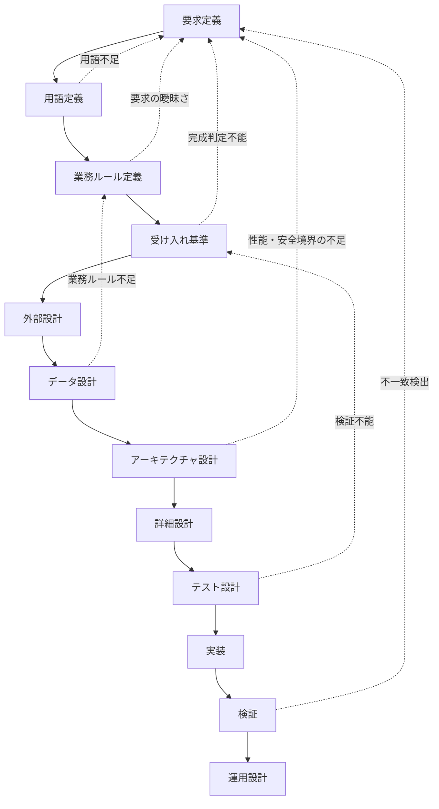

# LaborLens 開発ワークフロー

日付: 2026-06-01
更新日: 2026-06-03
状態: brushed draft
形式: staged waterfall with feedback checkpoints
出典: `docs/planning/WORKFLOW.md`
関連:

- `docs/product/REQUIREMENTS.md`
- `docs/product/USE-CASES.md`
- `docs/product/LEAN-SPEC-PLANNING.md`

## この文書の位置づけ

この文書は、LaborLens を段階的に開発するためのワークフロー定義である。

LaborLens では、コードを書く前に、製品の意味、用語、業務ルール、安全境界、判断基準、データ構造、検証観点を文書として固定する。実装は、これらの文書で確定した意味をコードへ写す工程として扱う。

この文書は、各工程の順序、成果物、参照関係、完了条件、更新ルールを定義する。まだ存在しない文書へのリンクも、今後作成する参照先としてあらかじめ置く。

## 目的

このワークフローの目的は次のとおりである。

- 要求、用語、業務ルール、設計、テスト、実装の責務を分離する。
- 後続工程が前工程の意味を失わずに参照できる状態を作る。
- 実装都合による要求の勝手な言い換えを防ぐ。
- 原本保護、プライバシー抑制、確認支援、安全境界を設計と実装に反映する。
- 仕様変更時に、要求、業務ルール、受け入れ基準、テスト、実装への影響を追跡できるようにする。

## 基本原則

| 原則 | 内容 |
| --- | --- |
| 意味優先 | コード生成より前に、業務上の意味、制約、判断基準、データの形を文書化する。 |
| 責務分離 | 要求、用語、業務ルール、設計、テスト、実装、運用を混在させない。 |
| 原本保護 | 原本 CSV を変更しないという前提を、要求、設計、テスト、運用に一貫して反映する。 |
| 確認支援 | LaborLens は確認材料を整理する。法的判断、医療判断、人事評価、外部共有可否の最終判断は代替しない。 |
| プライバシー境界 | 個人情報、健康関連情報、少人数部署の推測リスクは、表示・出力前に抑制判定を通す。 |
| トレーサビリティ | 成果物、issue、レポート、テスト、実装判断は、参照元の要求またはルールへ戻れるようにする。 |
| ローカル優先 | 主要処理は、ローカルサーバー、ローカル DB、バックグラウンドジョブを前提に設計する。 |
| 戻り可能なウォーターフォール | 工程は順に進める。ただし矛盾や不足が見つかった場合は、該当する前工程へ戻って文書を更新する。 |

## 全体フロー

## 工程一覧

| 順序 | 工程 | 主な成果物 | 状態 | 完了条件 |
| --- | --- | --- | --- | --- |
| 1 | 要求定義 | [`REQUIREMENTS.md`](../product/REQUIREMENTS.md) | 作成済み | 何を作るか、何を満たすべきか、何をしないかが固定されている。 |
| 2 | 用語定義 | [`GLOSSARY.md`](../product/GLOSSARY.md) | 初版作成済み | `RunId`、issue、粒度、抑制、公開用出力、原本 CSV などの意味が定義されている。 |
| 3 | 業務ルール定義 | [`BUSINESS-RULES.md`](../product/BUSINESS-RULES.md) | 初版作成済み | 打刻漏れ、時刻逆転、少人数部署抑制、結合不可などの判定条件が分離されている。 |
| 4 | 受け入れ基準 | [`ACCEPTANCE-CRITERIA.md`](../product/ACCEPTANCE-CRITERIA.md) | 初版作成済み | 要求 ID と検証可能な完成条件が対応している。 |
| 5 | 外部設計 | [`EXTERNAL-DESIGN.md`](../product/EXTERNAL-DESIGN.md) | 初版作成済み | 画面、レポート、操作フロー、入出力、利用者への見せ方が決まっている。 |
| 6 | データ設計 | [`DATA-DESIGN.md`](../product/DATA-DESIGN.md) | 初版作成済み | CSV、正規化データ、ローカル DB、成果物 JSON/CSV の構造が定義されている。 |
| 7 | アーキテクチャ設計 | [`REPOSITORY-PLAN.md`](REPOSITORY-PLAN.md) / [`ARCHITECTURE.md`](../product/ARCHITECTURE.md) | 一部作成済み | ローカルサーバー、DB、ジョブ、UI、ガイド AI の責務分担が決まっている。 |
| 8 | 詳細設計 | [`DETAILED-DESIGN.md`](DETAILED-DESIGN.md) | 未作成 | bounded context、module、API、job、型、エラー、設定の構造が決まっている。 |
| 9 | テスト設計 | [`TEST-PLAN.md`](../product/TEST-PLAN.md) | 初版作成済み | 受け入れ基準、業務ルール、境界条件、性能、安全境界の検証方法が定義されている。 |
| 10 | 実装 | [`IMPLEMENTATION-PLAN.md`](IMPLEMENTATION-PLAN.md) | 初版作成済み | 実装順序、依存関係、リスク、レビュー単位が決まっている。 |
| 11 | 検証 | [`VERIFICATION-REPORT.md`](VERIFICATION-REPORT.md) | 未作成 | 要求、設計、テスト結果、未解決事項の対応関係が確認されている。 |
| 12 | 運用設計 | [`OPERATIONS.md`](../product/OPERATIONS.md) | 初版作成済み | 起動、停止、ログ、バックアップ、障害時対応、データ保護方針が定義されている。 |

## 文書ごとの責務

| 文書 | 扱うこと | 扱わないこと |
| --- | --- | --- |
| `REQUIREMENTS.md` | 製品目的、利用者、対象範囲、機能要求、安全境界、非機能要求 | 詳細な判定式、DB スキーマ、画面レイアウト、テストケース |
| `GLOSSARY.md` | 用語の意味、表記揺れ、同義語、使ってよい文脈 | 業務判断の条件、実装方法 |
| `BUSINESS-RULES.md` | issue 判定、集計可否、抑制条件、業務上の分類 | UI 表示、DB 物理設計、コード構造 |
| `ACCEPTANCE-CRITERIA.md` | 完成判定、検証観点、要求 ID との対応 | 詳細なテスト手順、実装方式 |
| `EXTERNAL-DESIGN.md` | 画面、レポート、操作フロー、利用者への説明 | 内部 DB、module 構造 |
| `DATA-DESIGN.md` | CSV、正規化データ、DB、成果物、入力ハッシュ、RunId | 画面レイアウト、実装タスク管理 |
| `ARCHITECTURE.md` | コンポーネント責務、ローカルサーバー、DB、ジョブ、ガイド AI | 個別関数の詳細設計 |
| `DETAILED-DESIGN.md` | 型、module、API、job、エラー、設定、境界条件 | 要求そのものの再定義 |
| `TEST-PLAN.md` | テスト種別、テストデータ、合格条件、性能・安全境界検証 | 実装計画の代替 |
| `IMPLEMENTATION-PLAN.md` | 実装順序、マイルストーン、レビュー単位 | 要求変更の確定 |
| `VERIFICATION-REPORT.md` | 検証結果、未解決事項、要求との対応 | 新しい要求の追加 |
| `OPERATIONS.md` | 起動停止、ログ、復旧、バックアップ、データ保護 | 設計判断の後出し変更 |

## 参照関係

各文書は、前工程の意味を引き継ぐ形で作成する。参照先に矛盾が見つかった場合は、後続文書だけで吸収せず、該当する前工程へ戻って修正する。

| 文書 | 主な参照元 | 主な参照先 |
| --- | --- | --- |
| [`REQUIREMENTS.md`](../product/REQUIREMENTS.md) | [`USE-CASES.md`](../product/USE-CASES.md) | `GLOSSARY.md`, `BUSINESS-RULES.md`, `ACCEPTANCE-CRITERIA.md`, `LEAN-SPEC-PLANNING.md` |
| [`GLOSSARY.md`](../product/GLOSSARY.md) | `REQUIREMENTS.md` | `BUSINESS-RULES.md`, `DATA-DESIGN.md`, `LEAN-SPEC-PLANNING.md` |
| [`BUSINESS-RULES.md`](../product/BUSINESS-RULES.md) | `REQUIREMENTS.md`, `GLOSSARY.md` | `ACCEPTANCE-CRITERIA.md`, `DATA-DESIGN.md`, `TEST-PLAN.md` |
| [`ACCEPTANCE-CRITERIA.md`](../product/ACCEPTANCE-CRITERIA.md) | `REQUIREMENTS.md`, `BUSINESS-RULES.md` | `TEST-PLAN.md`, `VERIFICATION-REPORT.md` |
| [`EXTERNAL-DESIGN.md`](../product/EXTERNAL-DESIGN.md) | `REQUIREMENTS.md`, `GLOSSARY.md` | `DATA-DESIGN.md`, `ARCHITECTURE.md`, `TEST-PLAN.md` |
| [`DATA-DESIGN.md`](../product/DATA-DESIGN.md) | `REQUIREMENTS.md`, `GLOSSARY.md`, `BUSINESS-RULES.md` | `ARCHITECTURE.md`, `DETAILED-DESIGN.md`, `TEST-PLAN.md`, `LEAN-SPEC-PLANNING.md` |
| [`ARCHITECTURE.md`](../product/ARCHITECTURE.md) | `REPOSITORY-PLAN.md`, `DATA-DESIGN.md`, `REQUIREMENTS.md` | `DETAILED-DESIGN.md`, `IMPLEMENTATION-PLAN.md`, `OPERATIONS.md` |
| [`DETAILED-DESIGN.md`](DETAILED-DESIGN.md) | `ARCHITECTURE.md`, `DATA-DESIGN.md`, `BUSINESS-RULES.md` | `TEST-PLAN.md`, `IMPLEMENTATION-PLAN.md` |
| [`TEST-PLAN.md`](../product/TEST-PLAN.md) | `ACCEPTANCE-CRITERIA.md`, `BUSINESS-RULES.md`, `DETAILED-DESIGN.md` | `VERIFICATION-REPORT.md` |
| [`IMPLEMENTATION-PLAN.md`](IMPLEMENTATION-PLAN.md) | `DETAILED-DESIGN.md`, `TEST-PLAN.md` | `VERIFICATION-REPORT.md`, `OPERATIONS.md` |
| [`VERIFICATION-REPORT.md`](VERIFICATION-REPORT.md) | `TEST-PLAN.md`, `IMPLEMENTATION-PLAN.md`, `ACCEPTANCE-CRITERIA.md` | `OPERATIONS.md`, 次回改善計画 |
| [`OPERATIONS.md`](../product/OPERATIONS.md) | `ARCHITECTURE.md`, `VERIFICATION-REPORT.md`, `REQUIREMENTS.md` | 運用手順、障害対応、保守計画 |

## 意味を保存するためのルール

- 要求文は、設計や実装の都合で勝手に言い換えない。
- 用語が増えた場合は、コードや設計文書へ直接散らさず、先に `GLOSSARY.md` に追加する。
- 業務判断に関わる条件は、`BUSINESS-RULES.md` に分離する。
- 完成判定に関わる条件は、`ACCEPTANCE-CRITERIA.md` に分離する。
- 実装で迷った場合は、コードを書く前に、要求、用語、業務ルール、受け入れ基準へ戻る。
- Lean で表現する制約は、`LEAN-SPEC-PLANNING.md` に記録する。
- 10000 人規模、3 年分、ローカルサーバー、ローカル DB、バックグラウンドジョブ、ローカル使い方ガイド AI の前提は、`REQUIREMENTS.md` を正とする。
- 安全境界に関わる出力は、UI、レポート、ガイド AI のすべてで同じルールに従う。
- データ品質 issue と業務上の確認ポイントまたは推奨は混在させない。
- 抑制前データと抑制後の公開用出力は、設計上も実装上も分離する。

## 変更管理ルール

仕様変更が発生した場合は、次の順で確認する。

1. 変更が要求の変更か、用語の補足か、業務ルールの追加か、設計上の詳細化かを分類する。
2. 変更元の文書を先に更新する。
3. 影響する下流文書を列挙する。
4. 受け入れ基準とテスト観点への影響を確認する。
5. 実装済み箇所がある場合は、差分検証の対象に入れる。
6. 安全境界、原本保護、プライバシー抑制、トレーサビリティに影響する場合は、検証を必須にする。

変更時の記録項目:

| 項目 | 内容 |
| --- | --- |
| Change ID | 変更を識別する ID |
| 変更理由 | 業務上または技術上の理由 |
| 変更元文書 | 最初に更新すべき文書 |
| 影響文書 | 追随更新が必要な文書 |
| 影響する要求 ID | 該当する要求、業務ルール、受け入れ基準 |
| 検証方法 | 追加または変更するテスト観点 |
| 未決事項 | 後続工程へ残す判断事項 |

## 各工程のレビュー観点

| 工程 | レビュー観点 |
| --- | --- |
| 要求定義 | LaborLens が提供するもの、提供しないもの、安全境界が明確か。 |
| 用語定義 | 同じ言葉が複数の意味で使われていないか。英語名・日本語名・コード名が対応しているか。 |
| 業務ルール定義 | 判定条件が実装可能で、かつ法的・医療的・人事評価的な断定になっていないか。 |
| 受け入れ基準 | 要求を満たしたかどうかを観察可能な条件で判定できるか。 |
| 外部設計 | 利用者が次に何を確認すべきか理解できるか。抑制理由や根拠が表示されるか。 |
| データ設計 | 原本、正規化データ、検査結果、集計結果、公開用出力が分離されているか。 |
| アーキテクチャ設計 | ローカルサーバー、DB、ジョブ、UI、ガイド AI の責務が重複していないか。 |
| 詳細設計 | 型、API、job、エラーが業務上の意味を失っていないか。 |
| テスト設計 | 原本保護、プライバシー抑制、結合不可、性能、安全境界を検証できるか。 |
| 実装 | 設計外の業務判断をコードに埋め込んでいないか。 |
| 検証 | 要求、受け入れ基準、テスト結果、未解決事項が対応しているか。 |
| 運用設計 | 障害時にも原本、実行履歴、失敗理由、抑制境界を保てるか。 |

## 次に作る優先文書

次は、次の順番で作成する。

1. [`GLOSSARY.md`](../product/GLOSSARY.md)
2. [`BUSINESS-RULES.md`](../product/BUSINESS-RULES.md)
3. [`ACCEPTANCE-CRITERIA.md`](../product/ACCEPTANCE-CRITERIA.md)
4. [`DATA-DESIGN.md`](../product/DATA-DESIGN.md)
5. [`ARCHITECTURE.md`](../product/ARCHITECTURE.md)

最初に `GLOSSARY.md` と `BUSINESS-RULES.md` を固定する。これにより、DB 設計、Lean 仕様、テスト設計、ガイド AI の根拠文書化へ意味を失わずに接続できる。

## 直近の作業指示

### 1. `GLOSSARY.md`

最初に定義する用語:

- `RunId`
- 原本 CSV
- 正規化データ
- 公開用出力
- issue
- data quality issue
- business confirmation point
- 粒度
- 結合不可
- 抑制
- 少人数部署
- ガイド AI

### 2. `BUSINESS-RULES.md`

最初に分離するルール:

- 打刻漏れ
- 時刻逆転
- 重複行
- 未登録従業員
- 退職済み従業員
- 部署不一致
- 粒度不足
- 人件費と勤怠の結合不可
- 少人数部署抑制
- 個人疲労値非表示

### 3. `ACCEPTANCE-CRITERIA.md`

最初に作る受け入れ基準:

- 原本 CSV が変更されないこと。
- issue に行、列、理由、優先度が含まれること。
- 個人疲労値、睡眠時間、疲労コメントがユーザー向け出力に出ないこと。
- 少人数部署の集計が抑制されること。
- 結合不可の理由が利用者に説明されること。
- 法的判断、医療判断、人事評価として読める文言が出ないこと。
- 10000 人 × 3 年分相当の処理を、ローカル DB とバックグラウンドジョブで扱えること。

## 完了の定義

このワークフローにおける各工程は、次の条件を満たしたときに完了とする。

- 主成果物が Markdown として作成されている。
- 参照元と参照先が明記されている。
- 扱うこと、扱わないことが明確である。
- 未決事項が残る場合は、後続工程へ渡す形で記録されている。
- 安全境界、原本保護、プライバシー抑制への影響が確認されている。
- 後続工程がその文書だけを読んで次の作業に進める。
