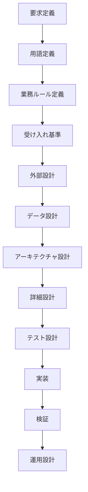

# LaborLens 開発ワークフロー目次

Date: 2026-06-01
Status: draft
Style: waterfall

## 目的

この文書は、LaborLens をウォーターフォール型で順に開発するための目次です。

このプロジェクトでは、コード生成より前に、意味、用語、制約、判断基準、データの形を保存することを重視します。

各工程の成果物は Markdown 文書として残し、後続工程から参照できるようにします。まだ存在しない文書へのリンクも、今後作成する予定の参照先として先に置きます。

## 基本方針

## 工程一覧

| 順序 | 工程 | 主な成果物 | 状態 | 目的 |
| --- | --- | --- | --- | --- |
| 1 | 要求定義 | [REQUIREMENTS.md](../product/REQUIREMENTS.md) | 作成済み | 何を作るか、何を満たすべきかを固定する |
| 2 | 用語定義 | [GLOSSARY.md](../product/GLOSSARY.md) | 未作成 | 勤怠、issue、伏せ字、集計粒度などの意味を揃える |
| 3 | 業務ルール定義 | [BUSINESS-RULES.md](../product/BUSINESS-RULES.md) | 未作成 | 打刻漏れ、結合不可、少人数部署抑制などを明文化する |
| 4 | 受け入れ基準 | [ACCEPTANCE-CRITERIA.md](../product/ACCEPTANCE-CRITERIA.md) | 未作成 | 完成判定の条件を要求から切り出す |
| 5 | 外部設計 | [EXTERNAL-DESIGN.md](EXTERNAL-DESIGN.md) | 未作成 | 画面、レポート、操作フロー、入出力を決める |
| 6 | データ設計 | [DATA-DESIGN.md](DATA-DESIGN.md) | 未作成 | CSV、正規化データ、ローカルDB、レポート項目を定義する |
| 7 | アーキテクチャ設計 | [REPOSITORY-PLAN.md](REPOSITORY-PLAN.md) / [ARCHITECTURE.md](ARCHITECTURE.md) | 一部作成済み | ローカルサーバー、DB、ジョブ、UI の責務を決める |
| 8 | 詳細設計 | [DETAILED-DESIGN.md](DETAILED-DESIGN.md) | 未作成 | crate、module、API、job 単位の構造を決める |
| 9 | テスト設計 | [TEST-PLAN.md](TEST-PLAN.md) | 未作成 | 実装前に何をどう検証するか決める |
| 10 | 実装 | [IMPLEMENTATION-PLAN.md](IMPLEMENTATION-PLAN.md) | 未作成 | 設計済みの内容をコードへ落とす |
| 11 | 検証 | [VERIFICATION-REPORT.md](VERIFICATION-REPORT.md) | 未作成 | 要求、設計、テスト結果の対応を確認する |
| 12 | 運用設計 | [OPERATIONS.md](OPERATIONS.md) | 未作成 | 起動、停止、ログ、バックアップ、障害時対応を決める |

## 参照関係

各文書は、前工程の意味を引き継ぐ形で作成します。

| 文書 | 参照元 | 参照先 |
| --- | --- | --- |
| [REQUIREMENTS.md](../product/REQUIREMENTS.md) | [USE-CASES.md](../product/USE-CASES.md) | [GLOSSARY.md](../product/GLOSSARY.md), [BUSINESS-RULES.md](../product/BUSINESS-RULES.md), [ACCEPTANCE-CRITERIA.md](../product/ACCEPTANCE-CRITERIA.md) |
| [GLOSSARY.md](../product/GLOSSARY.md) | [REQUIREMENTS.md](../product/REQUIREMENTS.md) | [BUSINESS-RULES.md](../product/BUSINESS-RULES.md), [DATA-DESIGN.md](DATA-DESIGN.md), [LEAN-SPEC-PLANNING.md](../product/LEAN-SPEC-PLANNING.md) |
| [BUSINESS-RULES.md](../product/BUSINESS-RULES.md) | [REQUIREMENTS.md](../product/REQUIREMENTS.md), [GLOSSARY.md](../product/GLOSSARY.md) | [ACCEPTANCE-CRITERIA.md](../product/ACCEPTANCE-CRITERIA.md), [TEST-PLAN.md](TEST-PLAN.md) |
| [ACCEPTANCE-CRITERIA.md](../product/ACCEPTANCE-CRITERIA.md) | [REQUIREMENTS.md](../product/REQUIREMENTS.md), [BUSINESS-RULES.md](../product/BUSINESS-RULES.md) | [TEST-PLAN.md](TEST-PLAN.md), [VERIFICATION-REPORT.md](VERIFICATION-REPORT.md) |
| [EXTERNAL-DESIGN.md](EXTERNAL-DESIGN.md) | [REQUIREMENTS.md](../product/REQUIREMENTS.md) | [DATA-DESIGN.md](DATA-DESIGN.md), [ARCHITECTURE.md](ARCHITECTURE.md) |
| [DATA-DESIGN.md](DATA-DESIGN.md) | [REQUIREMENTS.md](../product/REQUIREMENTS.md), [BUSINESS-RULES.md](../product/BUSINESS-RULES.md) | [ARCHITECTURE.md](ARCHITECTURE.md), [DETAILED-DESIGN.md](DETAILED-DESIGN.md), [TEST-PLAN.md](TEST-PLAN.md) |
| [ARCHITECTURE.md](ARCHITECTURE.md) | [REPOSITORY-PLAN.md](REPOSITORY-PLAN.md), [DATA-DESIGN.md](DATA-DESIGN.md) | [DETAILED-DESIGN.md](DETAILED-DESIGN.md), [IMPLEMENTATION-PLAN.md](IMPLEMENTATION-PLAN.md) |
| [DETAILED-DESIGN.md](DETAILED-DESIGN.md) | [ARCHITECTURE.md](ARCHITECTURE.md), [DATA-DESIGN.md](DATA-DESIGN.md) | [TEST-PLAN.md](TEST-PLAN.md), [IMPLEMENTATION-PLAN.md](IMPLEMENTATION-PLAN.md) |
| [TEST-PLAN.md](TEST-PLAN.md) | [ACCEPTANCE-CRITERIA.md](../product/ACCEPTANCE-CRITERIA.md), [DETAILED-DESIGN.md](DETAILED-DESIGN.md) | [VERIFICATION-REPORT.md](VERIFICATION-REPORT.md) |
| [VERIFICATION-REPORT.md](VERIFICATION-REPORT.md) | [TEST-PLAN.md](TEST-PLAN.md), [IMPLEMENTATION-PLAN.md](IMPLEMENTATION-PLAN.md) | [OPERATIONS.md](OPERATIONS.md) |

## 意味を保存するためのルール

- 要求文は、設計や実装の都合で勝手に言い換えない。
- 用語が増えたら [GLOSSARY.md](../product/GLOSSARY.md) に追加する。
- 業務判断に関わる条件は [BUSINESS-RULES.md](../product/BUSINESS-RULES.md) に分離する。
- 完成判定に関わる条件は [ACCEPTANCE-CRITERIA.md](../product/ACCEPTANCE-CRITERIA.md) に分離する。
- 実装で迷った場合は、コードより前に要求、用語、業務ルール、受け入れ基準へ戻る。
- Lean で表現する制約は [LEAN-SPEC-PLANNING.md](../product/LEAN-SPEC-PLANNING.md) に記録する。
- 10000人規模・3年分、ローカルサーバー、ローカルDB、バックグラウンドジョブ、ローカル使い方ガイドAIの前提は [REQUIREMENTS.md](../product/REQUIREMENTS.md) を正とする。

## 次に作る優先文書

次に作る文書は、次の順番を推奨します。

1. [GLOSSARY.md](../product/GLOSSARY.md)
2. [BUSINESS-RULES.md](../product/BUSINESS-RULES.md)
3. [ACCEPTANCE-CRITERIA.md](../product/ACCEPTANCE-CRITERIA.md)
4. [DATA-DESIGN.md](DATA-DESIGN.md)
5. [ARCHITECTURE.md](ARCHITECTURE.md)

まず用語と業務ルールを固定すると、DB設計、Lean仕様、テスト設計へ意味を失わずに接続しやすくなります。
