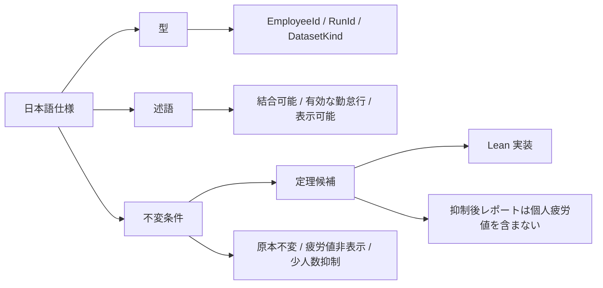
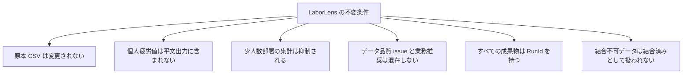
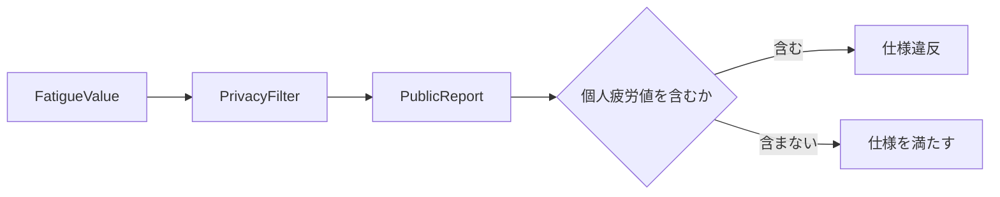

# LaborLens Lean 仕様化計画

Date: 2026-06-01
Status: draft
Source: `docs/product/REQUIREMENTS.md`

## 目的

この文書は、`REQUIREMENTS.md` に書かれた製品要求仕様のうち、Lean で表現する対象を整理するための計画文書です。

`REQUIREMENTS.md` は日本語の主要求仕様です。この文書では、その中でも特に安全制約、不変条件、データ分類の正しさに関わる部分を、Lean の型、述語、不変条件、定理候補へ分解します。

## 位置づけ

Lean 仕様は、製品仕様のすべてを置き換えるものではありません。

Lean で扱うのは、次のように「正しいことを明確に定義したい部分」です。

- 原本 CSV が変更されないこと
- 個人疲労値が公開レポートに出ないこと
- 少人数部署の集計が表示されないこと
- 結合できないデータを結合済みとして扱わないこと
- 未登録従業員を含む入力が確認対象 issue になること

## Lean 化マップ

## 型として表す候補

| 型 | 意味 |
| --- | --- |
| `EmployeeId` | 従業員識別子 |
| `DepartmentId` | 部署識別子 |
| `StoreId` | 店舗識別子 |
| `RunId` | 実行識別子 |
| `DatasetKind` | 入力データ種別 |
| `DataGrain` | データ粒度 |
| `IssueCode` | 不備コード |
| `IssueSeverity` | 優先度 |
| `PrivacyStatus` | 表示可能、抑制済みなどの状態 |
| `ReadinessStatus` | ready、blocked、partial などの状態 |
| `FatigueValue` | 内部データとしての個人疲労値 |
| `PublicReport` | ユーザー向けまたは外部向けの公開レポート |

## 述語として表す候補

| 述語 | 意味 |
| --- | --- |
| `existsInMaster employee master` | 従業員がマスタに存在する |
| `validAttendanceRow row` | 勤怠行が有効な時刻範囲を持つ |
| `joinableLaborCost cost attendance` | 人件費データが個人勤怠と結合可能である |
| `safeAggregateGroup group` | 集計単位が少人数部署ではない |
| `doesNotExposeFatigueValue report` | 個人疲労値が出力に現れない |
| `inputUnchanged before after` | 原本入力が実行前後で変化しない |

## 不変条件として表す候補

## 定理候補

| 定理候補 | 期待する意味 |
| --- | --- |
| 原本保護定理 | 原本保護処理を通した後も入力ハッシュは変化しない |
| 疲労値非表示定理 | プライバシー抑制後のレポートには個人疲労値が含まれない |
| 少人数抑制定理 | 少人数部署の集計は表示可能な集計結果に含まれない |
| 未登録従業員 issue 定理 | 未登録従業員を含む勤怠行は確認対象 issue を生成する |
| 人件費結合不可定理 | 従業員 ID を持たない人件費データは個人勤怠と結合可能に分類されない |

## 最初に Lean 化する推奨範囲

最初の Lean 化は、プライバシー境界に絞るのがよいです。

理由:

- 仕様上の価値が明確である
- 禁止事項がはっきりしている
- 型、述語、不変条件に分解しやすい
- 実装前でも形式化しやすい

最初の対象:

最初の Lean 目標:

- `FatigueValue` を内部データとして表す
- `PublicReport` を外部向け出力として表す
- `PrivacyFilter` 後の `PublicReport` には個人疲労値が含まれない、という性質を定義する

## 主仕様との対応

| 主仕様の項目 | Lean 仕様化の対象 |
| --- | --- |
| 原本保護 | `inputUnchanged` と原本保護定理 |
| プライバシー境界 | `doesNotExposeFatigueValue` と疲労値非表示定理 |
| 少人数部署抑制 | `safeAggregateGroup` と少人数抑制定理 |
| 人件費粒度確認 | `DataGrain` と `joinableLaborCost` |
| 従業員マスタ不一致確認 | `existsInMaster` と未登録従業員 issue 定理 |

## 初期スコープ外

次の内容は重要ですが、最初の Lean 化では後回しにします。

- UI 表示順
- 画面レイアウト
- PDF や Markdown の見た目
- 実際の CSV パーサ実装
- パフォーマンス要件
- 文言の自然さ
