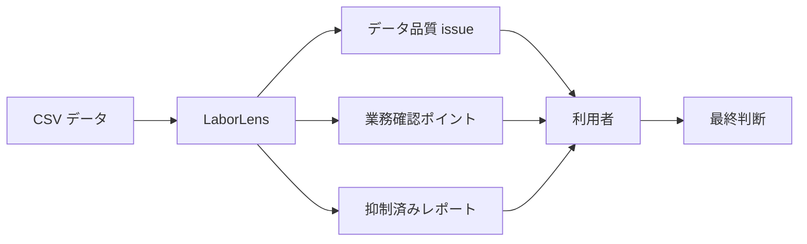
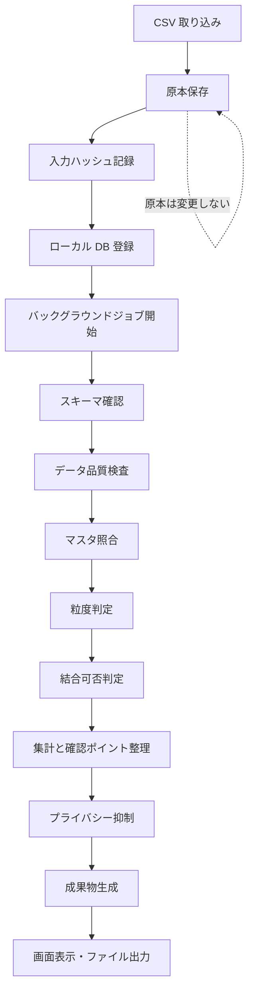
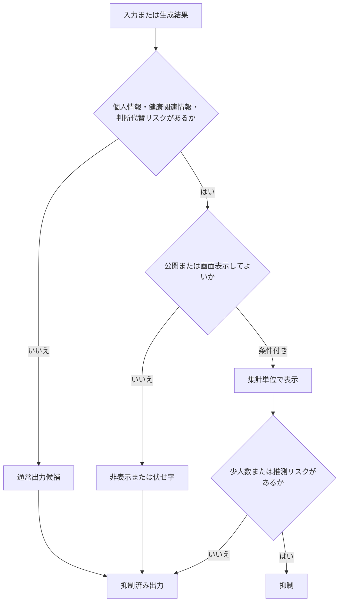

# LaborLens 要求仕様書

日付: 2026-06-01
状態: brushed draft
出典: `docs/product/USE-CASES.md`
関連:

- `docs/planning/WORKFLOW.md`
- `docs/product/LEAN-SPEC-PLANNING.md`

## この文書の位置づけ

この文書は、LaborLens について「何を作るか」「何を満たすべきか」「何をしてはならないか」を固定するための主要求仕様書である。

LaborLens の開発では、要求定義、用語定義、業務ルール定義、受け入れ基準、外部設計、データ設計、アーキテクチャ設計を順に分離する。そのため、この文書では実装方式、画面レイアウト、DB テーブル定義、詳細な issue 判定式、具体的なテストケースまでは確定しない。

この文書で扱うもの:

- 製品の目的
- 利用者と利用場面
- 入力データと出力成果物
- 機能要求
- 安全境界
- 非機能要求
- 後続工程へ引き継ぐ未決事項
- Lean 仕様化へ渡す制約候補

この文書で扱わないもの:

| 項目 | 扱う文書 |
| --- | --- |
| 用語の厳密な定義 | `GLOSSARY.md` |
| 打刻漏れ、時刻逆転、少人数部署などの詳細判定条件 | `BUSINESS-RULES.md` |
| 完成判定の詳細条件 | `ACCEPTANCE-CRITERIA.md` |
| 画面、操作フロー、レポートレイアウト | `EXTERNAL-DESIGN.md` |
| CSV 列定義、正規化データ、ローカル DB スキーマ | `DATA-DESIGN.md` |
| ローカルサーバー、ジョブ、UI、DB の構成 | `ARCHITECTURE.md` |
| Lean の型、述語、定理候補の詳細 | `LEAN-SPEC-PLANNING.md` |

## 1. 製品サマリー

LaborLens は、勤怠、人件費、売上、従業員マスタ、疲労関連データなどの CSV をローカル環境で取り込み、業務担当者が確認すべきデータ品質 issue と業務確認ポイントを整理する業務支援アプリケーションである。

LaborLens は、労務・経理・店舗運営・経営管理に関する確認材料を整理するが、法的判断、医療判断、人事評価、外部共有可否の最終判断は代替しない。

## 2. 製品原則

| 原則 | 要求 |
| --- | --- |
| 原本保護 | LaborLens は、取り込んだ原本 CSV を変更してはならない。 |
| 状態分離 | 原本、正規化データ、検査結果、集計結果、公開用出力を区別しなければならない。 |
| 確認支援 | LaborLens は、確認材料を提示する。適法・違法、診断、人事評価などの最終判断を出力してはならない。 |
| issue と推奨の分離 | データ品質 issue と業務上の確認ポイントまたは推奨は混在させてはならない。 |
| ローカル優先 | 主要処理は、利用者 PC または社内端末上のローカルサーバーとローカル DB で実行できなければならない。 |
| トレーサビリティ | すべての成果物は、実行単位を識別できる `RunId` と入力ハッシュまたは入力参照を持たなければならない。 |
| プライバシー境界 | 個人情報、健康関連情報、個人が推測され得る集計は、公開または画面表示の前に抑制判定を通さなければならない。 |
| 説明可能性 | レポート、issue、抑制理由、ガイド AI の回答には、利用者が根拠を追える情報を添えなければならない。 |

## 3. 想定利用者

| 利用者 | 主な関心 | LaborLens が提供するもの | LaborLens が提供しないもの |
| --- | --- | --- | --- |
| データ取込担当者 | CSV が読めるか、列や形式が合っているか | データ準備状況、不備一覧、修正依頼用チェックリスト | 原本 CSV の自動上書き修正 |
| 店長・現場責任者 | 店舗別の勤怠不備、負荷集中、欠員傾向 | 店舗別確認ポイント、修正対象、月次比較 | 店長個人の評価、懲戒判断 |
| 人事・労務担当者 | 長時間労働、有給取得、従業員マスタ不一致 | 労務確認メモ、対象者または対象部署の確認材料 | 適法・違法の最終判断 |
| 経理担当者 | 人件費データの粒度、部署別費用、結合可否 | 粒度判定、部署別・雇用区分別集計 | 給与計算の確定処理 |
| 経営者・管理者 | 全体のデータ準備状況、月次傾向、運用上のボトルネック | ready / blocked / partial の概要、月次レポート | 個人の健康状態や勤務評価 |
| 情報システム担当者 | ローカル環境での起動、処理状況、実行履歴 | 実行履歴、ログ、ジョブ状態、設定確認材料 | 社内認証・端末管理そのもの |
| ローカルガイド AI 利用者 | 操作方法、レポートの読み方、制約の意味 | 根拠文書付きの説明 | 根拠なしの断定、抑制対象情報の回答 |

## 4. 対象範囲

### 4.1 対象とする機能

LaborLens は、次の機能を対象とする。

- CSV 取り込み
- 原本保存
- スキーマ確認
- データ品質検査
- 従業員マスタ照合
- データ粒度判定
- 結合可否判定
- 勤怠不備確認
- 長時間労働、有給取得、人員不足などの確認材料整理
- 人件費、売上、シフトを使った集計
- プライバシー抑制
- レポート生成
- 修正後 CSV の再確認
- ローカル使い方ガイド AI
- 架空データによるローカルデモ

### 4.2 対象外とする機能

LaborLens は、次を対象外とする。

| 対象外 | 理由 |
| --- | --- |
| 適法・違法の確定判定 | 法的判断を代替しないため |
| 医療診断、治療指示、高ストレス者の個別判定 | 医療判断または健康情報の個人評価につながるため |
| 個人の人事評価、配置適性、懲戒判断 | 確認支援の範囲を超えるため |
| 給与計算の確定処理 | LaborLens は人件費確認材料を扱うが、給与計算システムではないため |
| 原本 CSV の自動上書き修正 | 原本保護原則に反するため |
| 外部共有可否の最終決定 | 匿名化や共有可否は利用組織側の責任で判断するため |
| クラウドサービスとしての外部公開 | ローカル実行を前提とするため |
| 実在個人情報を含むデモデータの配布 | デモは架空データに限定するため |

## 5. 前提と制約

### 5.1 企業規模とデータ量

LaborLens は、10000 人規模の企業データを扱えることを設計目標とする。対象期間は 3 年分を基本想定とする。

| 項目 | 想定 |
| --- | --- |
| 対象企業規模 | 最大 10000 人規模を設計目標とする |
| 対象期間 | 3 年分 |
| 勤怠データ量の目安 | 10000 人 × 365 日 × 3 年 = 約 1095 万行 |
| 組織構造 | 多拠点、多部署、階層部署を想定する |
| 実行形態 | 画面操作 + ローカルサーバー + ローカル DB + バックグラウンドジョブ |
| UI の責務 | 実行指示、進捗確認、結果閲覧、再確認、修正依頼確認 |
| ローカルサーバーの責務 | CSV 読み込み、スキーマ確認、検査、結合可否判定、集計、抑制、レポート生成 |
| ローカル DB の責務 | 取り込み結果、正規化データ、issue、集計結果、成果物メタデータ、実行履歴の保存 |

### 5.2 実行環境

LaborLens は、利用者 PC または社内端末上でローカルサーバーとローカル DB を起動して利用できなければならない。

外部 API やクラウド送信を前提にしない。ガイド AI もローカル実行を基本とし、製品ドキュメント、レポート定義、制約条件、生成済みレポートをローカル検索対象として利用する。

### 5.3 監査可能性

LaborLens は、実行ごとに次を記録しなければならない。

| 項目 | 要求 |
| --- | --- |
| `RunId` | 実行単位を一意に識別できること |
| 入力参照 | 使用した CSV、データ種別、取込時刻、入力ハッシュを確認できること |
| 実行設定 | 抑制閾値、対象期間、対象データセットなど、結果に影響する設定を確認できること |
| 実行結果 | ready / blocked / partial、issue 件数、成果物参照を確認できること |
| 再確認履歴 | 修正前後の差分と issue 件数の変化を確認できること |

## 6. 入力データ

### 6.1 入力データ種別

| データ種別 | 主な用途 | 注意点 |
| --- | --- | --- |
| 従業員マスタ | 従業員 ID、所属、雇用区分、在籍状態の照合 | 他データとの照合基準になる |
| 勤怠データ | 打刻漏れ、時刻逆転、重複、労働時間、休暇の確認 | 労務確認と給与関連確認の基礎になる |
| 人件費データ | 部署別、従業員別、雇用区分別の費用確認 | 粒度により個人勤怠との結合可否が変わる |
| 売上データ | 時間帯別の忙しさ、人員不足傾向の確認 | 日付、店舗、時間帯の粒度が重要になる |
| シフトデータ | 予定人員、実績人員、欠員対応の確認 | 勤怠、売上との粒度整合が必要になる |
| 疲労関連データ | 長時間労働、深夜勤務、休憩不足、連勤、有休取得不足などの労務リスク傾向確認 | 医学的診断として扱わず、個人値を直接表示してはならない |
| 休暇情報 | 有給取得状況、取得率、残日数の確認 | 勤怠データだけで不足する場合に使う |
| 共有予定データ | 外部共有前の個人情報、識別子、推測リスク確認 | 共有可否の最終判断はしない |

### 6.2 データ状態モデル

LaborLens は、入力データを状態別に区別して扱わなければならない。

| 状態 | 意味 | 変更可否 |
| --- | --- | --- |
| `RawCsvDataset` | 取り込まれた原本 CSV | 変更不可 |
| `StoredSourceDataset` | 原本保存後、入力ハッシュと参照情報を持つ状態 | 変更不可 |
| `ParsedDataset` | CSV として読めた状態 | 再生成可能 |
| `NormalizedDataset` | 列名、日付、ID などを内部形式へ揃えた状態 | 再生成可能 |
| `ValidatedDataset` | スキーマ確認とデータ品質検査を通した状態 | 再生成可能 |
| `JoinAssessment` | 他データとの結合可否が判定された状態 | 再生成可能 |
| `AnalysisDataset` | 集計・確認ポイント整理に使う状態 | 再生成可能 |
| `PrivacyFilteredReport` | 安全境界を通したユーザー向け出力 | 生成結果として保存 |

この状態分離は、原本保護、再現性、Lean 仕様化、DB 設計、テスト設計へ引き継ぐ。

## 7. 成果物

| 成果物 | 内容 | 主な利用者 |
| --- | --- | --- |
| `run_summary.json` | 実行 ID、入力参照、処理状態、issue 件数、成果物参照 | 全利用者、情報システム担当者 |
| `issues.csv` | 修正対象の行、列、理由、優先度、issue 種別 | データ取込担当者、人事・労務担当者 |
| `profile_report.json` | データ件数、列、欠損、形式不一致、粒度情報 | データ取込担当者、情報システム担当者 |
| データ準備状況レポート | ready / blocked / partial と理由 | 経営者、管理者、取込担当者 |
| 勤怠確認レポート | 打刻漏れ、時刻逆転、重複、長時間労働などの確認材料 | 人事・労務担当者、店長 |
| 人件費粒度レポート | 人件費データの粒度、結合可否、集計結果 | 経理担当者、経営者 |
| 人員不足確認レポート | 店舗、部署、曜日、時間帯別の不足傾向 | 店長、経営者 |
| 月次労務レポート | 前月比較、店舗比較、部署比較 | 人事・労務担当者、経営者 |
| 抑制済み集計レポート | 少人数部署や健康関連情報を抑制した集計 | 人事・労務担当者、経営者 |
| 外部共有前チェックリスト | 氏名、社員番号、メール、推測リスクの確認結果 | 共有前確認担当者 |
| 再確認結果 | 修正前後の issue 件数、入力ハッシュ、差分 | データ取込担当者、管理者 |

成果物の出力形式は、用途別に次の方針とする。

| 用途 | 出力形式 | 扱い |
| --- | --- | --- |
| 内部確認用 | Markdown + CSV + JSON | 担当者の確認、差分レビュー、機械処理、テストで使う。 |
| 共有用 | PDF + 抑制済み CSV | 社内共有または外部共有前確認に使う。抑制前データは含めない。 |
| UI 表示用 | JSON | Local UI がレポート内容を表示するための構造化データとして使う。 |

PDF は、1 ページ目に要約、2 ページ目以降に詳細表を置く。グラフは補助扱いとし、根拠テーブルを主にする。

## 8. 基本処理フロー

処理フローに関する要求:

| ID | 要求 |
| --- | --- |
| FLOW-001 | CSV 取り込み時、原本 CSV を保存し、以後の処理で原本を変更してはならない。 |
| FLOW-002 | 入力データには、データ種別、取込時刻、入力ハッシュ、`RunId` を関連付けなければならない。 |
| FLOW-003 | 重い処理は UI スレッドから分離し、バックグラウンドジョブとして実行しなければならない。 |
| FLOW-004 | UI は、ジョブの進捗、完了、失敗、取り消し可能状態、結果参照を表示できなければならない。 |
| FLOW-005 | スキーマ確認、データ品質検査、結合可否判定、プライバシー抑制は、成果物生成より前に完了していなければならない。 |
| FLOW-006 | 処理に失敗した場合でも、原本、実行履歴、失敗理由を確認できなければならない。 |

## 9. 状態と分類

### 9.1 データ準備状態

| 状態 | 意味 |
| --- | --- |
| `ready` | 必要な入力が揃い、対象レポートを生成できる状態 |
| `partial` | 一部の入力または粒度が不足しているが、限定されたレポートを生成できる状態 |
| `blocked` | 必須入力、必須列、形式、結合キーなどが不足し、対象レポートを生成できない状態 |

### 9.2 issue 分類

LaborLens は、少なくとも次の issue 分類を持たなければならない。詳細な issue code と判定条件は `BUSINESS-RULES.md` で定義する。

| 分類 | 意味 | 例 |
| --- | --- | --- |
| `schema_issue` | CSV の列、型、形式に関する不備 | 必須列欠落、日付形式不一致 |
| `data_quality_issue` | 行単位または値単位の不備 | 打刻漏れ、時刻逆転、重複 |
| `master_issue` | 従業員マスタとの照合不一致 | 未登録従業員、退職済み、部署不一致 |
| `grain_issue` | データ粒度が分析目的に合わない状態 | 月次のみの人件費を個人日次勤怠へ結合しようとする |
| `join_issue` | 結合キー不足または粒度不一致により結合できない状態 | 店舗 ID 欠落、従業員 ID 欠落 |
| `privacy_issue` | 表示前に抑制が必要な状態 | 少人数部署、個人疲労値、個人特定可能なコメント |
| `processing_issue` | 処理中に発生した実行上の問題 | CSV 読み込み失敗、ジョブ失敗 |

### 9.3 issue 優先度

| 優先度 | 意味 |
| --- | --- |
| `critical` | 対象処理を継続できない、または安全境界に違反する可能性がある |
| `high` | 主要レポートの正確性に大きく影響する |
| `medium` | 一部の集計または確認項目に影響する |
| `low` | 参考情報または軽微な修正候補である |

## 10. 機能要求

### 10.1 CSV 取り込みと原本保護

| ID | 要求 |
| --- | --- |
| FR-CSV-001 | LaborLens は、指定された CSV をデータ種別と紐づけて取り込めなければならない。 |
| FR-CSV-002 | LaborLens は、取り込んだ原本 CSV を変更不可の原本として保存しなければならない。 |
| FR-CSV-003 | LaborLens は、原本 CSV の入力ハッシュを記録し、再確認時に比較できなければならない。 |
| FR-CSV-004 | LaborLens は、文字コード、区切り文字、ヘッダー有無など、CSV 読み込みに必要な情報を記録できなければならない。 |
| FR-CSV-005 | LaborLens は、読み込み失敗時に、失敗理由と利用者が確認すべき対象を表示できなければならない。 |

### 10.2 スキーマ確認

| ID | 要求 |
| --- | --- |
| FR-SCHEMA-001 | LaborLens は、データ種別ごとの必須列、任意列、標準列名、登録済み別名、別名辞書バージョンを確認できなければならない。 |
| FR-SCHEMA-002 | LaborLens は、日付、時刻、数値、ID、部署、店舗などの列形式を確認できなければならない。 |
| FR-SCHEMA-003 | LaborLens は、CSV 仕様変更の影響として、列名変更、未知列、必須列欠落、形式変更、未登録別名、曖昧な別名、同名重複列、同一標準列に複数列が対応する状態、正規化後衝突、別名辞書不整合を整理できなければならない。 |
| FR-SCHEMA-004 | LaborLens は、スキーマ issue を行単位または列単位で `issues.csv` に出力できなければならない。 |
| FR-SCHEMA-005 | LaborLens は、標準列名または明示的な別名辞書にない列名を、部分一致、類似度、表記ゆれ推定、LLM 推定で自動対応付けしてはならない。 |

### 10.3 データ品質検査

| ID | 要求 |
| --- | --- |
| FR-DQ-001 | LaborLens は、勤怠データについて打刻漏れ、時刻逆転、重複、異常な勤務時間候補を検出できなければならない。 |
| FR-DQ-002 | LaborLens は、データ品質 issue と業務上の確認ポイントを区別して出力しなければならない。 |
| FR-DQ-003 | LaborLens は、issue ごとに、データ種別、行、列、理由、優先度、関連する入力ハッシュまたは `RunId` を出力しなければならない。 |
| FR-DQ-004 | LaborLens は、店舗別または部署別に修正依頼用の issue 一覧を作成できなければならない。 |

### 10.4 従業員マスタ照合

| ID | 要求 |
| --- | --- |
| FR-MASTER-001 | LaborLens は、勤怠、人件費、疲労関連データなどに含まれる従業員 ID を従業員マスタと照合できなければならない。 |
| FR-MASTER-002 | LaborLens は、未登録従業員、退職済み従業員、部署不一致、雇用区分不一致を確認対象 issue として出力できなければならない。 |
| FR-MASTER-003 | LaborLens は、マスタ不一致がある場合、関連するレポートの準備状態を `partial` または `blocked` として扱える必要がある。 |
| FR-MASTER-004 | LaborLens は、店舗マスタ、部署マスタ、雇用区分マスタの `display_order` に従って UI と帳票の表示順を制御できなければならない。 |

### 10.5 粒度判定と結合可否

| ID | 要求 |
| --- | --- |
| FR-GRAIN-001 | LaborLens は、人件費、売上、勤怠、シフトの粒度を、従業員別、部署別、店舗別、日別、月別、時間帯別などに分類できなければならない。 |
| FR-GRAIN-002 | LaborLens は、分析目的に対して必要な粒度が不足している場合、結合不可または限定集計として分類しなければならない。 |
| FR-GRAIN-003 | LaborLens は、従業員 ID を持たない人件費データを、個人勤怠と結合可能なデータとして扱ってはならない。 |
| FR-GRAIN-004 | LaborLens は、結合不可の理由を利用者に説明できなければならない。 |
| FR-GRAIN-005 | LaborLens は、結合可能な場合でも、結合結果に含まれるデータ種別、期間、粒度を成果物に明示しなければならない。 |

### 10.6 勤怠・労務確認

| ID | 要求 |
| --- | --- |
| FR-LABOR-001 | LaborLens は、長時間労働候補、連続勤務候補、休暇取得状況、有給取得状況を確認材料として整理できなければならない。 |
| FR-LABOR-002 | LaborLens は、法的な適法・違法の最終判断を出力してはならない。 |
| FR-LABOR-003 | LaborLens は、労務確認メモに、確認対象、根拠データ、対象期間、注意事項を含めなければならない。 |
| FR-LABOR-004 | LaborLens は、労務確認項目の初期閾値を設定可能にするが、閾値の具体値は `BUSINESS-RULES.md` で定義する。 |

### 10.7 店舗・部署運用確認

| ID | 要求 |
| --- | --- |
| FR-OPS-001 | LaborLens は、売上、勤怠、シフトを組み合わせて、曜日・時間帯・店舗別の人員不足候補を整理できなければならない。 |
| FR-OPS-002 | LaborLens は、店長または特定個人への負荷集中を確認材料として提示できるが、人事評価として読める表現を出力してはならない。 |
| FR-OPS-003 | LaborLens は、採用、応援、配置見直しの検討材料を提示できるが、最終判断を自動決定してはならない。 |

### 10.8 人件費・経理確認

| ID | 要求 |
| --- | --- |
| FR-COST-001 | LaborLens は、人件費データの粒度を表示し、個人勤怠、部署、店舗、雇用区分との結合可否を説明できなければならない。 |
| FR-COST-002 | LaborLens は、部署別、店舗別、雇用区分別の人件費確認レポートを生成できなければならない。 |
| FR-COST-003 | LaborLens は、人件費データを給与計算の確定結果として扱ってはならない。 |
| FR-COST-004 | LaborLens は、人件費データと勤怠データの粒度が一致しない場合、推定結合ではなく、結合不可または限定集計として扱わなければならない。 |

### 10.9 レポート生成

| ID | 要求 |
| --- | --- |
| FR-REPORT-001 | LaborLens は、利用者の立場に応じて、データ準備状況、不備一覧、勤怠確認、人件費確認、人員不足確認、月次労務、抑制済み集計を生成できなければならない。 |
| FR-REPORT-002 | すべてのレポートは `RunId`、対象期間、入力データ種別、生成時刻を持たなければならない。 |
| FR-REPORT-003 | レポートは、データ品質 issue、業務確認ポイント、プライバシー抑制結果を区別して表示しなければならない。 |
| FR-REPORT-004 | レポートは、確認材料であり、法的判断、医療判断、人事評価、外部共有判断の結論として読める文言を出力してはならない。 |
| FR-REPORT-005 | レポートは、根拠データまたは参照した集計条件を利用者が確認できる形で出力しなければならない。 |

### 10.10 修正後 CSV の再確認

| ID | 要求 |
| --- | --- |
| FR-RECHECK-001 | LaborLens は、修正後 CSV を原本とは別の入力として取り込み、再検査できなければならない。 |
| FR-RECHECK-002 | LaborLens は、修正前後の `RunId`、入力ハッシュ、issue 件数、主要 issue の変化を比較できなければならない。 |
| FR-RECHECK-003 | LaborLens は、修正後の検査でも原本 CSV を変更してはならない。 |
| FR-RECHECK-004 | LaborLens は、再確認結果を、修正依頼の完了確認材料として出力できなければならない。 |

### 10.11 外部共有前チェック

| ID | 要求 |
| --- | --- |
| FR-SHARE-001 | LaborLens は、共有予定データに氏名、社員番号、メールアドレス、個人識別子、少人数部署、健康関連情報が含まれる可能性を確認できなければならない。 |
| FR-SHARE-002 | LaborLens は、外部共有前チェックリストを出力できなければならない。 |
| FR-SHARE-003 | LaborLens は、外部共有可否の最終判断を出力してはならない。 |
| FR-SHARE-004 | LaborLens は、推測リスクがある集計を、抑制候補として明示しなければならない。 |

## 11. 安全境界

### 11.1 基本方針

LaborLens は、個人情報、健康関連情報、法務・医療・人事評価に関わる判断を安全境界で制限する。

### 11.2 禁止出力

| ID | 禁止出力 | 理由 |
| --- | --- | --- |
| SAFETY-001 | 個人別疲労ランキング | 健康情報の個人評価につながるため |
| SAFETY-002 | 個人の睡眠時間、疲労値、疲労コメントの平文表示 | 健康関連情報や個人特定リスクを含むため |
| SAFETY-003 | 医療診断または治療指示 | 医療判断を代替しないため |
| SAFETY-004 | 適法・違法の断定 | 法的判断を代替しないため |
| SAFETY-005 | 個人評価、配置適性、懲戒対象などの断定 | 人事評価につながるため |
| SAFETY-006 | 少人数部署の健康関連集計の表示 | 個人推測リスクがあるため |
| SAFETY-007 | ガイド AI による抑制対象情報の復元または回答 | プライバシー境界を迂回するため |
| SAFETY-008 | 少人数セル、差分推測、属性組合せにより個人を絞れる自然言語回答 | 個人推測リスクがあるため |
| SAFETY-009 | 抑制前データの通常 UI、RAG、ガイド AI、一般管理者画面への露出 | Default Deny のアクセス境界を迂回するため |

### 11.3 プライバシー抑制要求

| ID | 要求 |
| --- | --- |
| FR-PRIVACY-001 | LaborLens は、個人疲労値、睡眠時間、疲労コメントをユーザー向け出力に表示してはならない。 |
| FR-PRIVACY-002 | LaborLens は、少人数部署または個人が推測され得る集計を非表示、伏せ字、または抑制済みとして扱わなければならない。 |
| FR-PRIVACY-003 | LaborLens は、抑制した場合、可能な範囲で抑制理由を表示しなければならない。 |
| FR-PRIVACY-004 | LaborLens は、抑制前の内部データと抑制後の公開用出力を区別しなければならない。 |
| FR-PRIVACY-005 | LaborLens は、抑制対象情報がガイド AI の回答に含まれないようにしなければならない。 |
| FR-PRIVACY-006 | 少人数部署は有効データ数で判定し、閾値と注意部署の範囲を `BUSINESS-RULES.md` で定義し、実行設定として記録しなければならない。 |
| FR-PRIVACY-007 | LaborLens は、少人数セル、差分推測、属性組合せ、自然言語表現による個人推測リスクを抑制対象として扱わなければならない。 |
| FR-PRIVACY-008 | LaborLens は、抑制前データへのアクセスを Default Deny とし、許可ロール、明示目的、チケット番号、期間制限、必要最小範囲、承認、監査ログを必須にしなければならない。 |

## 12. ローカル使い方ガイド AI

### 12.1 目的

ローカル使い方ガイド AI は、LaborLens の操作方法、レポートの読み方、issue の意味、制約条件の意味を、根拠文書付きで説明するための機能である。

ガイド AI は、LaborLens の判断を拡張するものではない。製品ドキュメント、レポート定義、制約条件、生成済みレポートに基づいて説明する補助機能である。

### 12.2 仕様

| 項目 | 要求 |
| --- | --- |
| 実行場所 | 利用者 PC または社内端末上のローカル環境で動作すること |
| 推論基盤 | Ollama を候補とすること |
| 初期モデル候補 | Qwen3 8B を候補とすること |
| 代替モデル候補 | Qwen3 14B、Qwen3 30B-A3B を検討対象とすること |
| 参照情報 | 製品ドキュメント、レポート定義、制約条件、生成済みレポート |
| 回答言語 | 日本語と英語に対応すること |
| 回答要件 | 根拠文書またはレポート箇所を添えること |
| 安全要件 | 抑制対象情報、法的判断、医療判断、人事評価を回答しないこと |

### 12.3 ガイド AI がしてよいこと

- 操作手順を説明する。
- レポート項目名、issue、抑制理由の意味を説明する。
- データ品質 issue と業務確認ポイントの違いを説明する。
- ready / partial / blocked の意味を説明する。
- プライバシー抑制、少人数部署非表示、根拠文書表示の意味を説明する。
- 日本語または英語で説明する。

### 12.4 ガイド AI がしてはならないこと

| ID | 禁止事項 |
| --- | --- |
| AI-SAFE-001 | 法的な適法・違法の最終判断をすること |
| AI-SAFE-002 | 医療的な診断や治療指示をすること |
| AI-SAFE-003 | 人事評価、配置適性、懲戒判断をすること |
| AI-SAFE-004 | 根拠文書なしに断定的に説明すること |
| AI-SAFE-005 | 個人疲労値、睡眠時間、疲労コメントなどの抑制対象情報を回答すること |
| AI-SAFE-006 | プロンプト注入により安全境界や参照範囲を無視すること |
| AI-SAFE-007 | 抑制前データ、原本 CSV、正規化データ、分析データを直接参照すること |
| AI-SAFE-008 | 少人数セルまたは特定個人を推測できる表現で回答すること |

### 12.5 ガイド AI の品質要求

| ID | 要求 |
| --- | --- |
| AI-QUALITY-001 | ガイド AI は、回答に利用した根拠文書またはレポート箇所を表示しなければならない。 |
| AI-QUALITY-002 | ガイド AI は、検索結果が不足する場合、不足していることを説明し、推測で断定してはならない。 |
| AI-QUALITY-003 | ガイド AI は、日本語回答と英語回答の両方について、最低限の回答品質評価対象としなければならない。 |
| AI-QUALITY-004 | ガイド AI は、プロンプト注入対策を備えなければならない。 |
| AI-QUALITY-005 | ガイド AI は、生成済みレポートを参照する場合でも、抑制後の表示可能情報だけを回答対象にしなければならない。 |

## 13. ローカルデモ要求

ローカルデモ版は、Web サービスとして外部公開しない。利用者 PC 上でローカルサーバーとローカル DB を起動し、架空のサンプルデータだけを使って LaborLens の考え方と操作感を説明する。

| ID | 要求 |
| --- | --- |
| DEMO-001 | ローカルデモは、実在個人情報を含まない架空データだけを扱わなければならない。 |
| DEMO-002 | ローカルデモは、データ準備状況、不備一覧、売上粒度確認、人件費粒度確認、プライバシー境界、実行結果比較を確認できなければならない。 |
| DEMO-003 | ローカルデモは、原本 CSV を変更しない処理の流れを示さなければならない。 |
| DEMO-004 | ローカルデモは、少人数集計や個人疲労値が抑制されることを示さなければならない。 |
| DEMO-005 | ローカルデモは、修正前後で issue が減ることを確認できるシナリオを含まなければならない。 |

## 14. 非機能要求

### 14.1 性能

| ID | 要求 |
| --- | --- |
| NFR-PERF-001 | LaborLens は、10000 人 × 3 年分の勤怠データを設計目標として、画面だけで全処理を完結させず、ローカル DB とバックグラウンドジョブで処理しなければならない。 |
| NFR-PERF-002 | 大量 CSV の取り込み、検査、集計、レポート生成は、ジョブとして進捗確認できなければならない。 |
| NFR-PERF-003 | 性能の具体的な目標値、メモリ上限、処理時間目標は、`ARCHITECTURE.md` または `TEST-PLAN.md` で定義する。 |

### 14.2 信頼性

| ID | 要求 |
| --- | --- |
| NFR-REL-001 | 処理途中で失敗した場合でも、原本 CSV と実行履歴が失われてはならない。 |
| NFR-REL-002 | 再実行時には、入力ハッシュ、実行設定、対象期間を確認できなければならない。 |
| NFR-REL-003 | 成果物生成に失敗した場合、失敗理由と再実行に必要な情報を表示できなければならない。 |
| NFR-REL-004 | すべての処理成果物は `RunId` に紐づき、入力、正規化結果、抑制ポリシー、出力、監査ログを `RunArtifact` として追跡できなければならない。 |

### 14.3 セキュリティとプライバシー

| ID | 要求 |
| --- | --- |
| NFR-SEC-001 | LaborLens は、個人情報と健康関連情報を扱うため、抑制前データと抑制後出力の境界を明確にしなければならない。 |
| NFR-SEC-002 | ガイド AI は、抑制前データを直接回答対象にしてはならない。 |
| NFR-SEC-003 | ローカルデモは、実在個人情報を含んではならない。 |
| NFR-SEC-004 | 抑制前データへのアクセスは Default Deny とし、システム管理者、監査担当、データ保護責任者、限定された運用担当だけに限定しなければならない。 |
| NFR-SEC-005 | 抑制前データへのアクセスは、誰が、いつ、どの `RunId` または `DatasetId` にアクセスしたかを改ざん困難な監査ログに残さなければならない。 |
| NFR-SEC-006 | 認証、保存時暗号化、ログマスキング、監査ログ保持期間の詳細は、`ARCHITECTURE.md` または `OPERATIONS.md` で定義する。 |

### 14.4 保守性

| ID | 要求 |
| --- | --- |
| NFR-MAINT-001 | 要求、用語、業務ルール、受け入れ基準、データ設計、Lean 仕様は、相互参照できなければならない。 |
| NFR-MAINT-002 | issue code、データ粒度、表示状態、準備状態などの意味は、用語定義と業務ルール定義へ分離しなければならない。 |
| NFR-MAINT-003 | 仕様変更時には、影響する要求 ID、業務ルール、受け入れ基準、テスト観点を追跡できなければならない。 |

### 14.5 利用性

| ID | 要求 |
| --- | --- |
| NFR-UX-001 | 利用者は、どの CSV が使えるか、どこで止まっているか、次に何を確認すべきかを理解できなければならない。 |
| NFR-UX-002 | issue は、修正対象の行、列、理由、優先度を含み、修正依頼に使える粒度で提示されなければならない。 |
| NFR-UX-003 | レポートは、確認材料と最終判断の境界を明示しなければならない。 |
| NFR-UX-004 | ガイド AI の回答は、根拠文書付きで、日本語または英語で説明できなければならない。 |

## 15. 受け入れ基準への引き継ぎ

受け入れ基準の詳細は、後続工程の `ACCEPTANCE-CRITERIA.md` に分離する。この文書では、要求から導かれる検証観点だけを保持する。

| 検証観点 ID | 対応する主な要求 | 受け入れ基準で確認する内容 |
| --- | --- | --- |
| AC-SEED-001 | FLOW-001, FR-CSV-002, FR-RECHECK-003 | 実行前後で原本 CSV のハッシュまたはファイル内容が変化しないこと |
| AC-SEED-002 | FR-DQ-003, NFR-UX-002 | `issues.csv` または画面に、行、列、理由、優先度が含まれること |
| AC-SEED-003 | FR-PRIVACY-001, SAFETY-001, SAFETY-002 | 個人疲労値、睡眠時間、疲労コメントがユーザー向け出力に出ないこと |
| AC-SEED-004 | FR-PRIVACY-002, FR-PRIVACY-007, SAFETY-006, SAFETY-008 | 少人数部署、差分推測、属性組合せによる個人推測リスクが非表示、伏せ字、または抑制済みになること |
| AC-SEED-005 | FR-GRAIN-001, FR-GRAIN-003, FR-COST-004 | 人件費データの粒度と結合可否が明示されること |
| AC-SEED-006 | FR-MASTER-001, FR-MASTER-002 | 未登録、退職済み、部署不一致が issue として出力されること |
| AC-SEED-007 | FR-LABOR-002, FR-REPORT-004, SAFETY-004 | 法務、医療、人事評価の最終判断として読める文言が出ないこと |
| AC-SEED-008 | DEMO-001 | ローカルデモが架空データだけを扱うこと |
| AC-SEED-009 | NFR-PERF-001, FLOW-003 | 10000 人 × 3 年分相当の処理をローカル DB とバックグラウンドジョブで扱えること |
| AC-SEED-010 | AI-QUALITY-001, AI-SAFE-001..008 | ガイド AI が根拠文書付きで回答し、安全境界を越えた回答をしないこと |
| AC-SEED-011 | NFR-REL-002, NFR-REL-004 | `RunId` から入力参照、正規化参照、ポリシー参照、出力参照、監査参照を追跡できること |

## 16. Lean 仕様化への引き継ぎ

Lean 仕様は、製品仕様全体を置き換えるものではない。Lean では、安全制約、不変条件、データ分類の正しさに関わる部分を優先して扱う。

| 要求 | Lean 側で扱う候補 |
| --- | --- |
| 原本 CSV を変更しない | `inputUnchanged before after`、原本保護定理 |
| 個人疲労値を公開用出力に表示しない | `doesNotExposeFatigueValue report`、疲労値非表示定理 |
| 少人数部署の集計を抑制する | `safeAggregateGroup group`、少人数抑制定理 |
| 結合不可データを結合済みとして扱わない | `joinableLaborCost cost attendance`、人件費結合不可定理 |
| 未登録従業員を issue として出力する | `existsInMaster employee master`、未登録従業員 issue 定理 |
| データ品質 issue と業務推奨を分離する | issue 分類と report 分類の不変条件 |
| すべての成果物が `RunId` を持つ | 成果物型の不変条件 |

最初の Lean 化対象は、プライバシー境界に関する「個人疲労値が公開用出力に現れないこと」を推奨する。理由は、禁止事項が明確であり、内部データと公開用出力の型分離にしやすいためである。

## 17. 未決事項

次の事項は決定済みであり、後続工程では `BUSINESS-RULES.md` の定義を参照する。

| ID | 決定事項 | 決定内容 | 参照先 |
| --- | --- | --- | --- |
| OPEN-001 | 少人数部署とみなす範囲 | 有効データ数が 10 人未満の部署または集計セルを少人数部署とする。有効データ数が 10 人以上 30 人未満の場合は注意部署として扱う。 | `BUSINESS-RULES.md` |
| OPEN-002 | 長時間労働確認で使う初期閾値 | 月次総労働時間から `月の日数 / 7 * 40 時間` を差し引いた時間外・休日労働時間が 45 時間以上、つまり 2700 分以上となる場合を最初の確認ラインとする。 | `BUSINESS-RULES.md` |
| OPEN-003 | 有給取得状況で表示する集計粒度 | `PaidLeaveDisplayGrain` として、組織粒度、雇用区分、付与ルール区分、年5日義務区分、期間粒度を管理する。初期表示は `組織 × 付与ルール区分 × 年5日義務区分 × 年度` とする。 | `BUSINESS-RULES.md`, `DATA-DESIGN.md` |
| OPEN-005 | issue code の体系 | 英大文字とアンダースコアの安定コードとし、`DQ_*`, `CHECK_*`, `PRIVACY_*`, `JOIN_*`, `REPORT_*`, `AI_*`, `RECHECK_*` などの領域接頭辞で分類する。具体コードは `BUSINESS-RULES.md` の Rule ID と対応付ける。 | `BUSINESS-RULES.md`, `ACCEPTANCE-CRITERIA.md` |
| OPEN-008 | Ollama で採用する初期モデル | 初期モデルは `qwen3:8b` とする。回答品質、速度、メモリ使用量、安全境界の評価は `TEST-PLAN.md` で検証する。 | `ARCHITECTURE.md`, `TEST-PLAN.md` |
| OPEN-012 | レポート出力形式 | 内部確認用は Markdown + CSV + JSON、共有用は PDF + 抑制済み CSV、UI 表示用は JSON とする。PDF は 1 ページ目を要約、2 ページ目以降を詳細表にし、グラフは補助、根拠テーブルを主とする。 | `DATA-DESIGN.md`, `ARCHITECTURE.md` |
| OPEN-011 | 抑制前データへのアクセス制御 | Default Deny とし、通常 UI、RAG、ガイド AI、一般管理者画面から参照不可にする。許可ロールはシステム管理者、監査担当、データ保護責任者、限定された運用担当に限り、明示目的、チケット番号、期間制限、必要最小範囲、承認、改ざん困難な監査ログを必須にする。 | `ARCHITECTURE.md`, `DATA-DESIGN.md`, `BUSINESS-RULES.md` |
| OPEN-009 | RAG の検索対象文書とインデックス更新条件 | RAG 対象は承認済み、版管理済み、抑制後情報に限定する。製品マニュアル、労務コンパスの仕様書、操作 FAQ、用語集、承認済み労務ルール解説は対象、顧客別設定情報と抑制済み集計結果は条件付き対象、抑制前 CSV、個人別データ、監査ログ、下書き文書、Slack、メール、チケット原文は対象外とする。通常更新、定期更新、強制更新、無効化、版管理、禁止条件を固定する。 | `DATA-DESIGN.md`, `ARCHITECTURE.md` |
| OPEN-004 | 店舗別、部署別、雇用区分別の優先表示順 | 固定ロジックではなく、店舗マスタ、部署マスタ、雇用区分マスタに `display_order` を持たせ、登録済み項目は `display_order` 昇順で表示する。顧客ごとの並び順はマスタ設定で吸収し、コードにハードコードしない。無効化済み項目は原則非表示とし、過去データ参照時だけ末尾表示する。未登録値、未照合、その他、推定項目は登録済み項目の後ろに表示し、同順位時はコード昇順、次に名称昇順で安定化する。 | `EXTERNAL-DESIGN.md`, `DATA-DESIGN.md` |
| OPEN-006 | CSV 列名の標準形と別名許容範囲 | 内部列名は標準列名のみとし、正規化時に入力列名を標準列名へ解決する。照合前には前後空白除去、全半角正規化、連続空白の単一空白化だけを機械的に行い、英字は `case-insensitive` として照合する。明示的に登録された別名だけを許可する。未知列または未登録別名は警告付きで保持するが処理には使わず、必須列欠落、曖昧な別名、同名重複列、同一標準列に複数列が対応する状態、正規化後衝突、別名辞書不整合はエラーとする。未知列または未登録別名は必須列の代替として扱わない。別名辞書は入力プロファイル別、バージョン別に管理し、承認済みの有効版だけを使用する。部分一致、類似度、表記ゆれ推定、LLM 推定による列名解決は禁止する。 | `DATA-DESIGN.md`, `BUSINESS-RULES.md`, `TEST-PLAN.md` |
| OPEN-007 | 10000 人 × 3 年分データの性能目標値 | 日次勤務データ 10,000 人 x 3 年分、約 10,950,000 行を前提とし、全体処理 30 分以内、ピークメモリ 16 GB 以下を初期目標とする。詳細な内訳は `TEST-PLAN.md` に従う。 | `ARCHITECTURE.md`, `TEST-PLAN.md` |
| OPEN-010 | ガイド AI の評価データセット | 少人数セル、個人推測、非表示理由、抑制前データ、監査、ロール、根拠文書にない質問、個人特定、医療的断定、未承認情報、過去不具合、仕様変更を評価対象にする。 | `TEST-PLAN.md` |

現時点で、主要求仕様側の主要未決事項はない。運用手順、保持期間、端末別性能補正、詳細な UI レイアウトは後続文書で扱う。

## 18. 後続工程への引き継ぎ

次に作成する文書では、次の順で意味を具体化する。

1. `GLOSSARY.md`: `RunId`、issue、粒度、抑制、公開用出力、原本 CSV などの用語を定義する。
2. `BUSINESS-RULES.md`: 打刻漏れ、時刻逆転、長時間労働候補、少人数部署抑制、結合不可などの判定条件を定義する。
3. `ACCEPTANCE-CRITERIA.md`: この文書の要求 ID と検証観点を、確認可能な受け入れ基準へ分離する。
4. `DATA-DESIGN.md`: CSV、正規化データ、ローカル DB、成果物 JSON/CSV の構造を定義する。
5. `ARCHITECTURE.md`: ローカルサーバー、ローカル DB、バックグラウンドジョブ、UI、ガイド AI の責務分担を定義する。
