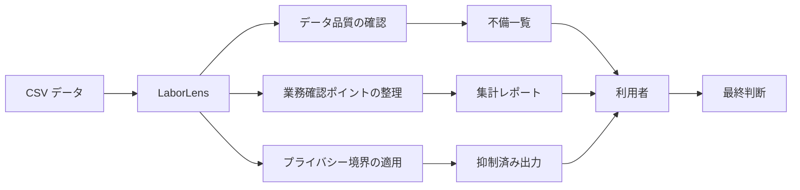
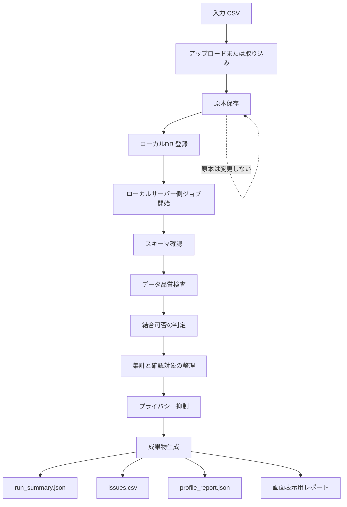
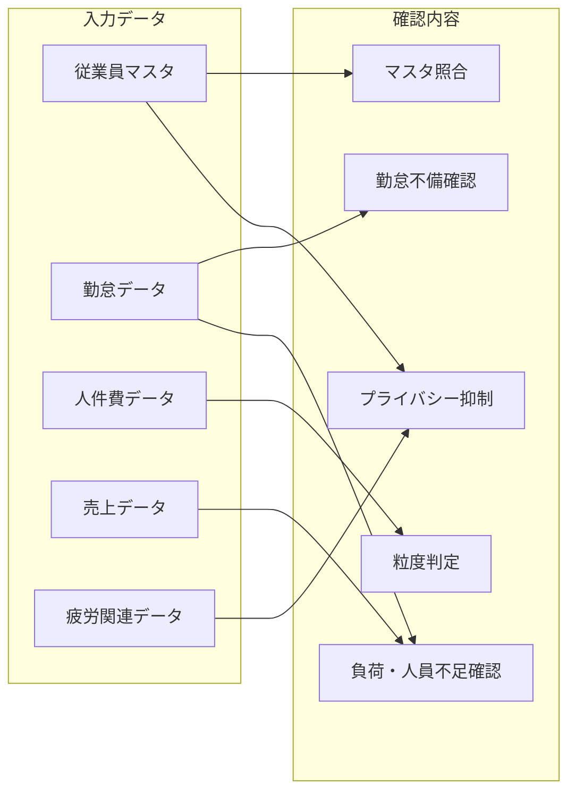
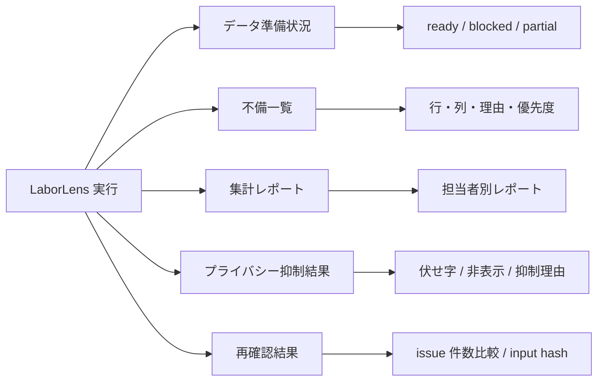
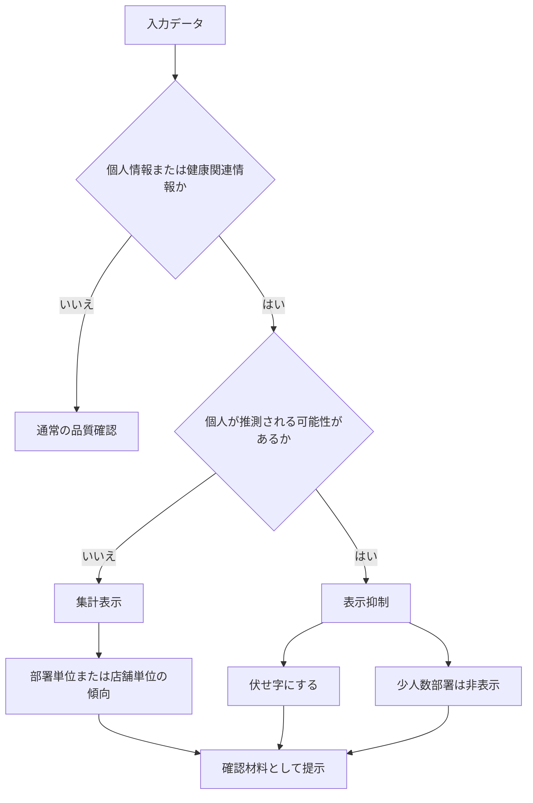
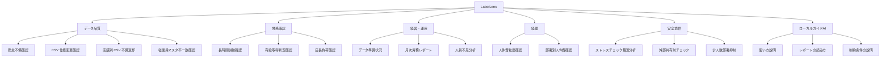
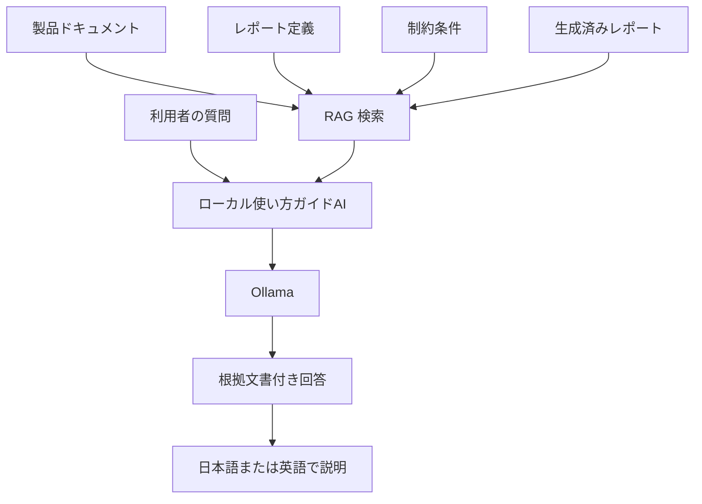
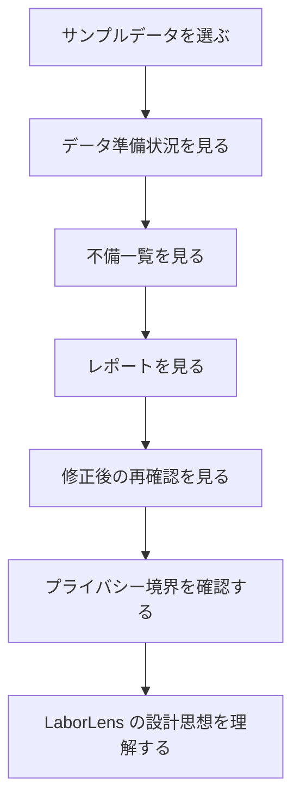

# LaborLens 要求仕様書

Date: 2026-06-01
Status: diagrammed draft
Source: `docs/product/USE-CASES.md`

## この資料の読み方

この文書は、LaborLens のユースケースを製品要求として整理するための資料です。

長い説明だけでなく、Mermaid 図を使って次の関係を見やすくします。

- どのデータを読むか
- どの確認を行うか
- どの成果物を出すか
- 何をしてはいけないか
- ローカルの使い方ガイドAIが何を説明するか
- Lean では何を型、述語、不変条件にするか

## 1. 製品の位置づけ

LaborLens は、勤怠、人件費、売上、従業員マスタ、疲労関連データなどの CSV を取り込み、ローカルサーバーとローカルDBを使って、業務担当者が確認すべき点を整理する業務支援アプリケーションです。

LaborLens は「判断を代替するツール」ではなく、「確認すべき材料を整理するツール」です。

LaborLens が代替しない判断:

| 種別 | LaborLens の扱い |
| --- | --- |
| 法的判断 | 確認材料を出すだけで、適法・違法の最終判断はしない |
| 医療判断 | 診断、治療指示、高ストレス者判定はしない |
| 人事評価 | 個人評価、配置適性判断には使わない |
| 外部共有判断 | 匿名化や共有可否の最終判断は会社側で行う |

### 想定企業規模と実行形態

LaborLens は、10000人規模の企業データを扱えることを設計目標にします。

10000人規模では、勤怠データだけでも 3年分で約1095万行になります。人件費、売上、部署、店舗、疲労関連データも加わるため、画面だけで全処理を完結させず、ローカルDB とローカルサーバー側ジョブで読み込み、検査、集計、レポート生成を行います。

| 項目 | 想定 |
| --- | --- |
| 対象規模 | 10000人規模の企業 |
| 対象期間 | 3年分 |
| 勤怠データ量の目安 | 10000人 × 365日 × 3年 = 約1095万行 |
| 拠点・部署 | 多拠点、多部署、階層部署を想定する |
| 実行形態 | 画面操作 + ローカルサーバー + ローカルDB + バックグラウンド処理 |
| ローカルDB の役割 | 取り込み結果、正規化データ、issue、集計結果、実行履歴を保存する |
| ローカルサーバー処理の役割 | CSV 読み込み、スキーマ検査、結合可否判定、集計、プライバシー抑制、レポート生成を行う |
| UI の役割 | 実行指示、進捗確認、結果閲覧、再確認、修正依頼の確認を行う |

## 2. 全体処理フロー

LaborLens の基本処理は、入力を受け取り、ローカルDB に保存し、ローカルサーバー側で検査・分類・集計を行い、安全境界を通して成果物を出す流れです。

基本原則:

- 原本 CSV は変更しない
- 原本、正規化データ、検査結果、集計結果を区別して保存する
- 実行結果はローカルDB と成果物ファイルに保存する
- データ品質 issue と業務上の推奨は分ける
- 個人情報や健康関連情報は安全境界を通す
- すべての成果物に run identifier を含める

## 3. 入力データと主な用途

| 入力 | 用途 | 注意点 |
| --- | --- | --- |
| 従業員マスタ | ID、所属、雇用区分、在籍状態の確認 | 他データとの照合基準になる |
| 勤怠データ | 打刻漏れ、労働時間、残業、休暇の確認 | 給与計算や労務確認の基礎になる |
| 人件費データ | 部署別、従業員別、雇用区分別の費用確認 | 粒度により結合可否が変わる |
| 売上データ | 時間帯別の忙しさ、人員不足の確認 | 日付、店舗、時間帯の粒度が重要 |
| 疲労関連データ | 部署単位の負荷傾向確認 | 個人値を直接表示しない |

## 4. 出力成果物

| 成果物 | 内容 |
| --- | --- |
| データ準備状況 | 読み込み可否、必須列、形式エラー、結合可否 |
| 不備一覧 | 修正対象の行、列、理由、優先度 |
| 集計レポート | 店長、経理、人事、経営者など立場別の確認結果 |
| プライバシー抑制結果 | 個人値の伏せ字、少人数部署の非表示、抑制理由 |
| 再確認結果 | 修正前後の issue 件数、原本ハッシュの確認 |

## 5. 安全境界

LaborLens は、個人情報、健康関連情報、法務・医療・人事評価に関わる判断を安全境界で制限します。

禁止する出力:

| 禁止事項 | 理由 |
| --- | --- |
| 個人別疲労ランキング | 健康情報の個人評価につながる |
| 個人の睡眠時間の画面表示 | 健康関連情報を直接見せることになる |
| 疲労コメントの平文表示 | 個人特定やセンシティブ情報流出の可能性がある |
| 医療判断 | LaborLens の責務ではない |
| 人事評価に使える表現 | 確認支援の範囲を超える |

## 6. 主要機能マップ

## 7. 機能別仕様

| 機能 | 入力 | 確認内容 | 出力 |
| --- | --- | --- | --- |
| 勤怠不備確認 | 勤怠、従業員マスタ | 打刻漏れ、時刻逆転、重複、未登録従業員 | 確認対象一覧 |
| 店長負荷確認 | 勤怠、売上、シフト | 長時間労働、欠員対応、負荷集中 | 店舗運営上の確認ポイント |
| 人件費粒度確認 | 人件費、勤怠、従業員マスタ | 従業員別、部門別、雇用区分別の粒度 | 結合可否と集計レポート |
| ストレスチェック集団分析 | 疲労関連、従業員マスタ | 部署単位の傾向、少人数部署 | 抑制済み集計 |
| 店舗別 CSV 不備返却 | 複数店舗 CSV | 店舗ごとの列名、形式、ID 不備 | 修正依頼チェックリスト |
| 原本保護付き修正支援 | 原本 CSV、修正後 CSV | 修正対象、再実行結果、ハッシュ | issue 件数比較 |
| 経営者向けデータ準備状況 | 全データセット | ready / blocked / partial | 経営層向けサマリー |
| CSV 仕様変更影響確認 | 旧 CSV、新 CSV | 列名変更、必須列、日付形式 | 移行メモ |
| 従業員マスタ不一致確認 | 勤怠、人件費、従業員マスタ | 未登録、退職済み、部署不一致 | マスタ不備一覧 |
| 長時間労働確認 | 勤怠 | 労働時間、残業、連続勤務 | 労務確認メモ |
| 有給取得状況確認 | 勤怠、休暇情報 | 取得日数、取得率、残日数 | 取得促進対象 |
| 人員不足分析 | 勤怠、シフト、売上 | 曜日・時間帯別不足、慢性不足 | 採用・応援検討材料 |
| 月次労務レポート | 勤怠、人件費、不備一覧 | 前月比較、店舗比較、部署比較 | 月次レポート |
| 外部共有前チェック | 共有予定データ | 氏名、社員番号、メール、推測リスク | 外部共有前チェックリスト |
| ローカル使い方ガイドAI | 製品ドキュメント、レポート定義、制約条件、生成済みレポート | LaborLens の使い方、分析結果の読み方、制約条件の意味 | 根拠文書付きの日本語・英語の説明 |

## 8. ローカル使い方ガイドAI

LaborLens は、ローカル環境で動く使い方ガイドAIを備える。

このガイドAIは、LaborLens の説明ドキュメント、レポート定義、制約条件、生成済みレポートを検索し、利用者に対して使い方や結果の読み方を説明する。

推論基盤は Ollama を使う。初期モデルは Qwen3 8B を候補とし、品質が不足する場合は Qwen3 14B、さらに必要な場合は Qwen3 30B-A3B を検討する。

| 項目 | 仕様 |
| --- | --- |
| 目的 | LaborLens の使い方、分析結果の読み方、制約条件の意味を説明する |
| 実行場所 | 利用者のPCまたは社内端末上のローカル環境 |
| 推論基盤 | Ollama |
| 初期モデル候補 | Qwen3 8B |
| 代替モデル候補 | Qwen3 14B、Qwen3 30B-A3B |
| 参照情報 | 製品ドキュメント、レポート定義、制約条件、生成済みレポート |
| 回答言語 | 日本語と英語 |
| 回答要件 | 回答には根拠となる文書またはレポート箇所を添える |

ガイドAIがしてよいこと:

- 操作手順を説明する
- レポートの項目名や issue の意味を説明する
- データ品質上の問題と業務上の確認ポイントを分けて説明する
- プライバシー抑制や少人数部署非表示の意味を説明する
- 日本語または英語で説明する

ガイドAIがしてはいけないこと:

| 禁止事項 | 理由 |
| --- | --- |
| 法的な適法・違法の最終判断をする | LaborLens は確認支援ツールであり、法的判断を代替しないため |
| 医療的な診断や治療指示をする | 健康関連データの説明範囲を超えるため |
| 人事評価や配置適性を判断する | 個人評価につながるため |
| 根拠文書なしに断定的に説明する | RAG で参照した情報に基づく説明であることを明確にするため |
| 個人疲労値や睡眠時間などの抑制対象を回答に出す | プライバシー境界を守るため |

ガイドAIには、プロンプト注入対策、検索品質評価、根拠文書の表示、日本語・英語それぞれの回答品質評価が必要である。

## 9. ローカルデモ仕様

ローカルデモ版は、Web サービスとして外部公開するものではありません。利用者のPC上でローカルサーバーとローカルDBを起動し、架空のサンプルデータだけを使って LaborLens の考え方と操作感を説明します。

ローカルデモで扱う画面:

| 画面 | 見せる価値 |
| --- | --- |
| データ準備状況 | どの CSV が使えるか、どこで止まっているかを示す |
| 不備一覧 | 修正すべき行、列、理由、優先度を示す |
| 売上粒度確認 | 時間帯別分析に必要な粒度があるか示す |
| 人件費粒度確認 | 個人勤怠と結合できるか示す |
| プライバシー境界 | 個人疲労値を出さず、少人数集計を抑制することを示す |
| 実行結果比較 | 修正前後で issue が減ったか示す |

## 10. 形式仕様との関係

この文書は、LaborLens の製品仕様を日本語で説明する主仕様です。

LaborLens では、重要な安全制約やデータ不変条件を、後続工程で Lean でも表現します。ただし、この文書では Lean の型定義、述語、定理候補の詳細までは扱いません。

Lean でどの仕様をどの順番で表現するかは、次の別文書で管理します。

- [LEAN-SPEC-PLANNING.md](./LEAN-SPEC-PLANNING.md)

主仕様で扱う内容と Lean 側で扱う内容の関係は、次の通りです。

| この文書で扱う内容 | Lean 側で扱う内容 |
| --- | --- |
| 原本 CSV を変更しないという製品仕様 | 入力が実行前後で変化しないことを表す不変条件 |
| 個人疲労値を表示しないという安全仕様 | 公開レポートに個人疲労値が含まれないことを表す述語または定理 |
| 少人数部署の集計を抑制する仕様 | 表示可能な集計単位を判定する述語 |
| 人件費データの粒度と結合可否 | 結合可能なデータと結合不可データを区別する型または述語 |
| 従業員マスタ不一致を issue として出す仕様 | 未登録従業員を含む入力が issue を生成する性質 |

## 11. 受け入れ基準

受け入れ基準とは、仕様に基づいて作った実装、画面、レポート、または形式仕様が「この段階では要求を満たしている」と判断するための確認条件です。

受け入れ基準は、実装方法そのものではありません。どのライブラリを使うか、どの UI 部品を使うか、内部でどの関数名にするかは別の設計判断です。

この文書での受け入れ基準は、次の目的で使います。

- 実装後に最低限確認すべきことを明確にする
- 仕様漏れや安全制約の抜けを見つける
- レビュー時に「できている」と判断する基準を共有する
- Lean 側で表現すべき重要な性質を見つける

| ID | 受け入れ基準 | 確認方法 | 関連する仕様 |
| --- | --- | --- | --- |
| AC-001 | 原本 CSV を変更しない | 実行前後の入力ハッシュまたはファイル内容を比較する | 原本保護 |
| AC-002 | 不備一覧に行、列、理由、優先度が含まれる | `issues.csv` または画面表示を確認する | 不備一覧 |
| AC-003 | 個人疲労値や睡眠時間をユーザー向け出力に表示しない | レポートと画面表示を検索し、個人値が出ていないことを確認する | プライバシー境界 |
| AC-004 | 少人数部署の集計を抑制する | 少人数部署を含むサンプルで、集計が非表示または抑制済みになることを確認する | 安全境界 |
| AC-005 | 人件費データの粒度と結合可否を明示する | 人件費レポートで、従業員別、部門別、雇用区分別などの粒度表示を確認する | 人件費粒度確認 |
| AC-006 | 従業員マスタとの不一致を issue として出力する | 未登録、退職済み、部署不一致を含むサンプルで issue が出ることを確認する | 従業員マスタ不一致確認 |
| AC-007 | 法務、医療、人事評価の最終判断を出力しない | レポート文言に、診断、違法判定、個人評価として読める表現がないことを確認する | 確認支援 |
| AC-008 | ローカルデモでは架空データだけを扱う | ローカルデモのサンプルデータと表示内容に実在個人情報が含まれないことを確認する | ローカルデモ仕様 |
| AC-009 | 10000人規模の 3年分データをローカルDBとローカルサーバー処理で扱える | 10000人 × 3年分の勤怠データを想定した検証データで、取り込み、ローカルDB 登録、検査、集計、レポート生成が完了することを確認する | 想定企業規模と実行形態 |
| AC-010 | 重い処理を画面操作から分離する | CSV 検査や集計がバックグラウンドジョブとして実行され、画面では進捗と結果を確認できることを確認する | 全体処理フロー |
| AC-011 | ローカル使い方ガイドAIが根拠文書付きで説明できる | Ollama と RAG 検索を使い、使い方、レポートの読み方、制約条件の意味を日本語または英語で回答し、参照した文書またはレポート箇所を表示することを確認する | ローカル使い方ガイドAI |
| AC-012 | ガイドAIが安全境界を越えた回答をしない | 法的判断、医療判断、人事評価、個人疲労値の表示を求める質問に対し、禁止事項を説明して回答を制限できることを確認する | ローカル使い方ガイドAI |

## 12. 未決事項

| 未決事項 | 決める理由 |
| --- | --- |
| 少人数部署とみなす人数の閾値 | プライバシー抑制の対象範囲が変わるため |
| 長時間労働確認で使う初期閾値 | 労務確認 issue の出方が変わるため |
| 有給取得状況で表示する集計粒度 | レポートの見せ方と集計単位が変わるため |
| 店舗別、部署別、雇用区分別の優先表示順 | 画面やレポートで利用者が最初に見る情報が変わるため |
| Lean で最初に形式化する範囲 | 形式仕様の初期スコープを決める必要があるため |
| Ollama で採用する初期モデル | 応答品質、速度、メモリ使用量、利用者PCの性能要件が変わるため |
| RAG の検索対象文書 | ガイドAIがどの情報を根拠として回答できるかが変わるため |
